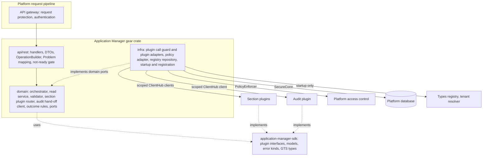
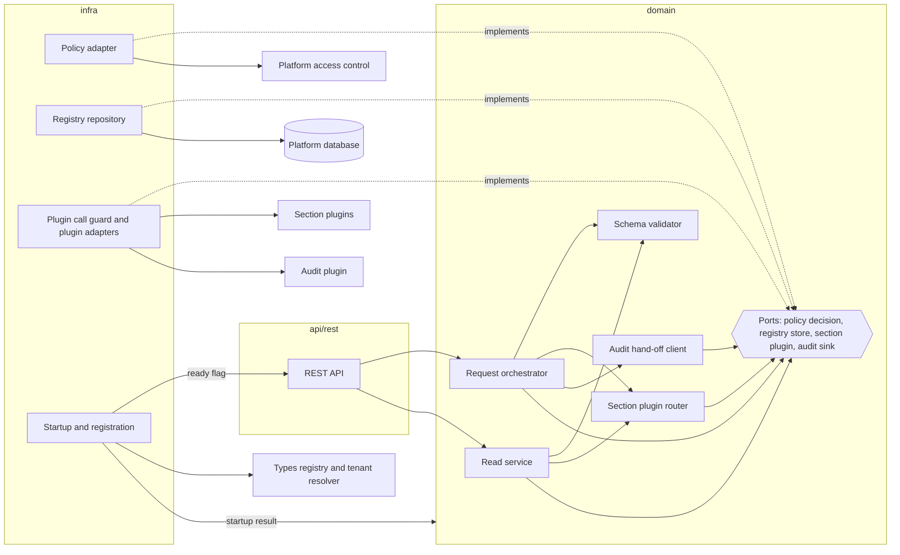
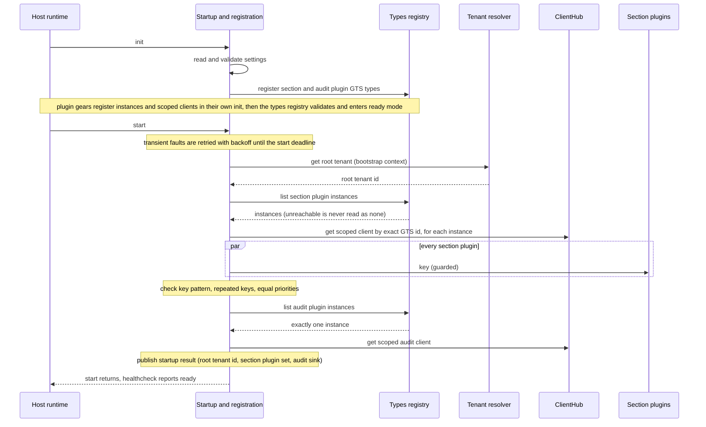
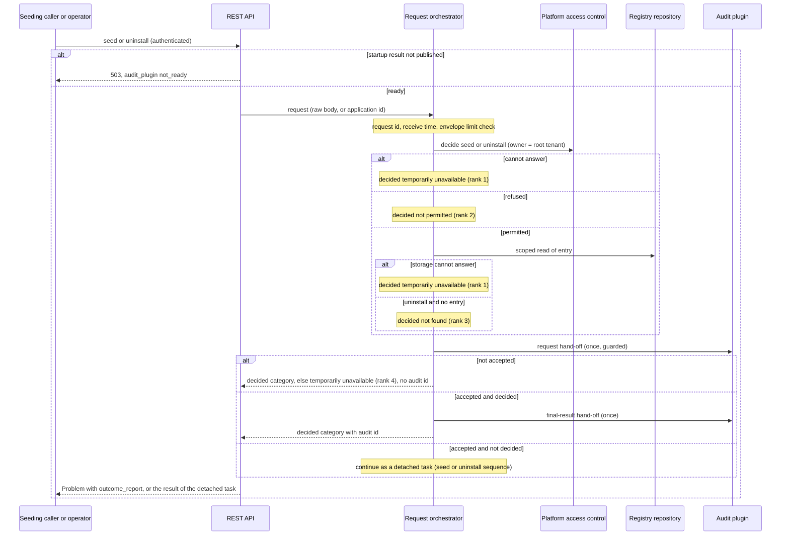
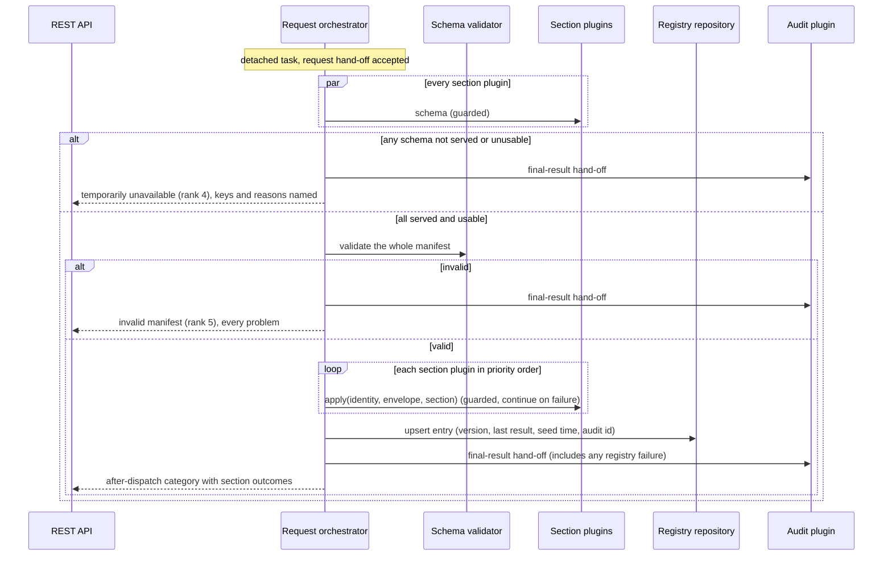
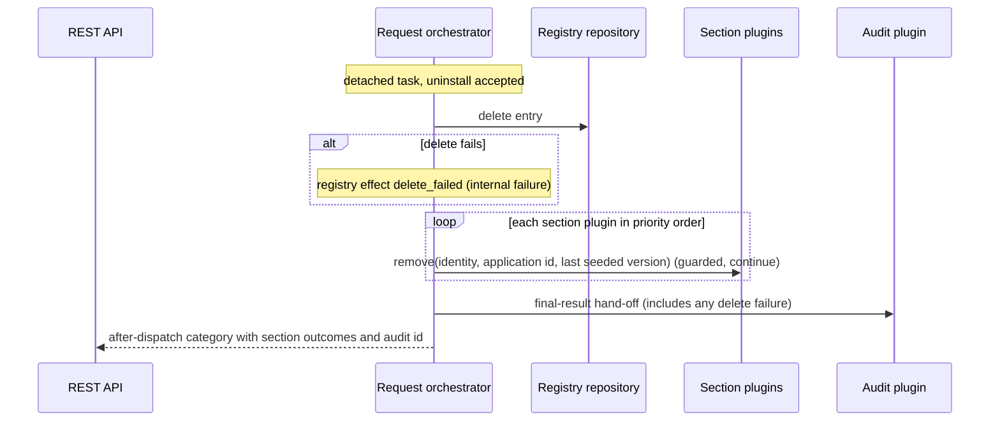
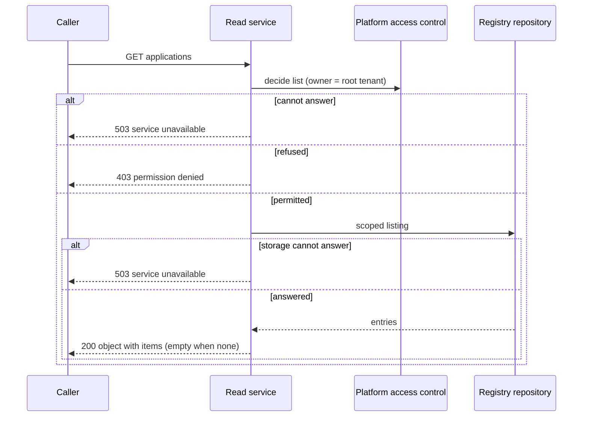
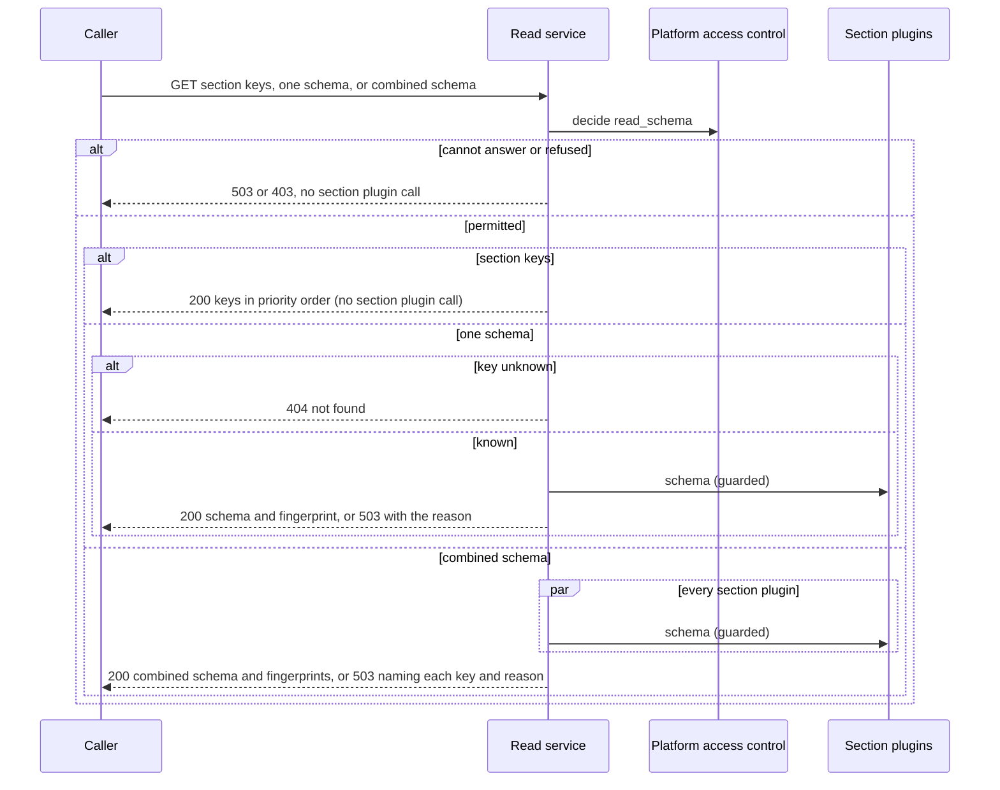
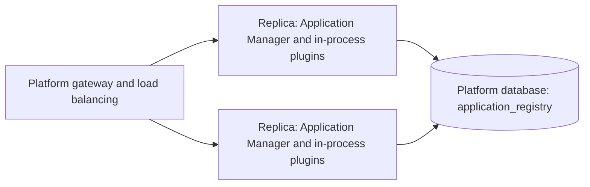

# Technical Design — Application Manager

How the Application Manager validates whole manifests, dispatches sections to its section plugins in priority order, hands every seed and uninstall request to one audit plugin, and keeps a minimal platform-wide registry of seeded applications. Written for gear implementers, section-plugin authors, and audit-plugin authors.

<!-- toc -->

- [1. Architecture Overview](#1-architecture-overview)
  - [1.1 Architectural Vision](#11-architectural-vision)
  - [1.2 Architecture Drivers](#12-architecture-drivers)
  - [1.3 Architecture Layers](#13-architecture-layers)
- [2. Principles & Constraints](#2-principles--constraints)
  - [2.1 Design Principles](#21-design-principles)
  - [2.2 Constraints](#22-constraints)
- [3. Technical Architecture](#3-technical-architecture)
  - [3.1 Domain Model](#31-domain-model)
  - [3.2 Component Model](#32-component-model)
  - [3.3 API Contracts](#33-api-contracts)
  - [3.4 Internal Dependencies](#34-internal-dependencies)
  - [3.5 External Dependencies](#35-external-dependencies)
  - [3.6 Interactions & Sequences](#36-interactions--sequences)
  - [3.7 Database schemas & tables](#37-database-schemas--tables)
  - [3.8 Deployment Topology](#38-deployment-topology)
- [4. Additional context](#4-additional-context)
  - [4.1 Design-Level Terms](#41-design-level-terms)
  - [4.2 Concurrent Requests for the Same Application](#42-concurrent-requests-for-the-same-application)
  - [4.3 Security Considerations](#43-security-considerations)
  - [4.4 Data Protection](#44-data-protection)
  - [4.5 Fault Tolerance](#45-fault-tolerance)
  - [4.6 Observability](#46-observability)
  - [4.7 Configuration](#47-configuration)
  - [4.8 Testability](#48-testability)
  - [4.9 Compliance](#49-compliance)
  - [4.10 Deviations from Platform Baselines](#410-deviations-from-platform-baselines)
  - [4.11 Guidance for Plugin Authors](#411-guidance-for-plugin-authors)
  - [4.12 Assumptions, Dependencies and Migration Impact](#412-assumptions-dependencies-and-migration-impact)
  - [4.13 Capacity and Resource Efficiency](#413-capacity-and-resource-efficiency)
- [5. Traceability](#5-traceability)

<!-- /toc -->

- [ ] `p3` - **ID**: `cpt-cf-application-manager-design-overview`

## 1. Architecture Overview

### 1.1 Architectural Vision

The Application Manager is a thin orchestrating gear built on the ToolKit gear model. It owns one manifest envelope, one small registry table, and one fixed sequence of checks, hand-offs, and plugin calls. All domain meaning lives in section plugins, and all audit storage lives in one audit plugin. Vocabulary follows the canonical [PRD glossary](./PRD.md#14-glossary); the few design-level terms that the PRD does not define are glossed in [§4.1](#41-design-level-terms).

The design rests on three decisions. First, the plugin set is fixed at startup: every section plugin registers a GTS instance of the Application Manager's section plugin type and a scoped ClientHub client, and the startup component enumerates them once into an in-memory key map and a priority order ([ADR 0001](./ADR/0001-cpt-cf-application-manager-adr-section-plugin-fan-out.md)). Second, every seed follows validate-then-dispatch: schemas are fetched live from every section plugin, the whole manifest is validated, and only then are sections dispatched one at a time in priority order, continuing after failures ([ADR 0002](./ADR/0002-cpt-cf-application-manager-adr-plugin-served-section-schemas.md), [ADR 0003](./ADR/0003-cpt-cf-application-manager-adr-validate-all-then-dispatch.md)). Third, trace before change: each seed and uninstall request is handed to the audit plugin before anything is dispatched, and its final result is handed over once the outcome is decided. Each hand-off is attempted exactly once ([ADR 0004](./ADR/0004-cpt-cf-application-manager-adr-audit-via-plugin.md)).

Outside the plugin calls, the gear is stateless apart from its registry, which is a rebuildable view of each application's last seed ([ADR 0005](./ADR/0005-cpt-cf-application-manager-adr-minimal-application-registry.md)). Each outcome category maps to exactly one HTTP status, and a partial failure is reported as an error ([ADR 0006](./ADR/0006-cpt-cf-application-manager-adr-outcome-http-mapping.md)). The design adds no coordination between concurrent requests for the same application id. Concurrency handling is left to the section plugins ([§4.2](#42-concurrent-requests-for-the-same-application)).

The gear is headless. Frontend architecture, client state management, responsive design, progressive enhancement, and offline support are not applicable because it has no user interface. The developer experience of callers and plugin authors is covered by §3.3 and §4.11.

### 1.2 Architecture Drivers

Requirements that significantly influence architecture decisions.

#### Functional Drivers

| Requirement | Design Response |
|---|---|
| `cpt-cf-application-manager-fr-manifest-envelope` | The schema validator (`cpt-cf-application-manager-component-schema-validator`) owns the envelope schema: an `application` object with exactly `id` and `version`, and a `sections` object (`cpt-cf-application-manager-entity-manifest`). The envelope limits are checked when the request is received, before the request hand-off. |
| `cpt-cf-application-manager-fr-application-id` | The id is opaque: no case folding, trimming, or normalisation. It is stored and compared as exact text on every supported database backend, and no code path parses or orders it (`cpt-cf-application-manager-dbtable-application-registry`). Uninstall takes the id in the path or in the request body and compares it the same way (§3.3). |
| `cpt-cf-application-manager-fr-opaque-version` | The version is stored as text, passed unchanged to `apply` and `remove`, and placed in the audit hand-offs. No component compares or sorts versions. |
| `cpt-cf-application-manager-fr-required-sections` | The validator requires exactly the key set: a missing key or an unknown key is a problem at `/sections/<key>`. When the key set is empty, `sections` must be an empty object. Keys follow the SDK token pattern, so the location needs no JSON Pointer escaping. |
| `cpt-cf-application-manager-fr-unique-section-keys` | The startup component reads `key` from each section plugin instance and fails startup on a repeated key or on a key outside the token pattern. The key map is immutable until the next start (`cpt-cf-application-manager-seq-startup`). |
| `cpt-cf-application-manager-fr-section-priority` | The priority is the registered GTS instance priority. The startup component sorts lowest value first and fails startup on an equal priority. The same order drives dispatch on seed and on uninstall. |
| `cpt-cf-application-manager-fr-startup-checks` | Every listed failure fails the start phase: the start capability returns an error and the host process exits (`cpt-cf-application-manager-component-startup-registration`). Permanent faults fail at once. Transient faults are retried until the configured start deadline. The reasons are catalogued in §4.6. An answering types registry that lists no section plugins gives an empty key set. |
| `cpt-cf-application-manager-fr-validate-before-dispatch` | The orchestrator fetches every schema on every seed, with no cache. The validator then checks the whole manifest and collects every problem with its JSON Pointer location. Dispatch runs only on a clean result. |
| `cpt-cf-application-manager-fr-plugin-served-schemas` | The gear holds no section rules: the `schema` operation is the only source, and compiled schemas do not outlive the request. A served schema must be JSON Schema Draft 2020-12 with references inside the served document. Anything else is a section-plugin defect, reported with reason `unusable`. |
| `cpt-cf-application-manager-fr-plugin-extensibility` | Section plugins are separate gears that register an instance of the section plugin GTS type. The Application Manager depends only on its own SDK types and the types registry, never on plugin crates. |
| `cpt-cf-application-manager-fr-ordered-dispatch` | The section plugin router walks the priority-ordered list one section plugin call at a time, records each section outcome, and continues after every failure kind. After the request hand-off is accepted, the rest of the request runs as a task detached from the HTTP request, so a caller disconnect or the gateway deadline cannot stop it midway. |
| `cpt-cf-application-manager-fr-pass-through` | `apply` receives the envelope and the parsed section value as sent. The registry has no section column, and nothing about sections is kept after the request. |
| `cpt-cf-application-manager-fr-plugin-owned-semantics` | The section plugin interface offers no cancel, undo, batch, or transaction operation. After a failure, the orchestrator never calls that section plugin again for the same request. |
| `cpt-cf-application-manager-fr-outcome-categories` | The orchestrator decides exactly one of the seven categories per request (`cpt-cf-application-manager-entity-outcome-category`). The REST API maps it per §3.3. |
| `cpt-cf-application-manager-fr-outcome-precedence` | The orchestrator applies the precedence table in `cpt-cf-application-manager-component-request-orchestrator`, which follows the PRD order. Storage is consulted only for a permitted caller, so a refused caller ends as not permitted even while storage cannot answer. |
| `cpt-cf-application-manager-fr-response-content` | Every seed and uninstall response carries the outcome report (`cpt-cf-application-manager-entity-outcome-report`): as the body on success, and in the Problem's `outcome_report` extension member on failure (§3.3). |
| `cpt-cf-application-manager-fr-bounded-plugin-calls` | The plugin call guard (`cpt-cf-application-manager-component-plugin-call-guard`) caps every plugin call with the one configured time limit. It stops waiting without cancelling the call, and each call kind maps its timeout as the PRD states. |
| `cpt-cf-application-manager-fr-dependency-failures` | Access control and storage are consulted before the request hand-off and before any section plugin call. A registry write or delete failure after dispatch counts as an internal failure. The report states the registry effect, and the final-result hand-off includes the failure. |
| `cpt-cf-application-manager-fr-uninstall` | Once an uninstall is accepted, the orchestrator deletes the entry and then calls `remove` in priority order with the last seeded version. A failed delete still runs removal and ends as internal failure (`cpt-cf-application-manager-seq-uninstall`). |
| `cpt-cf-application-manager-fr-application-registry` | The registry repository upserts the entry after dispatch with the version, the last result (derived as §3.1 states), the seed time, and the audit id. Requests that end before dispatch never reach a write. |
| `cpt-cf-application-manager-fr-retry` | Every request is independent and the registry holds no applied state, so a repeated seed, or a seed followed by an uninstall, is the retry path. Once a delete succeeded, only a seed followed by an uninstall repeats removal. |
| `cpt-cf-application-manager-fr-plugin-rollout` | Validation rules are the same before and after a plugin-set change. No operation fills in sections, replays seeds, or starts re-seeds. |
| `cpt-cf-application-manager-fr-discovery` | The read service lists keys from the in-memory section plugin set. It serves one key's schema or the combined schema live, through the plugin call guard (`cpt-cf-application-manager-seq-discovery`). |
| `cpt-cf-application-manager-fr-list-applications` | The read service lists the registry under the PolicyEnforcer scope with no plugin call. The response is an object with an `items` array (`cpt-cf-application-manager-seq-list-applications`). |
| `cpt-cf-application-manager-fr-authentication` | Every route is registered `.authenticated()` through OperationBuilder and receives the platform `SecurityContext`. There is no anonymous route and no gear-owned login. Plugins receive an identity-only caller context with the bearer token removed (`cpt-cf-application-manager-entity-caller-identity`). |
| `cpt-cf-application-manager-fr-authorization` | PolicyEnforcer checks four separate actions on the application resource type: `seed`, `uninstall`, `list`, and `read_schema` (permission matrix in §3.3). A section plugin's extra refusal returns the `NotPermitted` error kind. |
| `cpt-cf-application-manager-fr-audit-event` | The audit hand-off client assembles the request content and the final-result content from the request, the validator result, and the dispatch results (`cpt-cf-application-manager-entity-audit-event-content`). |
| `cpt-cf-application-manager-fr-audit-ordering` | The orchestrator attempts the request hand-off on every seed and uninstall that reaches the gear, including requests already decided. A request refused before readiness counts as an attempted request hand-off that was not accepted. Dispatch is gated on acceptance, and every accepted request gets a final-result hand-off attempt. Platform-rejected requests never reach the gear. |
| `cpt-cf-application-manager-fr-audit-single-handoff` | The audit hand-off client has no retry path. Each hand-off is one guarded call whose result is final for the request. |
| `cpt-cf-application-manager-fr-audit-plugin` | The startup component requires exactly one audit plugin instance. No REST operation returns audit data. |
| `cpt-cf-application-manager-fr-audit-exposure` | The audit plugin interface states the default-off exposure obligation. The gear itself never writes manifest content to logs, traces, metrics, or error text. |

#### NFR Allocation

This table maps non-functional requirements from PRD to specific design/architecture responses, demonstrating how quality attributes are realized.

| NFR ID | NFR Summary | Allocated To | Design Response | Verification Approach |
|---|---|---|---|---|
| `cpt-cf-application-manager-nfr-audit-completeness` | One attempted request hand-off per seed or uninstall that reaches the system, and one attempted final-result hand-off per accepted request hand-off | `cpt-cf-application-manager-component-request-orchestrator`, `cpt-cf-application-manager-component-audit-handoff-client`, `cpt-cf-application-manager-component-rest-api` | Every path through `cpt-cf-application-manager-seq-pre-dispatch-gate` reaches the request hand-off. A request refused before readiness counts as attempted and not accepted. Every exit of an accepted request attempts the final-result hand-off, and the detached request task cannot be cut short by the caller. Platform-rejected requests are logged by the platform, as the PRD exempts them. | Table-driven tests over every outcome category, the not-ready refusal, and a dropped HTTP request, with a counting test audit plugin that also refuses and exceeds the time limit. In production, the attempted and accepted counters (§4.6) reconcile with the request counters. |
| `cpt-cf-application-manager-nfr-platform-scope` | One platform-wide registry, reachable only through access checks | `cpt-cf-application-manager-component-registry-repository`, PolicyEnforcer, SecureConn | One table with no per-tenant partition. Every row carries the root tenant id as its secure-ORM scoping value, which is not tenant ownership. Every read and write runs through SecureConn with the AccessScope compiled for the action. | Inspection of the entity scoping declaration and of the absence of raw SQL. Tests on every action show that a refused or unanswered decision reaches no registry access. |
| `cpt-cf-application-manager-nfr-authorized-before-plugin` | No section plugin call for a caller who is not authorized | `cpt-cf-application-manager-component-request-orchestrator`, `cpt-cf-application-manager-component-read-service` | The permission decision is the first domain step of every operation. The section plugin router is reached only on a permit, for schema, `apply`, and `remove` alike. | A recording test section plugin shows zero section plugin calls for requests that end as not permitted or with an unanswered permission check, on every action. |
| `cpt-cf-application-manager-nfr-bounded-call-time` | Every plugin call ends within the configured time limit, which is never hardcoded | `cpt-cf-application-manager-component-plugin-call-guard`, gear configuration | Every plugin call (`key`, `schema`, `apply`, `remove`, and both hand-offs) goes through one guard that stops waiting at the configured limit. The setting is required, has no default, and is validated during `init` (§4.7). | Paused-clock tests with slow test section plugins and a slow test audit plugin. Configuration tests show that a missing or invalid setting fails startup and that a changed value changes behaviour with no code change. |
| `cpt-cf-application-manager-nfr-bounded-request-time` | A request never takes longer than its sequence of capped plugin calls | `cpt-cf-application-manager-component-request-orchestrator` | A seed makes the request hand-off, one concurrent schema phase, one `apply` per section plugin, and the final-result hand-off: at most N + 3 time limits, where N is the number of registered section plugins. An uninstall makes at most N + 2. The PDP decision and the registry operations add their platform-client bounds (§4.5). Operators keep the bound within the gateway request deadline (§4.7). | Tests under a paused clock, with test plugins that always reach the limit, assert the number of elapsed time limits for each sequence, not wall time. |
| `cpt-cf-application-manager-nfr-no-partial-on-invalid` | Nothing is dispatched for invalid manifests or for temporarily unavailable outcomes | `cpt-cf-application-manager-component-request-orchestrator`, `cpt-cf-application-manager-component-schema-validator` | Dispatch is reachable only when the caller is permitted, storage answered, the request hand-off was accepted, every schema was served and usable, and the manifest is valid. Every temporarily unavailable outcome is decided before that point. | Counting tests for every invalid-manifest cause and every temporarily unavailable cause assert zero `apply` and `remove` calls. |
| `cpt-cf-application-manager-nfr-traceable-subject` | Every audit event carries the authenticated caller subject | `cpt-cf-application-manager-component-audit-handoff-client` | The request hand-off always includes the caller identity taken from the request's `SecurityContext`, which the platform authentication pipeline guarantees. | The test audit plugin asserts that the subject is present on every request hand-off across all outcome categories. |
| `cpt-cf-application-manager-nfr-availability` | Available whenever deploys happen. Listing and key listing survive an audit outage | `cpt-cf-application-manager-component-read-service`, `cpt-cf-application-manager-topology-replicas` | Listing and key listing make no section plugin call and no hand-off. Schema reads need only the section plugins. After startup, readiness depends on no plugin. Replicas are stateless. During a rolling restart, replicas may briefly hold different key sets (§3.8). | Tests keep the audit plugin unavailable while listing, key listing, and schema reads succeed. Readiness tests show not ready until the startup result is published, and ready during a plugin outage. |
| `cpt-cf-application-manager-nfr-recovery` | The registry is fully rebuilt by re-seeding | `cpt-cf-application-manager-component-registry-repository` | An entry is a pure function of its application's last seed, written by an upsert keyed by application id. No other state exists, so re-seeding restores every entry. | A test empties the registry, re-seeds every application, and finds one entry for each. |
| `cpt-cf-application-manager-nfr-operational-signals` | Signals for failed hand-offs, startup failures, and repeated timeouts; outcome and timeout counts | `cpt-cf-application-manager-component-request-orchestrator`, `cpt-cf-application-manager-component-plugin-call-guard`, `cpt-cf-application-manager-component-startup-registration` | Platform telemetry carries the counters, histograms, and log events listed in §4.6, with an alert condition for each signal. A startup failure is a structured error event before the host exits. | Tests read the counters from an in-memory metric exporter and assert the structured log events for each signal condition. |
| `cpt-cf-application-manager-nfr-documentation` | API documentation, plugin contract documentation, operator settings documentation | `cpt-cf-application-manager-interface-rest-api`, SDK crate | OperationBuilder metadata generates the API documentation. The SDK crate is the normative plugin contract, and §3.3 and §4.11 mirror it, including how to choose a priority. Operator settings are documented in §4.7. | Inspection at each release. The API documentation is generated from route registration, so it matches the released interface by construction. |

#### Key ADRs

| ADR ID | Decision Summary |
|---|---|
| `cpt-cf-application-manager-adr-section-plugin-fan-out` | Every section plugin participates. Plugins are discovered once at startup into an in-memory key map and priority order, by GTS instance and scoped ClientHub client. |
| `cpt-cf-application-manager-adr-plugin-served-section-schemas` | Section plugins serve their own schemas, fetched on every seed with no caching, and every registered section is required. |
| `cpt-cf-application-manager-adr-validate-all-then-dispatch` | Validate the whole manifest first, then dispatch one at a time in priority order, continue after failures, and leave rollback to section plugins. |
| `cpt-cf-application-manager-adr-audit-via-plugin` | Exactly one audit plugin. A request hand-off before dispatch and a final-result hand-off after the outcome, each attempted once. The audit plugin retries until recorded and owns audit data. |
| `cpt-cf-application-manager-adr-minimal-application-registry` | The registry stores only id, version, last result, last seed time, and audit id as application data. A re-seed overwrites the entry. An accepted uninstall deletes it. Re-seeding rebuilds it. |
| `cpt-cf-application-manager-adr-outcome-http-mapping` | One HTTP status per outcome category. Partial failure is an error. Invalid manifest (422) is kept apart from plugin rejected (400). |

### 1.3 Architecture Layers

The diagram shows the gear's three code layers, the SDK crate, and the platform services that each layer reaches. Solid arrows are runtime calls. Dotted arrows are compile-time relationships: infrastructure implements the ports that the domain owns, and plugins implement the SDK interfaces.

- [ ] `p3` - **ID**: `cpt-cf-application-manager-tech-layers`

The gear uses the platform's single layer model: `api/rest/`, `domain/`, and `infra/` ([gear layout and SDK pattern](../../../../docs/toolkit_unified_system/02_gear_layout_and_sdk_pattern.md)). Orchestration and the outcome rules are domain logic, so there is no separate application layer.

| Layer | Responsibility | Technology |
|---|---|---|
| API (`api/rest/`), the presentation layer | REST routes, request and response DTOs, outcome-to-status mapping, canonical Problem bodies with the `outcome_report` member, the not-ready gate, and generated API documentation | Axum handlers registered through ToolKit OperationBuilder; canonical errors (RFC 9457) |
| Domain (`domain/`) | Request orchestration in precedence order, read flows, envelope and schema validation, the section plugin set and dispatch order, translation of plugin results into section outcomes, outcome ranking, and assembly of the outcome report and the audit content. It owns the ports that infrastructure implements. | Services marked `#[domain_model]` holding ports as trait objects; JSON Schema Draft 2020-12 through the workspace `jsonschema` crate; RFC 8785 canonical JSON with SHA-256 |
| Infrastructure (`infra/`) | Guarded plugin calls and ClientHub adapters, the PolicyEnforcer adapter, registry persistence, startup checks, the readiness healthcheck, and telemetry | ClientHub scoped clients by GTS id; types registry `list_instances`; tenant resolver; PolicyEnforcer; SeaORM through SecureConn; a hand-implemented start capability; platform OpenTelemetry |
| SDK crate (`application-manager-sdk`), the contract | Section plugin and audit plugin interfaces, shared models, plugin error kinds, and GTS type definitions | Rust traits and models; GTS |

The SDK crate is the only crate that plugin gears depend on. The gear registers no public ClientHub client of its own, so REST is the only consumer surface. Planned code locations, relative to `gears/system/application-manager/`:

| Item | Location |
|---|---|
| Section plugin interface | `application-manager-sdk/src/section_plugin_api.rs` |
| Audit plugin interface | `application-manager-sdk/src/audit_plugin_api.rs` |
| Shared models: outcome categories, section outcomes, outcome report, audit content, caller identity | `application-manager-sdk/src/models.rs` |
| Plugin error kinds | `application-manager-sdk/src/errors.rs` |
| GTS type definitions: the two plugin types, the application resource type, the outcome report type | `application-manager-sdk/src/gts.rs` |
| Composition root, capabilities, healthcheck registration | `application-manager/src/gear.rs` |
| Typed configuration | `application-manager/src/config.rs` |
| REST layer | `application-manager/src/api/rest/` (`dto.rs`, `handlers.rs`, `routes.rs`) |
| Domain services and ports | `application-manager/src/domain/`, with the ports in `domain/ports.rs` |
| Adapters, registry entity, repository, migrations | `application-manager/src/infra/`, with storage under `infra/storage/` (`entity/`, `repo.rs`, `migrations/`) |

## 2. Principles & Constraints

### 2.1 Design Principles

When two principles pull in different directions, the earlier one in this order wins: Trace Before Change; Honest, Deterministic Outcomes; Validate Everything, Then Dispatch; Bounded Waiting, No Cancellation; Pass Through, Never Interpret; Plugin Set Fixed at Startup; Minimal, Rebuildable State. For example, a valid manifest is still not dispatched when the request hand-off is not accepted, and a call the gear stopped waiting for is reported as `timed_out`, meaning its outcome is unknown, never as succeeded.

#### Pass Through, Never Interpret

- [ ] `p2` - **ID**: `cpt-cf-application-manager-principle-pass-through`

The gear validates shape against schemas it does not own. It moves sections unchanged to their owners and never gives meaning to versions, re-seeds, or section content. Domain logic, idempotency, rollback, and version rules stay in the section plugins, so a new kind of seeded data never requires a gear change.

**ADRs**: `cpt-cf-application-manager-adr-validate-all-then-dispatch`, `cpt-cf-application-manager-adr-minimal-application-registry`

#### Plugin Set Fixed at Startup

- [ ] `p2` - **ID**: `cpt-cf-application-manager-principle-startup-fixed-plugin-set`

The section plugin set, its keys and priority order, and the audit plugin client are resolved once, during the start phase, and then kept immutable. Request paths never consult the types registry, so key and priority conflicts surface at deploy time and a request can never see the plugin set change midway.

**ADRs**: `cpt-cf-application-manager-adr-section-plugin-fan-out`, `cpt-cf-application-manager-adr-audit-via-plugin`

#### Validate Everything, Then Dispatch

- [ ] `p2` - **ID**: `cpt-cf-application-manager-principle-validate-then-dispatch`

Dispatch happens only after every pre-dispatch step has passed: permission, storage, the request hand-off, every live schema, and the whole-manifest validation. Seed validation and the discovery combined schema are built by the same composition rule, so a manifest built from discovery passes validation.

**ADRs**: `cpt-cf-application-manager-adr-plugin-served-section-schemas`, `cpt-cf-application-manager-adr-validate-all-then-dispatch`

#### Trace Before Change

- [ ] `p2` - **ID**: `cpt-cf-application-manager-principle-trace-before-change`

No section plugin receives data or a removal request unless the audit plugin accepted the request hand-off. Each hand-off is attempted exactly once, and the audit plugin alone owns durability, so there are no duplicate events and no retry state in the gear.

**ADRs**: `cpt-cf-application-manager-adr-audit-via-plugin`

#### Honest, Deterministic Outcomes

- [ ] `p2` - **ID**: `cpt-cf-application-manager-principle-honest-outcomes`

Every seed and uninstall ends in exactly one outcome category chosen by a fixed precedence. A caller is never told "not permitted" or "not found" when the gear could not check, and a partial failure is never reported as success. When a dependency cannot answer, the gear fails closed.

**ADRs**: `cpt-cf-application-manager-adr-outcome-http-mapping`, `cpt-cf-application-manager-adr-validate-all-then-dispatch`

#### Bounded Waiting, No Cancellation

- [ ] `p2` - **ID**: `cpt-cf-application-manager-principle-bounded-waiting`

The gear stops waiting for a plugin call at the configured time limit, but it never cancels or undoes work a plugin has started. A timed-out call keeps running detached from the request, within the per-plugin in-flight cap, and its late result is logged by metadata only and discarded. For the same reason, once the request hand-off is accepted, the rest of the request runs detached from the HTTP request.

**ADRs**: `cpt-cf-application-manager-adr-validate-all-then-dispatch`, `cpt-cf-application-manager-adr-audit-via-plugin`

#### Minimal, Rebuildable State

- [ ] `p2` - **ID**: `cpt-cf-application-manager-principle-minimal-state`

The only persisted gear state is one registry entry per seeded application, derived entirely from that application's last seed. Manifests, sections, schemas, and audit data are never persisted by the gear. Recovery from any registry drift is a re-seed.

**ADRs**: `cpt-cf-application-manager-adr-minimal-application-registry`

### 2.2 Constraints

#### ToolKit Gear and Plugin Model

- [ ] `p2` - **ID**: `cpt-cf-application-manager-constraint-toolkit-plugin-model`

The gear follows the ToolKit SDK, domain, API, and infrastructure split, and the platform plugin model: plugin types are GTS types derived from the platform plugin base type, plugin instances are registered in the types registry, and plugin clients are resolved from ClientHub by exact GTS instance id ([ClientHub and plugins](../../../../docs/toolkit_unified_system/03_clienthub_and_plugins.md)). ClientHub cannot enumerate scoped clients, so the types registry instance list is the enumeration source. The Application Manager never depends on plugin crates. Discovery is eager, in the start phase, which departs from the plugin guide's lazy resolution (§4.10). Plugin gears run in the same host process (§3.8).

**ADRs**: `cpt-cf-application-manager-adr-section-plugin-fan-out`, `cpt-cf-application-manager-adr-audit-via-plugin`

#### Platform Authentication and Policy Enforcement

- [ ] `p2` - **ID**: `cpt-cf-application-manager-constraint-platform-auth`

Authentication belongs to the platform pipeline, and every route is authenticated. Authorization uses PolicyEnforcer against the platform access control service, and the gear never constructs an AccessScope by hand ([AuthN, AuthZ and secure ORM](../../../../docs/toolkit_unified_system/06_authn_authz_secure_orm.md)). The gear holds no credentials of its own. Plugins receive `CallerIdentity`, built from the request's `SecurityContext` with the bearer token removed, so the gear never forwards caller credentials to plugins (§3.3).

**ADRs**: `cpt-cf-application-manager-adr-validate-all-then-dispatch`

#### Secure ORM for the Registry

- [ ] `p2` - **ID**: `cpt-cf-application-manager-constraint-secure-orm`

All registry access goes through SecureConn with a Scopable entity scoped to the platform root tenant, under the platform convention that platform scope is the root tenant's id ([database patterns](../../../../docs/toolkit_unified_system/11_database_patterns.md)). There is no raw SQL outside migrations. The physical schema arrives through the gear's migrations, run by the platform migration phase.

**ADRs**: `cpt-cf-application-manager-adr-minimal-application-registry`

#### Canonical Error Model

- [ ] `p2` - **ID**: `cpt-cf-application-manager-constraint-canonical-errors`

Every error response is a canonical Problem (RFC 9457) built from a canonical error category, with the GTS error type, title, and status fixed by the [canonical error system](../../../../docs/arch/errors/DESIGN.md). Status changes stay within the category's status class through the platform's per-occurrence transport override. Production `internal` errors carry no diagnostic text. Seed and uninstall Problems add one documented RFC 9457 extension member, `outcome_report`. The category context stays the platform's own, and its reserved `extra` member is not used (§3.3, §4.10).

**ADRs**: `cpt-cf-application-manager-adr-outcome-http-mapping`

#### No Manifest Content Outside the Audit Plugin

- [ ] `p2` - **ID**: `cpt-cf-application-manager-constraint-no-manifest-content`

Section content and the manifest body exist in the gear only in memory, while the request runs or while a detached plugin call that holds them runs, whichever ends later. The per-plugin in-flight cap bounds how many such calls exist. Content leaves the gear only in the plugin calls that carry it: each section in its own `apply`, and the full manifest in the request hand-off. It never appears in the registry, logs, traces, metrics, error text, or diagnostics. Errors may name locations and section keys, never values. The application id and version are registry data and may appear in responses and logs.

**ADRs**: `cpt-cf-application-manager-adr-audit-via-plugin`, `cpt-cf-application-manager-adr-minimal-application-registry`

#### Restart for Plugin Changes

- [ ] `p2` - **ID**: `cpt-cf-application-manager-constraint-restart-for-plugin-change`

Adding, removing, or re-prioritizing a section plugin, or replacing the audit plugin, takes effect only when the Application Manager restarts, because the plugin set is built in the start phase. No rollout order is prescribed.

**ADRs**: `cpt-cf-application-manager-adr-section-plugin-fan-out`

#### Configured Time Limit Only

- [ ] `p2` - **ID**: `cpt-cf-application-manager-constraint-configured-time-limit`

The plugin-call time limit comes only from gear configuration. It has no compiled default and no extra handling margin, and it is the same for every plugin call kind.

**ADRs**: `cpt-cf-application-manager-adr-validate-all-then-dispatch`, `cpt-cf-application-manager-adr-audit-via-plugin`

## 3. Technical Architecture

### 3.1 Domain Model

**Technology**: Rust domain types marked `#[domain_model]`; GTS types for the plugin specifications, the authorization resource type, and the outcome report; JSON Schema Draft 2020-12 for the envelope and section schemas.

**Location**: shared models in `application-manager-sdk/src/models.rs`, GTS definitions in `application-manager-sdk/src/gts.rs`, and domain services in `application-manager/src/domain/` (§1.3). The persisted shape is defined in §3.7.

**Core Entities**:

- [ ] `p2` - **ID**: `cpt-cf-application-manager-entity-registry-entry`

**Application registry entry.** One entry per seeded application id: the application id, the last seeded version, the last result, the last seed time (the receive time of that seed), and the audit id of that seed's audit event. The entry is platform-wide. The secure ORM scopes it to the platform root tenant, and it has no tenant owner.

The last result is derived from the section outcomes of that seed:

- every section `succeeded`, including an empty key set: `succeeded`;
- at least one `succeeded` and at least one other section outcome: `partially_failed`;
- no `succeeded`: the after-dispatch winner, which is `not_permitted`, `plugin_rejected`, or `internal_failure`.

- [ ] `p2` - **ID**: `cpt-cf-application-manager-entity-manifest`

**Manifest.** A JSON object with exactly two members: `application`, the envelope, and `sections`, an object with one member per registered section key, whose value is that section. The envelope holds exactly `id` and `version`. Each is non-empty text within the configured maximum length (`max_envelope_text_length`, §4.7), with no NUL or other control characters. The id is never case-folded, trimmed, or normalised. The envelope rules are the gear's own. Section rules come from each section plugin's schema.

- [ ] `p2` - **ID**: `cpt-cf-application-manager-entity-section`

**Section.** The JSON value under one key of `sections`. The gear passes it unchanged to the owning section plugin's `apply`, together with the envelope.

- [ ] `p2` - **ID**: `cpt-cf-application-manager-entity-outcome-category`

**Outcome category and section outcome.** The request-level category is one of the seven PRD categories: succeeded, plugin rejected, not permitted, not found, invalid manifest, internal failure, and temporarily unavailable. Each section outcome is one of `succeeded`, `rejected`, `not_permitted`, `internal_failure`, `timed_out`, or `not_dispatched`. `timed_out` counts as an internal failure and means the outcome is unknown: the call may still complete after the gear stopped waiting, and that late result is not recorded in the audit event.

- [ ] `p2` - **ID**: `cpt-cf-application-manager-entity-outcome-report`

**Outcome report.** The caller-facing result of a seed or uninstall. The same document is the 200 body and the Problem's `outcome_report` member, and it validates against the outcome report GTS type. Its members:

| Member | Content | Values |
|---|---|---|
| `category` | The outcome category | `succeeded`, `plugin_rejected`, `not_permitted`, `not_found`, `invalid_manifest`, `internal_failure`, `temporarily_unavailable` |
| `application` | `id` and `version`, when known and within the envelope limits | Opaque text |
| `partial` | True when at least one section succeeded and at least one did not. It matches the registry's `partially_failed`. | Boolean |
| `sections` | One item per section plugin that took part, in priority order: `key`, `outcome`, and, for `rejected` and `not_permitted`, the plugin's `detail` and optional `location` | `outcome`: the section outcomes above |
| `problems` | Validation problems: `location` (JSON Pointer), `rule`, and `message` | `rule`: the failed JSON Schema keyword, such as `required`, `type`, or `additionalProperties`, or a gear token: `malformed_json`, `missing_section`, `unknown_section`, `max_length`, `control_character` |
| `unavailable` | Each dependency that could not answer: `dependency`, `key` for a section schema, and `reason` | `dependency`: `access_control`, `registry_storage`, `audit_plugin`, `section_schema`. `reason`: `unreachable`, `timed_out`, `refused`, `unusable`, `not_ready` |
| `registry_effect` | What the request did to its entry | `updated`, `not_updated`, `unchanged`, `deleted`, `delete_failed` |
| `audit_id` | The audit id, when the request hand-off was accepted | Opaque text |

In the 422 Problem, each field violation mirrors one item of `problems`: field is the location, reason is the rule, and description is the message. In the 400 Problem, each precondition violation mirrors one `rejected` section: subject `/sections/<key>`, plus the plugin's location when given.

- [ ] `p2` - **ID**: `cpt-cf-application-manager-entity-caller-identity`

**Caller identity.** The identity-only context that the gear passes to every section plugin call and to both hand-offs: the subject id, subject type, subject tenant id, and token scopes, copied from the request's `SecurityContext`, plus the request id. It never carries the bearer token.

- [ ] `p2` - **ID**: `cpt-cf-application-manager-entity-audit-event-content`

**Audit event content.** The request hand-off carries:

- the operation and the request id, a time-ordered UUID generated when the request is received, with its receive time. The request id is the stable correlation key for the request's audit event;
- the caller identity;
- the application id and version, when known and within the envelope limits;
- the full manifest as sent (seed);
- the category already decided before the hand-off, if any.

The final-result hand-off carries:

- the audit id and the request id;
- the validation result with its problems;
- the per-section outcomes, each with the fingerprint of the schema used. `timed_out` means the outcome is unknown, and no late result is sent;
- the overall outcome category;
- the registry effect;
- the completion time.

- [ ] `p2` - **ID**: `cpt-cf-application-manager-entity-schema-fingerprint`

**Schema fingerprint.** The PRD's schema identity. The Application Manager computes it, not the section plugin. It is the SHA-256 digest, written as `sha256:` followed by lowercase hex, of the RFC 8785 canonical JSON serialization of the schema exactly as served for that request. Because canonicalization removes formatting and member order, the same schema content always gives the same fingerprint on every replica and across restarts, and any change of content gives a new one. The fingerprint is computed per request, sent to the audit plugin, and returned by schema discovery. It is never stored by the gear. Changing the algorithm would be a change to the audit event content and would follow the audit contract's compatibility rule.

| Entity | Description | Schema |
|---|---|---|
| ApplicationRegistryEntry | Last-seed view of one application | §3.7 `cpt-cf-application-manager-dbtable-application-registry` |
| Manifest | Envelope plus sections, as submitted | Envelope schema owned by the gear; combined schema served by discovery (§3.3) |
| Section | One section plugin's part of a manifest | Served live by that section plugin |
| OutcomeCategory and SectionOutcome | Request and per-section results | Fixed sets in `application-manager-sdk/src/models.rs` |
| OutcomeReport | Caller-facing result of seed and uninstall | GTS type `gts.cf.core.application_manager.outcome_report.v1~`, defined in `application-manager-sdk/src/gts.rs` |
| CallerIdentity | Identity passed to plugins | `application-manager-sdk/src/models.rs` |
| AuditEventContent | Content of the two hand-offs | `application-manager-sdk/src/models.rs`, used by the audit plugin interface |
| SchemaFingerprint | Identity of a schema as served | Defined above |

**Relationships**:
- Manifest → Section: one section per registered section key, addressed by the key.
- Manifest → ApplicationRegistryEntry: a seed that passes validation creates or overwrites the entry for its envelope application id.
- ApplicationRegistryEntry → AuditEventContent: the entry's audit id names the audit event of the last seed.
- OutcomeReport → SectionOutcome: one section outcome per section plugin that took part, in priority order.
- Section → SchemaFingerprint: each validated section carries the fingerprint of the schema it was checked against.
- AuditEventContent → CallerIdentity: every request hand-off names the caller.

### 3.2 Component Model

The diagram places each component in its layer. Domain components call ports, and infrastructure components implement them (dotted arrows). The startup component publishes the startup result that the domain components and the REST not-ready gate read.

#### REST API

- [ ] `p2` - **ID**: `cpt-cf-application-manager-component-rest-api`

##### Why this component exists — REST API

It is the only caller-facing surface. It turns HTTP requests into domain calls and domain results into the status mapping of ADR 0006.

##### Responsibility scope — REST API

- Registers the seven operations of `cpt-cf-application-manager-interface-rest-api` through OperationBuilder, with versioned paths, `.authenticated()`, no license requirement, request and response schemas, tags, the declared error statuses, and the gateway throttling zones.
- Reads the seed body as raw JSON bytes rather than through the typed JSON extractor, so that a malformed body is audited and reported as invalid manifest instead of being refused before the gear sees it. The gateway body limit still applies (§4.10).
- Owns the not-ready gate: until the startup result is published, it refuses every request as temporarily unavailable. For seed and uninstall, the refusal counts as an attempted request hand-off that was not accepted: it is logged, it increments the hand-off failure and refused-before-ready counters, and the outcome report names `audit_plugin` with reason `not_ready`. Reads are refused the same way, with no hand-off accounting.
- Maps the outcome category to a canonical error category and status (§3.3), and writes the outcome report as the 200 body or as the Problem's `outcome_report` member.
- Awaits the orchestrator's result. When the HTTP request is dropped, the detached request task still completes.
- Holds no business rules.

##### Responsibility boundaries — REST API

It does not authenticate or authorize, which belong to the platform pipeline and the orchestrator. It does not decide categories and does not log manifest content. Platform-rejected requests, such as unauthenticated requests, oversized bodies, wrong content types, and throttled requests, never reach it.

##### Related components (by ID) — REST API

- `cpt-cf-application-manager-component-request-orchestrator` — calls for seed and uninstall
- `cpt-cf-application-manager-component-read-service` — calls for listing and discovery
- `cpt-cf-application-manager-component-startup-registration` — reads the ready flag it publishes

#### Request Orchestrator

- [ ] `p1` - **ID**: `cpt-cf-application-manager-component-request-orchestrator`

##### Why this component exists — Request Orchestrator

The PRD's precedence, audit ordering, and dispatch rules form one sequence that must be the same on every path. One component owns that sequence, so no branch can skip a step.

##### Responsibility scope — Request Orchestrator

For seed and uninstall it runs, in order:

1. Receive: the request id, the receive time, and the envelope limit check. Seed reads the id and version leniently from the raw body. Uninstall takes the id from the path or the body.
2. The permission decision for `seed` or `uninstall`, through the policy decision port.
3. For a permitted caller only, the registry step: a scoped read of the entry. It proves that storage can answer and, for uninstall, decides not found and yields the last version. An uninstall id that breaks the envelope limits cannot name any entry, so it is decided as not found with no registry read.
4. The request hand-off, through the audit hand-off client.
5. Seed only, once the hand-off is accepted and no category is decided: the schema-fetch phase and the whole-manifest validation.
6. Dispatch in priority order through the section plugin router: `apply` on seed, `remove` on uninstall.
7. The registry write: the upsert on seed, or the delete on uninstall.
8. The final-result hand-off.

Once step 4 is accepted, steps 5 to 8 run as a task detached from the HTTP request. The REST handler awaits the task, and a caller disconnect or the gateway deadline cannot cut it short. Uninstall runs the delete (step 7) before dispatch (step 6), so the entry is deleted whatever the section plugins return.

The orchestrator records a decided category the moment one applies and keeps it through the remaining audit steps. It builds the outcome report. This table is the normative precedence. Other sections of this document refer to it and do not restate it:

| Stage | Rank | When | Category |
|---|---|---|---|
| Pre-dispatch | 1 | Platform access control cannot answer, or registry storage cannot answer for a permitted caller | Temporarily unavailable |
| Pre-dispatch | 2 | Platform access control refuses the caller | Not permitted |
| Pre-dispatch | 3 | Uninstall of an id with no entry | Not found |
| Pre-dispatch | 4 | The request hand-off is not accepted, or a schema is not served or is unusable | Temporarily unavailable |
| Pre-dispatch | 5 | The manifest is invalid, including the envelope limits | Invalid manifest |
| After dispatch | 1 | Any section ends `not_permitted` | Not permitted |
| After dispatch | 2 | Any section ends `rejected` | Plugin rejected |
| After dispatch | 3 | Any section ends `internal_failure` or `timed_out`, or the registry write or delete fails | Internal failure |
| After dispatch | none | No rank applies | Succeeded |

The first matching pre-dispatch rank decides. A category decided at ranks 1 to 3 is kept through the request hand-off. If that hand-off is not accepted, a not permitted or not found category is kept, and any other request ends as temporarily unavailable. A decided request is never dispatched. It gets the final-result hand-off once its request hand-off is accepted.

Invariants:
- No `apply` or `remove` before an accepted request hand-off and a permit.
- No registry access without a permit.
- No registry change for requests that end before dispatch.
- Exactly one attempt per hand-off.
- The accepted-request task completes even when the HTTP request is dropped.

##### Responsibility boundaries — Request Orchestrator

It holds no plugin set, which the router holds, and no schema logic, which the validator holds. It never retries a hand-off, never cancels or undoes a plugin call, and never coordinates concurrent requests for the same application id (§4.2).

##### Related components (by ID) — Request Orchestrator

- `cpt-cf-application-manager-component-registry-repository` — reads, upserts and deletes entries through the registry store port
- `cpt-cf-application-manager-component-audit-handoff-client` — makes both hand-offs
- `cpt-cf-application-manager-component-schema-validator` — validates the manifest
- `cpt-cf-application-manager-component-section-plugin-router` — fetches schemas and dispatches
- `cpt-cf-application-manager-component-rest-api` — called and awaited by

#### Read Service

- [ ] `p2` - **ID**: `cpt-cf-application-manager-component-read-service`

##### Why this component exists — Read Service

Listing and discovery have different availability rules from seed and uninstall: they make no hand-off, and they produce no outcome category. Keeping them apart keeps them available during an audit outage.

##### Responsibility scope — Read Service

- Runs the permission decision for `list` or `read_schema` first.
- Lists registry entries under the compiled scope, as an object with an `items` array, unpaginated and in unspecified order (§4.10).
- Lists section keys in priority order from the in-memory section plugin set.
- Fetches one key's schema, or every schema concurrently for the combined schema.
- Returns schema fingerprints with schemas.

##### Responsibility boundaries — Read Service

No hand-off, no registry writes, no caching of schemas. A read is not a seed, so read failures use canonical errors directly: permission denied, not found for an unknown key, and service unavailable naming each dependency and reason.

##### Related components (by ID) — Read Service

- `cpt-cf-application-manager-component-registry-repository` — lists entries through the registry store port
- `cpt-cf-application-manager-component-section-plugin-router` — fetches live schemas
- `cpt-cf-application-manager-component-schema-validator` — composes the combined schema and computes fingerprints

#### Schema Validator

- [ ] `p2` - **ID**: `cpt-cf-application-manager-component-schema-validator`

##### Why this component exists — Schema Validator

Whole-manifest validation and the combined schema must follow one rule, so that discovery is a reliable contract for seeding callers.

##### Responsibility scope — Schema Validator

- Owns the envelope schema and the envelope limits: non-empty text, within the configured maximum length, with no NUL or other control characters.
- Compiles each served section schema as Draft 2020-12. A missing `$schema` means Draft 2020-12. A `$schema` that names another dialect, a reference that leaves the served document, a pattern that the linear-time engine cannot compile, or any other compile failure makes that key's schema `unusable`.
- Configures the workspace `jsonschema` crate explicitly: the draft is pinned to 2020-12, `pattern` and `patternProperties` use the crate's linear-time regular-expression engine, and the retriever refuses every external reference. No network or file resolution can happen, whatever crate features the workspace enables.
- Runs compilation, validation, canonicalization, and hashing on the blocking thread pool, off the async executor.
- Composes the combined schema: the envelope schema with a `sections` object whose properties are every current section schema under its key, all keys required, and no other members allowed. Each section schema is embedded as its own schema resource with a distinct `$id` that the gear assigns from its section key. References local to the served document, such as `#/$defs/item`, therefore resolve inside that resource and never collide across section plugins.
- Validates the manifest against that composition in one pass and collects every problem.
- Writes problem messages from the failed keyword and the schema-side constraint, never from instance values.
- Computes schema fingerprints over each schema exactly as served, before the gear assigns its `$id`.

##### Responsibility boundaries — Schema Validator

It resolves nothing outside the served document. It keeps no compiled schema beyond the request and owns no section rules.

##### Related components (by ID) — Schema Validator

- `cpt-cf-application-manager-component-request-orchestrator` — called during seed
- `cpt-cf-application-manager-component-read-service` — called for discovery

#### Section Plugin Router

- [ ] `p1` - **ID**: `cpt-cf-application-manager-component-section-plugin-router`

##### Why this component exists — Section Plugin Router

Routing must depend only on the startup-built section plugin set, so that a manifest can never select or add a section plugin.

##### Responsibility scope — Section Plugin Router

- Holds the immutable section plugin set from the startup result: each section plugin's key, priority, GTS instance id, and section plugin port, in priority order.
- Fetches all schemas concurrently and reports every key whose schema was not served, with its reason.
- Calls `apply` or `remove` one at a time in priority order.
- Translates each port result into a section outcome.
- Passes the caller identity to every call.

##### Responsibility boundaries — Section Plugin Router

It never calls the types registry after startup, never selects a plugin per request, and never retries a call. Each call goes through the guarded adapter behind the section plugin port.

##### Related components (by ID) — Section Plugin Router

- `cpt-cf-application-manager-component-plugin-call-guard` — wraps every call behind the section plugin port
- `cpt-cf-application-manager-component-startup-registration` — receives the section plugin set from it

#### Plugin Call Guard

- [ ] `p2` - **ID**: `cpt-cf-application-manager-component-plugin-call-guard`

##### Why this component exists — Plugin Call Guard

The time-limit rule applies to every plugin call kind, and in an asynchronous runtime, dropping a timed-out call would cancel it. One guard makes "stop waiting, never cancel" uniform. The guard and the ClientHub adapters together implement the section plugin port and the audit sink port.

##### Responsibility scope — Plugin Call Guard

- Runs each plugin call as a task detached from its caller, and waits for it up to the configured time limit.
- On expiry, returns a timeout to the caller and lets the task run to completion. The late result is logged by metadata only (request id, plugin kind, section key, call kind, elapsed time, and result kind) and discarded.
- Enforces the per-plugin in-flight cap (`plugin_max_in_flight`, §4.7). It counts the calls in flight to each plugin instance, including detached calls still running after their timeout. When the cap is reached, the new call is not sent and ends at once as a timeout. No running call is cancelled.
- Turns a panic, a transport error, or a missing client into an internal error.
- In the stop phase, waits for detached calls until the stop deadline, then abandons the rest and logs their count per plugin. Detached calls do not take the shutdown token, so the gear never cancels plugin work (§4.10).
- Records call duration, timeouts, cap refusals, and the number of calls still running after their timeout, with the plugin kind, the call kind, and the section key as labels.

##### Responsibility boundaries — Plugin Call Guard

It does not decide what a timeout means for the request; the router, the audit hand-off client, and the startup component map it. It adds no margin to the limit.

##### Related components (by ID) — Plugin Call Guard

- `cpt-cf-application-manager-component-section-plugin-router` — wraps section plugin calls
- `cpt-cf-application-manager-component-audit-handoff-client` — wraps hand-offs
- `cpt-cf-application-manager-component-startup-registration` — wraps `key` calls

#### Audit Hand-Off Client

- [ ] `p1` - **ID**: `cpt-cf-application-manager-component-audit-handoff-client`

##### Why this component exists — Audit Hand-Off Client

It concentrates the audit contract on the gear's side: what each hand-off contains, the rule of one attempt per hand-off, and the handling of hand-offs that are not accepted.

##### Responsibility scope — Audit Hand-Off Client

- Assembles `cpt-cf-application-manager-entity-audit-event-content`. This is domain logic.
- Makes the request hand-off and the final-result hand-off through the audit sink port, once each.
- Treats a refusal, an error, a timeout, or a cap refusal of the request hand-off as not accepted, and returns no audit id. A request hand-off that is not accepted never gets a final-result hand-off.
- Logs every hand-off that was not accepted, and counts every hand-off attempted, accepted, and not accepted, by kind.

##### Responsibility boundaries — Audit Hand-Off Client

No retries, no queue, no local copy of audit content, and no audit reads. Recording, the "final result unknown" marking, and retention belong to the audit plugin.

##### Related components (by ID) — Audit Hand-Off Client

- `cpt-cf-application-manager-component-plugin-call-guard` — wraps both hand-offs behind the audit sink port
- `cpt-cf-application-manager-component-request-orchestrator` — called by

#### Registry Repository

- [ ] `p2` - **ID**: `cpt-cf-application-manager-component-registry-repository`

##### Why this component exists — Registry Repository

It is the only owner of the gear's persisted data, and it enforces the secure-ORM scoping rules on every access. It implements the registry store port.

##### Responsibility scope — Registry Repository

- Scoped read of one entry.
- Scoped upsert keyed by application id: insert, or overwrite every field, with the last writer winning.
- Scoped delete by application id. Deleting an entry that no longer exists counts as deleted.
- Scoped listing of all entries.
- Stamps the root tenant id from the startup result as the scoping value on every write.
- Reports "storage cannot answer" as a distinct error kind, both for storage errors and for the database acquire and statement timeouts.

##### Responsibility boundaries — Registry Repository

It stores no field beyond §3.7, never interprets the id or the version, and never orders or paginates the listing (§4.10).

##### Related components (by ID) — Registry Repository

- `cpt-cf-application-manager-component-request-orchestrator` — called by for seed and uninstall
- `cpt-cf-application-manager-component-read-service` — called by for listing
- `cpt-cf-application-manager-component-startup-registration` — receives the root tenant id from it

#### Startup and Registration

- [ ] `p1` - **ID**: `cpt-cf-application-manager-component-startup-registration`

##### Why this component exists — Startup and Registration

Every configuration and plugin-set problem must stop the gear at deploy time. This component performs all the startup checks and publishes the immutable startup result.

##### Responsibility scope — Startup and Registration

- During `init`: reads the gear configuration with the strict accessor and validates every setting (§4.7), registers the section plugin and audit plugin GTS types in the types registry, and registers the gear's migrations.
- During the start phase, through a hand-implemented start capability:
  - resolves the root tenant id through the tenant resolver, with a bootstrap `SecurityContext` that has no subject and no token, as sibling gears do;
  - lists the section plugin instances and the audit plugin instances, and resolves each scoped client;
  - reads every section plugin's key concurrently through the call guard, and reads each registered priority;
  - enforces the startup checks;
  - publishes the startup result once: the root tenant id, the section plugin set, and the audit sink. The orchestrator, the read service, the registry repository, and the REST not-ready gate read it from a one-time-initialised holder.
- Fault handling: permanent faults fail the start phase at once. Transient faults are retried with backoff until `startup_retry_deadline`, then fail (§4.6 catalogue). On failure, the start capability returns the error, the host's start phase fails, and the host process exits. The gear does not use the `WithLifecycle` spawn-and-log helper, which only logs a task error and keeps the host running ([lifecycle.rs](../../../../libs/toolkit/src/lifecycle.rs)).
- Registers the gear healthcheck through `RestApiCapability::healthcheck`. It reports not ready until the startup result is published. After that it reports ready and probes no plugin, no audit plugin, no access control, and no storage, because each of those failures already has a defined per-request outcome.
- Records the startup duration and emits a structured startup failure event that names the reason and the instances involved.

##### Responsibility boundaries — Startup and Registration

It never re-runs after startup, never filters plugin instances by vendor, and never uses `choose_plugin_instance`. Each check failure stops the start phase with a named reason. The types registry and the tenant resolver are not consulted after the start phase. The root tenant id is held in memory for the life of the process.

##### Related components (by ID) — Startup and Registration

- `cpt-cf-application-manager-component-section-plugin-router` — owns the section plugin set it publishes
- `cpt-cf-application-manager-component-audit-handoff-client` — receives the audit sink
- `cpt-cf-application-manager-component-plugin-call-guard` — wraps `key` calls and receives the time limit and the in-flight cap
- `cpt-cf-application-manager-component-registry-repository` — receives the root tenant id
- `cpt-cf-application-manager-component-rest-api` — reads the ready flag

#### Ports and Composition

The domain owns four ports, plus a clock and an id source. Infrastructure implements them, and tests replace them with doubles:

| Port | Operations | Implemented by | Test double |
|---|---|---|---|
| Policy decision | Decide an action for a caller, with resource properties: permit with an AccessScope, refused, or cannot answer | Policy adapter over PolicyEnforcer | A test PDP that permits, refuses, returns a constraint that does not compile, or cannot answer |
| Registry store | Read, upsert, delete, and list under a scope | Registry repository | A test database per test, or an in-memory store for domain tests |
| Section plugin | `key`, `schema`, `apply`, and `remove`, each returning a guarded result | Call guard and the section plugin ClientHub adapter | Test section plugins that count, delay, fail, reject, refuse, change schemas, panic, or never return |
| Audit sink | Request hand-off and final-result hand-off, each returning a guarded result | Call guard and the audit plugin ClientHub adapter | A counting test audit plugin that accepts, refuses, fails, or delays |
| Clock and request id source | Receive time, completion time, and time-ordered request ids | System clock and UUID generator | A controllable clock and a fixed id sequence |

`gear.rs` is the composition root. In `init` it validates the configuration, registers the GTS types and the migrations, and builds the policy adapter and the registry repository. In the start phase, the startup component builds the plugin adapters and publishes the startup result. Domain services hold their ports as trait objects and never see transport, storage, or ClientHub types. Tests build the domain services directly with doubles, and run the startup component against a fake types registry, tenant resolver, and ClientHub.

### 3.3 API Contracts

This section realizes the PRD public interfaces `cpt-cf-application-manager-interface-seeding` and `cpt-cf-application-manager-interface-discovery`, and the PRD integration contracts `cpt-cf-application-manager-contract-section-plugin` and `cpt-cf-application-manager-contract-audit-plugin`. The SDK crate is the normative statement of the two plugin contracts. The plugin tables below mirror it, and both realize the PRD contracts.

- [ ] `p2` - **ID**: `cpt-cf-application-manager-interface-rest-api`

- **Contracts**: `cpt-cf-application-manager-interface-seeding`, `cpt-cf-application-manager-interface-discovery`
- **Technology**: REST over HTTP, JSON bodies, canonical Problem errors (RFC 9457), OpenAPI generated from OperationBuilder registration ([REST OperationBuilder](../../../../docs/toolkit_unified_system/04_rest_operation_builder.md))
- **Location**: the platform's generated OpenAPI document. There is no hand-written API specification file.

**Endpoints Overview**:

| Method | Path | Description | Stability |
|---|---|---|---|
| `POST` | `/application-manager/v1/applications` | Seed: submit a manifest. Creates or overwrites the registry entry for the envelope's application id. Permission `seed`. | unstable |
| `DELETE` | `/application-manager/v1/applications/{application_id}` | Uninstall by application id, given as one percent-encoded path segment and compared as exact text after one decoding. Permission `uninstall`. | unstable |
| `POST` | `/application-manager/v1/applications:uninstall` | Uninstall with the application id in the JSON body as `application_id`, for ids that a path segment cannot carry, such as `.`, `..`, or ids containing `/`. Same behaviour and exact comparison as the path form. Permission `uninstall`. | unstable |
| `GET` | `/application-manager/v1/applications` | List seeded applications: an object with an `items` array, each item with id, version, last result, last seed time, and audit id. No plugin call. Permission `list`. | unstable |
| `GET` | `/application-manager/v1/section-keys` | List current section keys in priority order. No plugin call. Permission `read_schema`. | unstable |
| `GET` | `/application-manager/v1/section-keys/{section_key}/schema` | Read one key's live schema and its fingerprint. Permission `read_schema`. | unstable |
| `GET` | `/application-manager/v1/manifest-schema` | Read the live combined schema, with every section schema's fingerprint. Permission `read_schema`. | unstable |

**Operation registration.** Each route is registered through OperationBuilder with:

- an operation id in the `application_manager.*` namespace (`seed`, `uninstall`, `uninstall_by_body`, `list_applications`, `list_section_keys`, `get_section_schema`, `get_manifest_schema`);
- `.authenticated()` and `.no_license_required()`;
- the request and response schemas and a tag;
- the error statuses each route can return;
- for seed, both uninstall forms, and the combined-schema read, a binding to gateway rate-limit and in-flight zones whose limits live in the gateway configuration (§4.13).

Seed and uninstall declare 400, 403, 404 (uninstall only), 422 (seed only), 500, and 503. Reads declare 403, 404 (single schema only), and 503. Responses that the platform pipeline produces itself, such as authentication, body-limit, content-type, and throttling refusals and the gateway's deadline-exceeded response, are outside the gear's mapping (§4.5). The seed request schema in the generated documentation describes only the envelope, because section schemas are live, and points callers to the combined-schema operation for the full shape. The seeding interface documentation states that manifests must not carry secrets, and it states the gateway deadline sizing rule (§4.7).

The REST interface is `unstable` until the first stable release and follows the PRD breaking-change policy.

**Seed and uninstall outcome mapping** (ADR 0006). Precedence follows the table in `cpt-cf-application-manager-component-request-orchestrator`.

| Outcome category | HTTP | Canonical error category | Body | Caller action |
|---|---|---|---|---|
| Succeeded | 200 | none | Outcome report | None |
| Plugin rejected | 400 | `failed_precondition` | Problem. Each rejecting section is a precondition violation: subject `/sections/<key>`, plus the plugin's location within it when given. | Fix the named sections, then seed again |
| Not permitted | 403 | `permission_denied` | Problem | Obtain the permission, or the extra permission that the refusing section plugin requires |
| Not found | 404 | `not_found` (uninstall only) | Problem | None; check the id |
| Invalid manifest | 422 | `invalid_argument`, status overridden to 422 within the 4xx class | Problem. Each validation problem is a field violation with its JSON Pointer location and rule token. | Fix the manifest |
| Internal failure | 500 | `internal` | Problem with the generic platform detail. Causes: a section plugin failed or timed out, the registry could not be updated after a seed was dispatched, or, after an accepted uninstall, the registry entry could not be deleted. | Seed: seed again. Uninstall: uninstall again when the effect is `delete_failed`; otherwise seed again, then uninstall |
| Temporarily unavailable | 503 | `service_unavailable` | Problem. The report's `unavailable` names each dependency and reason. | Retry later. For reason `unusable`, retry only after the section plugin is fixed |

**Outcome report carrier.** Every Problem for seed and uninstall carries the outcome report in a top-level RFC 9457 extension member named `outcome_report`, typed by the outcome report GTS type. The 200 body is the same document. The category context is the platform's own, and its reserved `extra` member is not used. Two platform dependencies remain open, both recorded in §4.10 and §4.12:

- The canonical error middleware currently re-serializes every problem body through the fixed `Problem` structure, which would drop the member ([canonical_error_layer.rs](../../../../libs/toolkit/src/api/canonical_error_layer.rs)). It must keep extension members.
- Moving the report into the category context's `extra`, as a derived error type chained under each category ([canonical errors §3.8](../../../../docs/arch/errors/DESIGN.md#38-context-type-extensibility-extra-field)), waits on a decision by the canonical-error owners.

Requests that fail platform authentication get the platform's 401 and never reach the gear.

**Safe wire errors.**

- The text of a section plugin's `Internal` error, timeout details, PDP internals, and storage errors never appear in responses. They are logged under the request's trace id. Plugin `Internal` text is logged length-bounded, under the plugin-diagnostic log classification.
- A section plugin's `Rejected` and `NotPermitted` detail is returned as caller-facing text, truncated to a bounded length that the SDK fixes. The section plugin contract forbids putting manifest values in it.
- Validation messages name locations, rule tokens, and schema-side constraints, never manifest values.
- Unknown and missing keys are named, because the caller needs them to fix the manifest.

**Authorization.** PolicyEnforcer evaluates the resource type `gts.cf.core.application_manager.application.v1~` with actions `seed`, `uninstall`, `list`, and `read_schema`. Every decision is requested with the root tenant as owner tenant, so a permit means platform-scope access, and the compiled AccessScope is what SecureConn applies to the registry. Seed and uninstall also send the application id, when known, as the resource property `application_id`, so that policies can later narrow a grant to some applications with no change in the gear. The gear compiles only the tenant constraint, so a policy that returns any other constraint fails closed as not permitted. Enforcer results map as follows:

- `EvaluationFailed`: platform access control cannot answer (pre-dispatch rank 1, 503);
- `Denied` and `CompileFailed`: not permitted (pre-dispatch rank 2, 403).

**Permission matrix.** Seed and uninstall are granted separately. Holding one never implies the other.

| Action | Operations | What a permit allows | Intended holders |
|---|---|---|---|
| `seed` | Seed | Create or overwrite any application's entry, and have every section plugin apply its section with that plugin's own service credentials | Each application's deployment pipeline, as a service subject. Granted narrowly. |
| `uninstall` | Both uninstall forms | Delete any application's entry, and have every section plugin remove that application | Operators. Granted separately from `seed`. |
| `list` | List seeded applications | Read every registry entry | Operators and application teams |
| `read_schema` | List section keys, read one schema, read the combined schema | Read the keys and the live schemas | Seeding callers and application teams |

- [ ] `p2` - **ID**: `cpt-cf-application-manager-interface-section-plugin-api`

- **Contracts**: `cpt-cf-application-manager-contract-section-plugin`
- **Technology**: ToolKit plugin model. The asynchronous plugin interface lives in the SDK crate, the GTS plugin type is `gts.cf.toolkit.plugins.plugin.v1~cf.core.application_manager_section.plugin.v1~`, and the client is a scoped ClientHub client under the instance's GTS id.
- **Location**: `application-manager-sdk/src/section_plugin_api.rs`; the GTS type in `application-manager-sdk/src/gts.rs`

| Operation | Called | Receives | Returns | Time-limit outcome |
|---|---|---|---|---|
| `key` | Once, during the start phase | Nothing | Its one section key, following the SDK token pattern: lower-case letters, digits, `-`, `_`, and `.`, within a bounded length that the SDK fixes | Retried until the start deadline, then startup fails |
| `schema` | On every seed after the request hand-off, and on every schema discovery read | Caller identity | Its section schema as a JSON Schema Draft 2020-12 document, with references inside the document | Seed or read ends as temporarily unavailable, reason `timed_out` |
| `apply` | On seed dispatch, in priority order | Caller identity, the envelope (id, version), and its own section unchanged | Success, or one error kind | Section is `timed_out`, an internal failure; dispatch continues |
| `remove` | On an accepted uninstall, in priority order | Caller identity and the envelope (id, last seeded version) | Success, or one error kind | Section is `timed_out`, an internal failure; dispatch continues |

Priority is not an operation. It is the `priority` of the plugin's registered GTS instance, read during the start phase, with the lowest value first. The instance `vendor` is not used for selection.

| Error kind | Carries | Request effect |
|---|---|---|
| `Rejected` | Caller-facing detail, and optionally a JSON Pointer location inside the section | Section outcome `rejected`, which counts as plugin rejected |
| `NotPermitted` | Caller-facing detail | Section outcome `not_permitted`, which counts as not permitted. This is the extra-authorization refusal: the caller is permitted by the gear but lacks a permission the section plugin requires. |
| `Internal` | Diagnostic detail, logged only and length-bounded. It must not contain manifest values or secrets. | Section outcome `internal_failure` |

Any other failure, such as a panic, a transport failure, or a client that cannot be resolved, is treated as `Internal`.

**Caller identity.** Every section plugin call and both hand-offs receive `CallerIdentity` (`cpt-cf-application-manager-entity-caller-identity`), never the raw `SecurityContext`. It has no bearer token, so no plugin can reuse the caller's credentials. A section plugin uses it to identify the caller and to make its own authorization decision. For a PolicyEnforcer check, the plugin builds a context from the identity, without a token. Section plugins use their own service credentials for any work they do.

**Contract evolution.** Additive changes within a `v1` plugin type are allowed: new optional model fields and new audit content members, as the PRD compatibility rule states. Anything else, such as a new operation, a changed signature, a new error kind, or a changed meaning, is a new GTS type version. A gear release that supports a new version lists the instances of every version it supports at startup, and the key, priority, and single-audit-plugin checks apply across versions. The running gear does not list instances of a version it does not support. A plugin therefore moves to a new version only after the gear supports it, as the PRD's coordinated-update rule requires, and the key listing shows which section plugins took part.

- [ ] `p2` - **ID**: `cpt-cf-application-manager-interface-audit-plugin-api`

- **Contracts**: `cpt-cf-application-manager-contract-audit-plugin`
- **Technology**: ToolKit plugin model. The asynchronous plugin interface lives in the SDK crate, the GTS plugin type is `gts.cf.toolkit.plugins.plugin.v1~cf.core.application_manager_audit.plugin.v1~`, and the client is a scoped ClientHub client under the instance's GTS id.
- **Location**: `application-manager-sdk/src/audit_plugin_api.rs`; the GTS type in `application-manager-sdk/src/gts.rs`

| Operation | Called | Receives | Returns | Time-limit outcome |
|---|---|---|---|---|
| Request hand-off | Once per seed or uninstall that reaches the gear, after whichever permission and registry steps ran, and before any section plugin call | Caller identity and the request hand-off content (`cpt-cf-application-manager-entity-audit-event-content`) | An opaque audit id when accepted, or an error kind | Not accepted: no audit id and nothing dispatched |
| Final-result hand-off | Once per accepted request hand-off, after the outcome is decided | Caller identity, the audit id, and the final-result content | Accepted, or an error kind | Not accepted: the response is unchanged, and the failure is logged and counted |

| Error kind | Meaning | Request effect |
|---|---|---|
| `Refused` | The audit plugin declines the hand-off, for example content it cannot record | Request hand-off: not accepted, reason `refused`. Final-result hand-off: logged and counted. |
| `Unavailable` | The audit plugin cannot take the hand-off now | Request hand-off: not accepted, reason `unreachable`. Final-result hand-off: logged and counted. |

Any other failure, such as a panic, a transport error, an unresolvable client, a timeout, or a cap refusal, is treated as not accepted. A timeout or a cap refusal gives reason `timed_out`.

The audit contract, on the gear's side:

- **Cardinality.** Exactly one audit plugin instance must be registered. Startup fails when none or more than one is registered. A client that cannot be resolved is retried until the start deadline and then fails startup.
- **Accepted.** An accepted hand-off means the audit plugin has taken responsibility for recording it and will retry until it is recorded. It does not mean the record is already durable.
- **Correlation.** The request id is the stable key of the request's audit event. The audit plugin deduplicates on it.
- **Not accepted.** A request hand-off that is not accepted never gets a final-result hand-off.
- **Possibly recorded.** A request hand-off that timed out may still have been recorded, with an audit id the caller never received. The audit plugin keeps such an event identifiable. "Possibly recorded" and "final result unknown" are the same observable state: an event with no final result, which the audit plugin marks "final result unknown" at a time it decides.
- **Late results.** A `timed_out` section outcome means the outcome is unknown, and the gear never sends a late result.
- **Obligations.** Retention, purge, erasure, exposure (off by default), immutability, and the conformance test are audit plugin obligations, as `cpt-cf-application-manager-contract-audit-plugin` lists.

### 3.4 Internal Dependencies

| Dependency Gear | Interface Used | Purpose |
|---|---|---|
| types-registry | `TypesRegistryClient` from its SDK | Register the two plugin GTS types during `init`. List section plugin and audit plugin instances once during the start phase. |
| tenant-resolver | `TenantResolverClient` from its SDK | Resolve the root tenant id once during the start phase, with a bootstrap context that has no subject and no token. The id becomes the platform-scope value for decisions and the scoping value of every registry row. |
| authz-resolver | PolicyEnforcer from `authz-resolver-sdk` | Permission decisions for `seed`, `uninstall`, `list`, and `read_schema`, and AccessScope compilation |
| api-gateway | Platform REST host and AuthN middleware | Request protection, authentication, `SecurityContext`, the readiness probe, and route hosting |
| Section plugin gears | `cpt-cf-application-manager-interface-section-plugin-api` (scoped clients) | Keys, schemas, `apply`, and `remove` |
| Audit plugin gear | `cpt-cf-application-manager-interface-audit-plugin-api` (scoped client) | Request and final-result hand-offs |

**Dependency Rules** (per project conventions):
- No circular dependencies
- Always use sdk modules for inter-gear communication
- No cross-category sideways deps except through contracts
- Only integration/adapter gears talk to external systems
- `SecurityContext` must be propagated across all in-process calls

How the rules apply here. The `SecurityContext` propagates to every platform client. Plugins receive `CallerIdentity` instead, which is the one deliberate narrowing of the propagation rule (§3.3). The startup lookup of the root tenant has no caller, so it uses a bootstrap context. The gear talks to no external system. Its only adapters reach platform services and plugin gears.

The gear declares `deps = [types_registry, tenant_resolver, authz_resolver]` and the capabilities `db`, `rest`, and `stateful`, with a hand-implemented start capability rather than a lifecycle helper. Plugin gears depend on `application-manager-sdk` and on the types registry, as the platform plugin pattern does. The Application Manager depends on neither plugin crates nor plugin gears, in line with the platform plugin isolation rule. The order in which the gear and the plugin gears run `init` does not matter, because the types registry validates instances against types when it enters ready mode, after every gear's `init` and before the start phase.

### 3.5 External Dependencies

#### Platform Relational Database

- **Contract**: platform storage baseline through SecureConn. The gear defines no contract of its own.

| Dependency | Interface Used | Purpose |
|---|---|---|
| Platform database (through toolkit-db) | SeaORM via SecureConn, migrations run by the platform migration phase | Holds the registry table only. Each operation is bounded by the gear's database acquire timeout and, where the backend supports it, a statement timeout (§4.5, §4.7). |

#### Platform Observability Backend

- **Contract**: platform telemetry baseline. The gear defines no contract of its own.

| Dependency | Interface Used | Purpose |
|---|---|---|
| Platform telemetry (OpenTelemetry) | ToolKit tracing, metrics and structured logging | Carries logs, metrics, traces, and operator signals. Losing signals does not affect request handling. |

The dependency rules of §3.4 apply unchanged.

### 3.6 Interactions & Sequences

#### Startup and Plugin Discovery

**ID**: `cpt-cf-application-manager-seq-startup`

**Use cases**: `cpt-cf-application-manager-usecase-plugin-change`

**Actors**: `cpt-cf-application-manager-actor-operator`, `cpt-cf-application-manager-actor-section-plugin`, `cpt-cf-application-manager-actor-audit-plugin`

The diagram shows the successful path. Any failed check ends the start phase as the description states.

**Description**: The startup result is built once, after every gear has finished `init` and the types registry is in ready mode. The `key` calls run concurrently, so the key phase takes at most one time limit per attempt. Permanent faults fail the start phase at once. Transient faults are retried with backoff until `startup_retry_deadline`, then fail (§4.6 catalogue). A failure makes the start capability return an error, which fails the host's start phase. The process exits after a structured error event that names the reason and the instances involved, and platform orchestration reports a failed rollout. If the types registry answers with no section plugin instances, the key set is empty. Until the startup result is published, the healthcheck reports not ready, so the platform keeps the replica out of traffic. A request that reaches it anyway is refused by the not-ready gate (`cpt-cf-application-manager-seq-pre-dispatch-gate`).

#### Pre-Dispatch Gate

**ID**: `cpt-cf-application-manager-seq-pre-dispatch-gate`

**Use cases**: `cpt-cf-application-manager-usecase-first-seed`, `cpt-cf-application-manager-usecase-reseed`, `cpt-cf-application-manager-usecase-retry`, `cpt-cf-application-manager-usecase-uninstall`, `cpt-cf-application-manager-usecase-audit-recording`

**Actors**: `cpt-cf-application-manager-actor-seeding-caller`, `cpt-cf-application-manager-actor-operator`, `cpt-cf-application-manager-actor-platform-access-control`, `cpt-cf-application-manager-actor-platform-storage`, `cpt-cf-application-manager-actor-audit-plugin`

The diagram shows the steps that seed and uninstall share, up to and including the request hand-off. Rank labels refer to the precedence table in the request orchestrator.

**Description**: Each request takes exactly one of these paths:

1. Not ready: 503 with `audit_plugin` and reason `not_ready`. It counts as an attempted request hand-off that was not accepted, and it is logged.
2. Platform access control cannot answer: the request hand-off is attempted, and the response is 503.
3. The caller is refused: the request hand-off is attempted, and the response is 403, whether or not the hand-off is accepted.
4. Registry storage cannot answer for a permitted caller: the request hand-off is attempted, and the response is 503.
5. Uninstall of an id with no entry: the request hand-off is attempted, and the response is 404, whether or not the hand-off is accepted.
6. Undecided, and the request hand-off is not accepted: 503 with no audit id.
7. Undecided, and the request hand-off is accepted: the seed or uninstall sequence continues as a task detached from the HTTP request.

On every path where the request hand-off is accepted and a category is already decided, the final-result hand-off follows once. A seed's envelope-limit problems are recorded at receive time and join the validation result, so they end as invalid manifest at rank 5 unless an earlier rank applies.

#### Seed and Re-Seed

**ID**: `cpt-cf-application-manager-seq-seed`

**Use cases**: `cpt-cf-application-manager-usecase-first-seed`, `cpt-cf-application-manager-usecase-reseed`, `cpt-cf-application-manager-usecase-retry`

**Actors**: `cpt-cf-application-manager-actor-seeding-caller`, `cpt-cf-application-manager-actor-platform-storage`, `cpt-cf-application-manager-actor-audit-plugin`, `cpt-cf-application-manager-actor-section-plugin`

The diagram continues a seed after the pre-dispatch gate accepted its request hand-off. It runs as a detached task that the REST API awaits.

**Description**: Each seed takes exactly one of these paths after the gate:

1. A schema is not served or is unusable: 503, naming each key with reason `unreachable`, `timed_out`, or `unusable`. Nothing is dispatched.
2. The manifest is invalid: 422 with every problem. Nothing is dispatched.
3. The manifest is valid: every section plugin receives `apply`, the entry is upserted, and the after-dispatch ranking gives 200, 403, 400, or 500.

A re-seed follows the same sequence. The upsert overwrites the entry, and each section plugin decides what the repeat means. The last result is derived as §3.1 states. If the upsert fails, the request counts as an internal failure under the after-dispatch ranking, the report's registry effect is `not_updated`, the final-result hand-off carries the failure, and the failure is logged. Seeding again repairs the entry. A failed final-result hand-off never changes the response. It is logged and counted. The task holds the manifest until it ends. When the HTTP request is dropped, the task still completes, and its outcome is visible in the audit trail and in the registry listing.

#### Uninstall

**ID**: `cpt-cf-application-manager-seq-uninstall`

**Use cases**: `cpt-cf-application-manager-usecase-uninstall`

**Actors**: `cpt-cf-application-manager-actor-operator`, `cpt-cf-application-manager-actor-seeding-caller`, `cpt-cf-application-manager-actor-platform-storage`, `cpt-cf-application-manager-actor-audit-plugin`, `cpt-cf-application-manager-actor-section-plugin`

The diagram continues an uninstall after the pre-dispatch gate accepted its request hand-off for an existing entry. It runs as a detached task that the REST API awaits.

**Description**: Once accepted, an uninstall deletes the entry whatever the section plugins return. If the delete fails, removal still runs in priority order, and the request ends as an internal failure ranked by the after-dispatch order: a section plugin's not permitted or rejected result still ranks higher. The delete failure is included in the final-result hand-off and logged. Calling uninstall again completes a failed delete, and the section plugins receive `remove` again, which their idempotency rules handle. Once the delete has succeeded, a repeated uninstall ends as not found with no section plugin call. To repeat removal after a failed or interrupted `remove`, the caller seeds again and then uninstalls. An empty key set gives a succeeded uninstall with no section plugin call.

#### List Seeded Applications

**ID**: `cpt-cf-application-manager-seq-list-applications`

**Use cases**: `cpt-cf-application-manager-usecase-list-applications`

**Actors**: `cpt-cf-application-manager-actor-operator`, `cpt-cf-application-manager-actor-application-team`, `cpt-cf-application-manager-actor-platform-access-control`, `cpt-cf-application-manager-actor-platform-storage`

The diagram shows a listing request from an operator or application team.

**Description**: Listing makes no section plugin call and no hand-off, so it stays available during an audit or section plugin outage. Entries are returned in an `items` array, in unspecified order, with no pagination (§4.10).

#### Discovery of Keys and Schemas

**ID**: `cpt-cf-application-manager-seq-discovery`

**Use cases**: `cpt-cf-application-manager-usecase-discovery`

**Actors**: `cpt-cf-application-manager-actor-seeding-caller`, `cpt-cf-application-manager-actor-application-team`, `cpt-cf-application-manager-actor-section-plugin`

The diagram shows the three discovery reads.

**Description**: Discovery serves the same live schemas, and the same composition, that seed validation uses. It needs no audit plugin. A schema that is served but unusable (another dialect, an external reference, or a compile failure) is reported with reason `unusable`, logged and counted as a section plugin defect, and raises the unusable-schema signal (§4.6).

### 3.7 Database schemas & tables

- [ ] `p3` - **ID**: `cpt-cf-application-manager-db-registry`

The gear owns one table in the platform database, created by its migrations. The table holds no section content, no manifest, and no personal data. It is reachable only through SecureConn under a PolicyEnforcer-compiled scope. Supported backends are those of the platform database layer: PostgreSQL, MySQL, and SQLite.

#### Table: application_registry

**ID**: `cpt-cf-application-manager-dbtable-application-registry`

**Schema**:

| Column | Type | Description |
|---|---|---|
| `application_id` | bounded text | Opaque application id within the configured maximum length. Compared exactly on every backend, never normalized. |
| `owner_tenant_id` | UUID | Platform root tenant id: the secure-ORM scoping value, the same on every row. It is not application data and not tenant ownership (ADR 0005 storage scoping note). |
| `version` | bounded text | Last seeded version, opaque and non-empty |
| `last_result` | small enumerated text | `succeeded`, `partially_failed`, `plugin_rejected`, `not_permitted`, or `internal_failure` |
| `last_seeded_at` | timestamp with time zone | Receive time of the last seed |
| `audit_id` | text | Opaque audit id of the last seed's audit event |

**PK**: `application_id`

**Constraints**: every column NOT NULL. `application_id` and `version` are non-empty. `last_result` is limited to the listed values, so changing that list needs a migration. The text columns compare with a binary, no-pad collation on every backend: `C` on PostgreSQL, `BINARY` on SQLite, and a binary no-pad collation such as `utf8mb4_0900_bin` on MySQL. Case, trailing spaces, and Unicode normalization forms therefore always make ids distinct. The column size caps the accepted range of `max_envelope_text_length`, and `init` rejects a larger value.

**Additional info**: no secondary indexes, because the primary key is the only lookup. The entity is Scopable with the tenant dimension mapped to `owner_tenant_id` and no resource, owner, or type dimension. It has no foreign keys and no triggers. Adding or removing a section plugin never requires a migration. The complete query list is: read one entry by primary key, upsert on the primary key, delete on the primary key, and list all entries under the scope. One initial migration creates the table. It is registered in `init` and run by the platform migration phase under the platform's per-gear migration history. Its down step drops the table, which loses only data that re-seeding rebuilds.

Partitioning, sharding, replica tiers, hot, warm, and cold storage, and archival are not applicable, because the registry is one small platform-wide table in the shared platform database and its rows live until uninstall. Backup and replication follow the platform storage baseline. The gear has no data catalog or master-data role, and the lineage of an entry is its audit id. Registry drift is not detected; re-seeding is the only reconciliation.

**Example**:

| application_id | owner_tenant_id | version | last_result | last_seeded_at | audit_id |
|---|---|---|---|---|---|
| `<application-id>` | `<root-tenant-id>` | `<version>` | `partially_failed` | `<receive-time>` | `<audit-id>` |

### 3.8 Deployment Topology

- [ ] `p3` - **ID**: `cpt-cf-application-manager-topology-replicas`

The gear runs inside the platform host process on each replica, behind the platform API gateway. The supported topology has the section plugin and audit plugin gears in the same host process, where they register during their own `init`, before the start phase. Out-of-process plugins are not supported. The host spawns out-of-process gears only after the start phase ([host_runtime.rs](../../../../libs/toolkit/src/runtime/host_runtime.rs)), so their instances would be missing when the gear enumerates them, and the platform does not yet guarantee remote scoped-client registration before dependants start (§4.12). Replicas are stateless apart from the shared registry table in the platform database. Each replica builds its own startup result in its start phase.

The diagram shows replicas behind the platform gateway, sharing the registry table.

A section plugin change needs a restart. As a consequence of this design, while a rolling restart is in progress replicas may briefly hold different key sets. Each request is validated and dispatched against one replica's set, consistently from start to end, and seeding callers re-seed after the rollout completes (PRD `cpt-cf-application-manager-nfr-availability`).

The gear's healthcheck reports not ready until its startup result is published, so the platform keeps a starting replica out of traffic. After startup, readiness never depends on the audit plugin, section plugins, access control, or storage, so their outages do not remove replicas from rotation. Liveness is the platform host's own probe. The gear adds none, because it has no background loop that can hang apart from detached plugin calls, which the in-flight cap bounds.

Graceful shutdown: the gateway stops routing to the replica and drains in-flight requests within the platform stop deadline. The gear's stop waits for detached request tasks and detached plugin calls until that deadline, then abandons the rest with a log. Requests still running are interrupted as §4.5 describes.

Packaging, container images, orchestration, environment promotion, infrastructure as code, immutable infrastructure, tagging, and auto-scaling are inherited from the platform host, and the gear adds nothing to them. Scale-out is by replica count, because replicas are stateless. Rollback is a redeploy of the previous release; the only schema change is the additive initial migration. Canary and blue-green rollouts are not applicable beyond the platform's rolling restart, because replicas may already differ during a rollout and callers re-seed after it.

## 4. Additional context

### 4.1 Design-Level Terms

These terms add to the [PRD glossary](./PRD.md#14-glossary) and do not redefine any term in it.

| Term | Meaning |
|---|---|
| GTS id | A Global Type System identifier for a type or an instance. Plugin types and plugin instances are named by GTS ids ([ClientHub and plugins](../../../../docs/toolkit_unified_system/03_clienthub_and_plugins.md)). |
| Types registry | The platform gear that stores GTS types and instances. It is the plugin registration facility's enumeration source. |
| ClientHub scoped client | A plugin client registered with `register_scoped` and resolved with `get_scoped` by exact GTS instance id. ClientHub itself cannot enumerate scoped clients ([client_hub.rs](../../../../libs/toolkit/src/client_hub.rs)). |
| `choose_plugin_instance` | The platform helper that picks one plugin instance by vendor and lowest priority. Not used (ADR 0001). |
| PDP | Policy decision point: the platform access control service that PolicyEnforcer asks. The PRD calls it platform access control. |
| PolicyEnforcer, AccessScope, SecureConn | The platform enforcement point, the compiled access constraint it returns, and the database access layer that applies that constraint ([AuthN, AuthZ and secure ORM](../../../../docs/toolkit_unified_system/06_authn_authz_secure_orm.md)). |
| Canonical error, Problem | The platform error categories and their RFC 9457 wire form ([canonical error system](../../../../docs/arch/errors/DESIGN.md)). |
| AuthN, DTO, NFR, OpenAPI | Authentication; data transfer object; non-functional requirement; the OpenAPI format for describing REST interfaces. |
| Root tenant | The platform's top tenant. Its id is the platform-scope value for permission decisions and the scoping value of every registry row. It is resolved once at startup. |
| Section plugin set | The immutable, startup-built list of section plugins: key, priority, GTS instance id, and client, in priority order. |
| Key set | The section keys of the section plugin set. A manifest's `sections` must have exactly this set. |
| Plugin set | The section plugin set together with the audit plugin client. |
| Startup result | The plugin set and the root tenant id, published once at the end of the start phase. |
| Section plugin call | A plugin call to a section plugin (`key`, `schema`, `apply`, or `remove`), as opposed to a hand-off. |
| Decided category | A category fixed before the request hand-off, at pre-dispatch ranks 1 to 3. It is kept through the remaining audit steps. |
| Rank | A position in the precedence table of `cpt-cf-application-manager-component-request-orchestrator`. |
| Caller identity | The identity-only context passed to plugins, with no bearer token (`cpt-cf-application-manager-entity-caller-identity`). |
| Detached task | A task that runs independently of the caller that started it: each guarded plugin call, and the rest of a request after its request hand-off was accepted. |
| Orphan event | An audit event that the audit plugin recorded from a request hand-off that timed out, with an audit id the caller never received ([ADR 0004](./ADR/0004-cpt-cf-application-manager-adr-audit-via-plugin.md)). The PRD calls it possibly recorded. It ends marked "final result unknown". |
| Not-ready gate | The REST layer's refusal of requests that arrive before the startup result is published. |
| Time limit, timeout | `plugin_call_timeout` is the PRD's time-limit setting. "Time limit" is the value. "Timeout" and `timed_out` name the event of exceeding it. |
| Outcome report | The caller-facing result of seed and uninstall (`cpt-cf-application-manager-entity-outcome-report`). |
| Registry effect | What a request did to its registry entry: updated, not updated, unchanged, deleted, or delete failed. |

### 4.2 Concurrent Requests for the Same Application

This section resolves PRD open question OQ2. The Application Manager adds no coordination for concurrent seed or uninstall requests that name the same application id: no lock, no in-flight marker, and no conflict outcome. Each request runs its full flow on its own: permission, registry step, request hand-off, schemas, validation, dispatch, registry write, and final-result hand-off. Each section plugin decides how it handles concurrent `apply` and `remove` calls for the same application, as part of the idempotency and ordering behaviour the PRD already assigns to it.

The registry entry ends with whichever request wrote last. A seed that finishes after a concurrent uninstall can recreate the entry, and an uninstall that finishes last leaves it deleted. Both requests are fully audited, so the trail shows the interleaving, and a later seed or uninstall settles the entry. This resolution needs no change to the outcome categories, the registry fields, or the hand-off rules.

### 4.3 Security Considerations

**Trust boundaries and assumptions.**

- Callers are authenticated by the platform pipeline. The gear trusts the `SecurityContext` it receives.
- Section plugins and the audit plugin are gears that the operator deploys into the same host process, with the host's privileges. They are trusted with the data they receive: each section plugin its own section, and the audit plugin the full manifest and the caller identity. The gear does not sandbox them.
- Plugin calls are in-process, with no network hop. Out-of-process plugins are not supported (§3.8), so no plugin transport protection is needed today. If they become supported, the platform's ClientHub transport authentication and encryption baseline applies.
- Encryption in transit is the platform gateway's TLS for caller traffic. In-process plugin calls stay in memory. Encryption at rest follows the platform database baseline. The registry holds no sensitive data, and the gear stores no manifest.
- Plugin clients are resolved by exact GTS instance id, and instances are registered through the types registry by gears deployed in the host.

| Threat or concern | Design control | Residual |
|---|---|---|
| A caller selects or adds a section plugin through the manifest | Routing uses only the startup section plugin set. An unknown key makes the manifest invalid. | None |
| An unauthorized caller probes schemas or triggers plugin work | The permission decision comes first on every operation. The router is unreachable without a permit. | None |
| PDP outage lets requests through | Fail closed: temporarily unavailable, no registry access, no section plugin call | Seeding waits for the PDP |
| A `seed` holder acts through every section plugin's service credentials (confused deputy) | `seed` and `uninstall` are granted separately and narrowly (permission matrix, §3.3). The application id is sent to the PDP as a resource property, so policies can narrow a grant per application. Each section plugin should make its own authorization decision with the caller identity and refuse with `NotPermitted`. The audit event records the subject. | A section plugin that skips its own check. When a later section plugin refuses, earlier ones have already applied, and the request reports not permitted with the partial effect. |
| A malicious or impersonating plugin | Clients are resolved by exact GTS instance id. Only gears deployed in the host register instances. A second audit plugin fails startup. | A malicious plugin gear that the operator deploys has the host's privileges. Plugin review and supply-chain controls are the platform's. |
| A served schema is hostile (external references, heavy patterns) | Schemas are untrusted input. The retriever refuses every external reference. Patterns use the explicitly configured linear-time engine. Compilation and validation run off the async executor. Compile failures make the schema `unusable`. | A large schema costs CPU on every seed. Section plugins are trusted, operator-deployed code. |
| Oversized or unstorable id, version, or key | The envelope limits (maximum length, no control characters) are checked at receive time, before any hand-off. Keys follow the token pattern, checked at startup. The gateway body limit bounds the manifest. Comparison is exact on every backend. | None |
| Errors or logs leak manifest content | `cpt-cf-application-manager-constraint-no-manifest-content`. Validation messages never include instance values. The section plugin contract forbids manifest values and secrets in any plugin text. Plugin `Internal` text is logged length-bounded under the plugin-diagnostic classification, and late results are logged by metadata only. | A section plugin that echoes values in its text breaks its contract and puts content into gear logs. Detail is truncated, and the contract conformance review covers it. |
| A section plugin acts with caller credentials | Plugins receive `CallerIdentity`, which has no bearer token. The contract requires the plugin's own service credentials. | A section plugin whose own PDP check needs the caller's token cannot make that check. It authorizes on identity and scopes, or it refuses. |
| A hung plugin exhausts tasks or memory | The per-plugin in-flight cap bounds calls in flight, including detached ones. Gateway rate-limit and in-flight zones bound requests. | One time limit of waiting per call while the plugin hangs |
| Audit exposure leaks other section plugins' data | The audit plugin contract makes manifest exposure off by default, operator-enabled, and documented as security-relevant | See the four concerns below |
| Secrets inside manifests | The seeding interface documentation states that manifests must not carry secrets. Nothing is persisted by the gear. | The gear cannot detect secrets; the audit plugin stores what is sent |

Audit exposure concerns that operators and security reviewers (`cpt-cf-application-manager-actor-security-reviewer`) must weigh when an audit plugin enables exposure:

1. Other section plugins' section data can leak, bypassing those plugins' authorization.
2. Access through the audit plugin falls outside the Application Manager's PolicyEnforcer checks.
3. Swapping the audit plugin silently changes exposure and durability, because the gear never retries and relies entirely on the audit plugin.
4. The Application Manager cannot know which section content is sensitive.

### 4.4 Data Protection

The registry holds application ids, versions, results, times, and audit ids. None of it is personal data, and erasure requests for it need no gear-specific handling. The caller identity is the only personal data the gear handles. It is read from the `SecurityContext` and passed to the audit plugin in the request hand-off and to every section plugin in its calls, never with the bearer token. Manifests exist in the gear only in memory, for the life of the request or of a detached plugin call that holds them, whichever ends later. The in-flight cap bounds the detached calls. The full manifest leaves the gear only in the request hand-off. The audit plugin owns storage, retention, pseudonymization, and erasure of audit events. Each section plugin owns its own data, including data that consumer services (`cpt-cf-application-manager-actor-consumer-service`) rely on. Uninstall never removes audit events. Data residency follows the platform baseline, and because plugins run in the same host process, the gear adds no data transfer.

### 4.5 Fault Tolerance

| Failure | Behaviour | Caller sees | Recovery |
|---|---|---|---|
| PDP cannot answer, including its per-call deadline | No registry access, request hand-off attempted, no section plugin call | Temporarily unavailable | Retry |
| Registry storage cannot answer before dispatch, including the acquire and statement timeouts | No section plugin call, request hand-off attempted, registry unchanged | Temporarily unavailable | Retry |
| A request reaches a replica before readiness | Refused by the not-ready gate, counted as a request hand-off that was not accepted, logged | Temporarily unavailable, reason `not_ready` | Retry |
| Audit plugin does not accept the request hand-off (error, refusal, timeout, or cap refusal) | Nothing dispatched, no audit id, failure logged and counted. A timed-out hand-off may still be recorded by the audit plugin as an orphan event. | Decided category, else temporarily unavailable | Retry |
| A schema is not served, or is unusable | Nothing dispatched, final-result hand-off attempted. An unusable schema raises the unusable-schema signal. | Temporarily unavailable, naming each key and reason | `unreachable` or `timed_out`: retry after the section plugin recovers. `unusable`: retry after the section plugin is fixed. |
| A section plugin fails or times out during dispatch | That section is `internal_failure` or `timed_out`, whose outcome is unknown. The remaining section plugins are still called. The late result is logged by metadata only and discarded. | After-dispatch category with section outcomes | Seed: seed again. Uninstall: seed again, then uninstall. |
| A plugin's in-flight cap is reached | The new call is not sent and ends as a timeout. Nothing is cancelled. | As for a timeout of that call kind | Retry after the plugin catches up |
| Registry upsert fails after dispatch | Counts as internal failure in the after-dispatch ranking, registry effect `not_updated`, included in the final-result hand-off, logged | Internal failure or higher-ranked category, section outcomes, registry not updated | Seeding again repairs the entry |
| Registry delete fails after an accepted uninstall | Removal still runs in priority order. Counts as internal failure in the after-dispatch ranking, registry effect `delete_failed`, included in the final-result hand-off, logged. | Internal failure or higher-ranked category, with section outcomes | Uninstalling again completes the delete |
| Final-result hand-off not accepted | Response unchanged, failure logged and counted. The audit plugin marks the event "final result unknown". | Normal result | None needed from the caller |
| The caller disconnects, or the gateway deadline passes, after the request hand-off was accepted | The detached request task completes: dispatch, the registry write or delete, and the final-result hand-off | A transport failure or the gateway's deadline-exceeded response. The outcome is in the audit trail and the registry listing. | Read the listing and act on the last result |
| System stops after the request hand-off (crash, kill, or stop deadline) | No recovery by the system. The audit event stays open, and the audit plugin marks it "final result unknown". The registry is whatever was last written. Plugin calls already started may complete on their own. | Transport failure, such as a connection reset or a gateway error | Seed: seed again. Uninstall: uninstall again while the entry exists, otherwise seed again, then uninstall. |
| A permanent startup fault | The start phase fails at once with a named reason, and the host exits | The replica never becomes ready, and orchestration reports a failed rollout | The operator fixes the configuration or the plugins and redeploys |
| A transient startup fault | Retried with backoff until the start deadline, then fails as a permanent fault does | The replica becomes ready late, or never | The operator restores the dependency, and the platform restarts the replica |
| Concurrent requests for the same application id | No coordination. The last registry writer wins. Both requests are audited. | Each request's own result | Re-seed or uninstall settles the entry |

The gear keeps no retry queue, no outbox, and no in-flight state across restarts. Every recovery is a new request from the caller, which keeps behaviour after a failure the same on every replica.

**Timeouts outside the plugin calls.** The PDP decision is bounded by the PolicyEnforcer per-call evaluation deadline. The authz-resolver SDK owns its default, and the gear does not override it. Registry operations are bounded by the gear's database settings: the connection-pool acquire timeout and, on PostgreSQL, the `statement_timeout` parameter. Neither has a platform default, so operators set both (§4.7). On a backend with no statement timeout, only acquisition is bounded. Every such timeout counts as "cannot answer".

**Explicitly not applicable.** Circuit breakers are not used: the per-plugin in-flight cap is the bulkhead, and a hung plugin costs at most one time limit per call. Dead-letter queues, sagas, and compensation are not applicable, because the gear has no queue and leaves rollback to section plugins (ADR 0003). Backup, point-in-time recovery, and disaster recovery of the registry follow the platform storage baseline. Beyond that, re-seeding rebuilds every entry (`cpt-cf-application-manager-nfr-recovery`).

### 4.6 Observability

**Logs.** Structured platform logs carry the request id, the trace id, the operation, the application id and version, the outcome category, the section key, and the call kind, as relevant to each event. They never carry section content, the manifest body, or schema bodies. Events include:

- hand-off not accepted, with the hand-off kind and reason;
- plugin call timeout, cap refusal, and late plugin result (metadata only);
- section plugin internal error detail, length-bounded;
- registry write or delete failure;
- dependency unavailable, with the dependency and reason;
- unusable schema, with the section key;
- a request refused before readiness;
- detached calls abandoned at the stop deadline, with the count per plugin;
- startup progress, and the startup failure event, which names the reason and the instances involved.

**Metrics** (platform OpenTelemetry):

- seed and uninstall request counts, by operation and outcome category;
- seed and uninstall request duration histograms, by operation and outcome category;
- read request counts and durations, by operation and result;
- PDP decision duration, and registry operation duration by operation;
- dependency-unavailable counts, by dependency and reason;
- plugin call duration and timeout counts, by plugin kind, call kind, and section key;
- cap refusal counts, by plugin kind and section key;
- a gauge of calls still running after their timeout, by plugin kind and section key;
- hand-offs attempted, accepted, and not accepted, by hand-off kind;
- requests refused before readiness, by operation;
- unusable schema counts, by section key;
- registry write failure counts, by write kind;
- startup duration, and startup failure counts by reason.

The section key is a safe label, because keys follow the token pattern and the key set is small and bounded. The application id is never a label.

**Alert conditions.** Operators set the thresholds and windows in platform monitoring. The gear emits the signals, and this table documents the conditions. Support routing follows `cpt-cf-application-manager-nfr-operational-signals`.

| Signal | Condition |
|---|---|
| Failed hand-offs | Any hand-off not accepted within the window |
| Repeated section plugin timeouts | The timeout rate for one section key exceeds the operator's threshold over the window |
| Hung plugin | The gauge of calls running after their timeout keeps rising for a key, or cap refusals occur |
| Unusable schema | Any unusable schema for a key |
| Dependency unavailable | Dependency-unavailable counts for one dependency exceed the operator's threshold |
| Registry write failures | Any registry write or delete failure |
| Startup failure | Any startup failure event, or a replica that never becomes ready |

There is no gear-specific SLO. The platform baseline applies, as the PRD's NFR exclusions state.

**Startup failure catalogue.** Each reason is named in the startup failure event. Operator documentation includes a troubleshooting table keyed by these reasons. The reason names are part of the operator contract and change only with a release note.

| Reason | Kind | Trigger | Operator action |
|---|---|---|---|
| `invalid_setting` | Permanent, at `init` | A required setting is missing or invalid; the event names the setting | Fix the configuration |
| `invalid_section_key` | Permanent | A key is empty or breaks the token pattern | Fix the section plugin |
| `duplicate_section_key` | Permanent | Two instances report the same key; the event names both | Remove or re-key one section plugin |
| `equal_priority` | Permanent | Two instances share a priority; the event names both | Change one priority |
| `priority_unreadable` | Permanent | An instance has no readable priority | Fix the instance registration |
| `no_audit_plugin` | Permanent | No audit plugin instance is registered | Deploy one audit plugin |
| `multiple_audit_plugins` | Permanent | More than one audit plugin instance is registered; the event names them | Remove the extra audit plugins |
| `types_registry_unreachable` | Transient | The types registry did not answer until the start deadline | Restore the types registry |
| `root_tenant_unresolved` | Transient | The tenant resolver did not answer until the start deadline | Restore the tenant directory |
| `section_key_unavailable` | Transient | A `key` call failed or timed out until the start deadline | Restore the section plugin |
| `plugin_client_unresolved` | Transient | A scoped client could not be resolved until the start deadline | Check the plugin gear's registration |

**Traces.** One span per request, with child spans for the permission decision, registry access, each hand-off, each section plugin call, and the detached request task. Section plugin call spans carry the section key and call kind. No span attribute carries manifest content.

### 4.7 Configuration

The gear's settings live under `gears.application-manager.config` in the host configuration. The gear reads them with the strict accessor, so a missing section fails `init`. Durations are humantime strings with a unit, such as seconds or milliseconds. Values may differ per environment.

| Setting | Meaning | Validation |
|---|---|---|
| `plugin_call_timeout` | The PRD's time-limit setting: the one time limit for every plugin call, including `key` at startup and both hand-offs | Required, no default, a positive duration |
| `plugin_max_in_flight` | Per plugin instance, the most calls in flight at once, counting detached calls still running after their timeout | Required, no default, a positive integer |
| `startup_retry_deadline` | The overall bound for retrying transient startup faults | Required, no default, a positive duration |
| `max_envelope_text_length` | The maximum length of the application id and of the version, in bytes of UTF-8 | Required, no default, a positive integer no larger than the registry column size |

A missing or invalid setting fails `init` with reason `invalid_setting`. There is no extra handling margin on the time limit. Audit exposure settings belong to the audit plugin's own configuration, which its documentation describes.

The gear also relies on these platform settings:

| Setting | Owner | Rule |
|---|---|---|
| Gateway request deadline | api-gateway, fixed ([gear.rs](../../../../gears/system/api-gateway/src/gear.rs)) | Operators keep (N + 3) × `plugin_call_timeout`, plus the PDP and registry bounds, within it. Otherwise callers see the gateway's deadline-exceeded response while the request still completes. |
| Gateway body limit | api-gateway configuration, `defaults.body_limit_bytes` | Bounds the raw seed body |
| Gateway rate-limit and in-flight zones | api-gateway configuration, bound per operation | Back-pressure for re-seed bursts (§4.13) |
| Database acquire timeout and statement timeout | `gears.application-manager.database` (toolkit-db) | Operators must set both. They bound the registry operations. |
| PolicyEnforcer evaluation deadline | authz-resolver SDK default | Bounds the PDP decision |

### 4.8 Testability

Every test level and its scope:

| Level | Scope | Runs in |
|---|---|---|
| Unit | The precedence table and after-dispatch ranking as table-driven cases, including a refused caller with storage down (not permitted) and each enforcer error kind; the last-result derivation; the envelope limits and the key token pattern; problem messages free of instance values; fingerprint stability across formatting and member order; outcome-to-status mapping; outcome report member names and tokens | Domain services with port doubles |
| Integration | Orchestrator and read service with test section plugins, a test audit plugin, a test PDP, and a test database. They cover every NFR threshold in §1.2. | SQLite always; PostgreSQL and MySQL in the integration lane, through `libs/test-containers` |
| Startup | Every reason in the startup failure catalogue; transient faults that recover before the deadline and that outlast it; the empty plugin set; the host exiting on failure; not ready until publication | Startup harness with a fake types registry, tenant resolver, and ClientHub |
| REST and Problem contract | Each route through the real HTTP stack: the status per category, the `application/problem+json` type, the `outcome_report` member surviving the canonical error middleware, the 422 override, field and precondition violations, the 200 body validating against the outcome report type, and the `items` listing | The gear's REST layer in an in-process host |
| End to end | Seed, re-seed, both uninstall forms, listing, and discovery through the gateway with test plugins, including a dropped HTTP request and a request past the gateway deadline | The platform E2E lane ([testing guide](../../../../docs/TESTING.md)) |
| Security | (a) Schemas with an external or file reference, another dialect, or an uncompilable body become `unusable`, with no network or file access. (b) A catastrophic pattern runs on the linear-time engine, and the request ends within its bound. (c) A sentinel manifest value sent through every outcome path is absent from logs, spans, metric labels, and Problem bodies. (d) Plugin `Internal` text is absent from responses. (e) No plugin observes a bearer token. (f) Ids that differ by case, trailing space, or Unicode normalization form stay distinct on every backend lane, and ids such as `.`, `..`, and `a/b` uninstall through the body form. | Integration lane |
| Fuzz | The raw-body envelope reader, and schema compilation with served schemas as input | Fuzz lane |
| Performance | Not a load test. The N + 3 and N + 2 bound tests under a paused clock are the performance check. Capacity is covered by §4.13. | Integration lane |
| Contract conformance | The section plugin pass-through check compares what a test section plugin receives with what the caller sent. Audit-plugin authors own their conformance test for the recording obligations. | Integration lane |
| Inspection | No audit read operation, no fill-in or replay operation, no section rules in configuration or source, and no raw SQL | Review |

**Clock.** Timing tests run under a paused, controllable runtime clock. They assert the number of elapsed time limits, never wall time, because the bound has no margin.

**Guard tests.** A call that completes after the limit has its side effect observed after the response. The late result is logged once, by metadata only, and discarded. A panicking plugin yields an internal error and does not affect later calls. No cancel signal reaches a plugin. The in-flight cap refuses without cancelling. At the stop deadline, detached calls are abandoned with a log. The accepted-request task completes after the HTTP request is dropped.

**Test seams and data.** The ports of §3.2 are the seams. The clock and the request id source are injectable. Shared test plugins and fixtures (manifests, served schemas, and sentinel values) live in the gear's test-support module. Each test gets its own database, or its own application ids on a shared one, and a fixed root tenant id.

**Coverage target.** 90% or more, as the PRD testing strategy states. That is above the platform-wide threshold.

PRD acceptance criteria map to levels as follows:

| PRD §9 criteria about | Level |
|---|---|
| Validation, required sections, envelope limits, key changes | Unit and integration |
| Dispatch order, continuing after failures, per-section results, extra-permission refusals, timeouts | Integration, under a paused clock |
| Uninstall, delete failure, not found | Integration and end to end |
| Permissions and refused callers, including storage down | Unit and integration |
| Hand-off counts and failures, the not-ready refusal | Integration |
| Dependency failures and precedence | Unit and integration |
| Schemas not served or unusable | Integration and security |
| Startup failures and the empty plugin set | Startup |
| Discovery, listing, and availability during an audit outage | Integration and end to end |
| No audit read surface | Inspection |

### 4.9 Compliance

There are no gear-specific regulatory obligations, and platform baselines apply. The gear's own data is non-personal. Obligations for stored audit content, including data-subject requests, belong to the audit plugin, and those for section data belong to each section plugin. The deterministic precedence and the per-section outcomes in every audit event give reviewers a reproducible account of each request.

Consent management and a privacy impact assessment are not applicable to the gear: the caller identity is its only personal data, the gear stores none of it, and the audit plugin owns the audit content, as the PRD's NFR exclusions state. The gear adds no cross-border transfer, because plugins run in the same host process.

Audit trail controls: the hand-off rules are in §3.3, the `cpt-cf-application-manager-nfr-audit-completeness` allocation in §1.2, and the failure handling in §4.5. The evidence is the audit events together with the attempted and accepted hand-off counters (§4.6), and monitoring is the failed hand-off alert.

### 4.10 Deviations from Platform Baselines

Status values: **Accepted** means recorded in an ADR or the PRD. **Proposed** means awaiting the review owner. **Pending platform decision** means the design depends on a platform change.

| Baseline | Deviation | Rationale | Review owner | Status | Validation |
|---|---|---|---|---|---|
| Canonical errors: `invalid_argument` maps to 400 | Invalid manifest uses `invalid_argument` with a per-occurrence override to 422 | ADR 0006 keeps a malformed manifest apart from a section plugin refusal (400). The override stays within the 4xx class, as the platform transport-override rule allows. | Canonical error system owners | Accepted in ADR 0006; owner review pending | REST contract test: 422 with the `invalid_argument` type and field violations |
| Canonical errors: fixed context structures; `extra` is reserved and must not be populated in the current phase; the middleware re-serializes problem bodies through the fixed `Problem` structure | The outcome report rides in a top-level RFC 9457 extension member, `outcome_report`, typed by `gts.cf.core.application_manager.outcome_report.v1~`. `extra` is not used. | PRD `cpt-cf-application-manager-fr-response-content` requires per-section outcomes, the registry effect, and the audit id in every failed response, which no fixed context carries. RFC 9457 allows extension members. Two platform changes are needed: the middleware must keep extension members, and the later move into `extra` as a derived error type chained under each category ([canonical errors §3.8](../../../../docs/arch/errors/DESIGN.md#38-context-type-extensibility-extra-field)) needs the owners' decision. | Canonical error system owners, with the ToolKit REST owners | Pending platform decision | REST contract test: the member survives the middleware for every category and validates against the type |
| Secure ORM guide: an unreachable PDP gives 403 (the rule) and 500 (the mapping example) | `EvaluationFailed` gives temporarily unavailable (503). `Denied` and `CompileFailed` give not permitted (403). | PRD precedence rank 1: a caller is never told "not permitted" when permission could not be checked. It is still fail-closed, with no data access and no section plugin call. Account Management maps `EvaluationFailed` to service unavailable in the same way. | Platform security architecture owners, who should also reconcile the guide | Proposed | Unit test per enforcer error kind: rank and status |
| Plugin guide: resolve the plugin lazily on first use ([TOOLKIT_PLUGINS.md](../../../../docs/TOOLKIT_PLUGINS.md#1-lazy-plugin-resolution)); select one instance with `choose_plugin_instance` | Eager, one-time discovery of every instance in the start phase, after the types registry is ready, with no `choose_plugin_instance` | ADR 0001 and `cpt-cf-application-manager-fr-startup-checks`: conflicts fail at deploy time, and the plugin set is immutable per request. Starting after ready mode removes the race that lazy resolution avoids. Transient faults are retried until the start deadline. | Platform plugin model owners | Proposed | Startup tests for every catalogue reason and for recovery before the deadline |
| Lifecycle: background tasks take child cancellation tokens ([lifecycle guide](../../../../docs/toolkit_unified_system/08_lifecycle_stateful_tasks.md)) | Guarded plugin calls and the accepted-request task run detached and do not take the shutdown token. At stop, the gear stops waiting at the deadline and abandons them with a log. | PRD `cpt-cf-application-manager-fr-bounded-plugin-calls` forbids cancelling plugin work, and the accepted-request task must survive a dropped HTTP request. The in-flight cap and the gateway zones bound them. | ToolKit lifecycle owners | Proposed | Guard tests, the dropped-request test, and a stop test with a never-returning plugin |
| REST guide: typed JSON extractor for request bodies | The seed body is read as raw bytes and parsed by the gear | A malformed body must be audited and reported as invalid manifest, not refused before the gear sees it. The gateway body limit still applies. | Platform API reviewers | Proposed | REST test: a malformed body gives 422 and is audited |
| Shared list pagination convention | Listing returns every entry in an object with an `items` array, unpaginated, in unspecified order | The PRD says opaque text is never sorted, and every keyset order sorts ids, even `last_seeded_at` with the id as tiebreaker for equal times. The `items` object lets pagination be added later without a breaking change. | Platform API reviewers, with the Application Manager owner | Proposed. Revisit when the listing-duration histogram exceeds the platform read-latency baseline, or when the platform has a pagination convention for unordered keys. | Integration test: every entry is returned in `items` |
| ADR 0005 field list | The table also has `owner_tenant_id`, always the root tenant | It is the secure-ORM scoping value, not application data, as the ADR 0005 storage scoping note states | Application Manager owner | Accepted (ADR 0005 amended) | Inspection of the entity scoping declaration |
| PRD precedence rank 1 | Storage is consulted only for a permitted caller | The scope needed to read the registry exists only after a permit. PRD rank 1 now reads "registry storage cannot answer for a permitted caller". | Application Manager owner | Accepted (PRD amended) | Unit and integration tests: a refused caller with storage down ends as not permitted |
| PRD section plugin contract: "JSON Schema" | JSON Schema Draft 2020-12 only, with references inside the served document. Anything else is a section-plugin defect, reported as `unusable`. | Validation must be deterministic and must never fetch remote content. The PRD contract and ADR 0002 now state the rule. | Application Manager owner | Accepted (PRD and ADR 0002 amended) | Security tests (a) and (b) |
| PRD audit completeness | Platform-rejected requests are not audited. A request refused before readiness counts as a request hand-off that was not accepted. | The PRD exempts platform-rejected requests, which the platform logs. The not-ready case is not exempt, and it is handled inside the PRD's hand-off rules. | Application Manager owner, with the security reviewer | Accepted (PRD amended) | Integration test: the not-ready refusal is counted. Inspection of the gateway layer order. |
| PRD startup checks | Startup fails when the root tenant cannot be determined, after the bounded retry | Every registry row and every decision needs the root tenant. The PRD startup checks and dependencies now include it. | Application Manager owner | Accepted (PRD amended) | Startup test for `root_tenant_unresolved` |

### 4.11 Guidance for Plugin Authors

This guidance is for section plugin authors (`cpt-cf-application-manager-actor-section-plugin-author`) and audit plugin authors (`cpt-cf-application-manager-actor-audit-plugin-author`). The SDK crate is the normative contract.

Section plugin authors:

- Choose a priority as the registered instance priority. Lower values run earlier on seed and on uninstall. Leave gaps between values so later plugins can be placed between existing ones, and document why the plugin needs its position. Two plugins with the same priority stop the gear from starting, and a priority change is an intentional order change.
- Choose a key that follows the SDK token pattern: lower-case letters, digits, `-`, `_`, and `.`, within the bounded length. Any other key stops the gear from starting.
- Keep `schema` cheap and free of side effects, because it runs on every seed and every schema read, under the time limit. During an environment-wide re-seed, it is called once per seed, so its cost is a capacity obligation (§4.13).
- Serve JSON Schema Draft 2020-12, with every reference inside the served document. A missing `$schema` is read as Draft 2020-12. Do not rely on a top-level `$id`, because the gear assigns one when it composes the combined schema.
- Make `apply` and `remove` tolerate repeats and concurrent calls for the same application. The gear neither serializes nor deduplicates them (§4.2), and it never undoes a call that timed out.
- Never put manifest values or secrets in `Rejected`, `NotPermitted`, or `Internal` detail. Use a JSON Pointer location inside the section instead.
- Identify the caller from `CallerIdentity` and make your own authorization decision before acting on its behalf. Use your own service credentials for any work. Clean up your own data when the plugin is removed from the environment.

Audit plugin authors (`cpt-cf-application-manager-usecase-audit-recording`):

- Accept or refuse each hand-off quickly and within the time limit. Return an opaque audit id on the request hand-off. Accepting means you take responsibility for recording it.
- Deduplicate on the request id. Expect no final-result hand-off for a request hand-off that the gear counted as not accepted. Treat "possibly recorded" and "final result unknown" as the same state, and treat `timed_out` section outcomes as unknown.
- Meet every obligation of `cpt-cf-application-manager-contract-audit-plugin`, including retrying until recorded, the "final result unknown" marking, identifying possibly recorded events, and exposure that is off by default, and ship the conformance test that shows it.

### 4.12 Assumptions, Dependencies and Migration Impact

- **Assumptions**: the platform plugin model lets each section plugin instance carry a priority, through the plugin base type's priority. Section plugins and the audit plugin are gears in the same host process that register during their own `init`. The types registry is in ready mode before the start phase. The root tenant is created at install time and never deleted. Operators set the database acquire and statement timeouts.
- **Dependencies**: the types registry and the tenant resolver at startup; the PDP, the platform database, and the plugins at run time; platform telemetry for signals.
- **Platform dependencies and open questions for platform owners**:
  1. The canonical error middleware must keep RFC 9457 extension members, so that `outcome_report` reaches the caller. Owners: ToolKit REST and canonical error system owners. Status: pending platform decision. Seed and uninstall failures cannot carry the outcome report until it lands.
  2. Enabling `extra` with derived error types chained under each category, so that the outcome report can move there. Owners: canonical error system owners. Status: pending platform decision. Until then, the extension member is the carrier.
  3. A guarantee that out-of-process gears register their scoped clients and instances before dependants start. Owners: platform plugin model owners. Status: open. Until then, only in-process plugins are supported.
  4. Reconciling the secure ORM guide on an unreachable PDP (403 in the rule, 500 in the mapping example). Owners: platform security architecture owners. Status: open. The gear's mapping is in §3.3.
- **Migration impact**: this is a new gear with one new table and no data to migrate. Adding or removing a section plugin never changes the schema. A future change to the outcome categories or the status mapping would supersede ADR 0006 and would be a breaking API change under the PRD breaking-change policy.

### 4.13 Capacity and Resource Efficiency

**Load assumption.** This follows the PRD capacity profile. Manifests are small documents sent at deploy time, and the registry grows by one entry per seeded application. The main burst is an environment-wide re-seed after a section-plugin change: one seed per application. Each seed fetches every schema, makes one `apply` per section plugin, and makes two hand-offs, the first carrying the full manifest.

**Burst behaviour.** Requests are independent, and their concurrency comes from the callers. A burst of concurrent seeds multiplies `schema` and `apply` calls on every section plugin by the number of seeds, and combined-schema reads repeat the schema fan-out. This is why `schema` must stay cheap (§4.11). Caching stays excluded by ADR 0002.

**Back-pressure.** Seed, both uninstall forms, and the combined-schema read are bound to gateway rate-limit and in-flight zones. The binding is declared through OperationBuilder, and the limits live in the gateway configuration. The per-plugin in-flight cap protects each plugin. The gear has no rate limiter of its own, as the PRD's NFR exclusions state.

**CPU.** Schema compilation, validation, RFC 8785 canonicalization, and SHA-256 hashing run on the blocking thread pool, so they cannot stall the async executor that also serves reads.

**Memory and bandwidth per request.** The raw body, bounded by the gateway body limit, is parsed once and shared by reference. The served schemas and their compiled forms live for the request. Each `apply` carries one section, and the request hand-off carries one copy of the manifest. Detached calls keep their copy until they end, bounded by the in-flight cap. Nothing is stored.

**Cost.** The cost drivers are the plugin calls and the audit volume, which is one event per request carrying a full manifest. The gear needs no infrastructure or licences of its own, so cost optimisation beyond that is not applicable.

**Time to market.** Not applicable as a design driver. The gear ships together with its SDK, an audit plugin gear, and its first section plugins.

**Revisit trigger.** The request-duration histograms, the plugin call durations, and the cap refusals during re-seed bursts (§4.6) show when plugin capacity, not the gear, needs attention.

## 5. Traceability

- **PRD**: [PRD.md](./PRD.md)
- **ADRs**: [ADR/](./ADR/)
  - `cpt-cf-application-manager-adr-section-plugin-fan-out` — [0001](./ADR/0001-cpt-cf-application-manager-adr-section-plugin-fan-out.md)
  - `cpt-cf-application-manager-adr-plugin-served-section-schemas` — [0002](./ADR/0002-cpt-cf-application-manager-adr-plugin-served-section-schemas.md)
  - `cpt-cf-application-manager-adr-validate-all-then-dispatch` — [0003](./ADR/0003-cpt-cf-application-manager-adr-validate-all-then-dispatch.md)
  - `cpt-cf-application-manager-adr-audit-via-plugin` — [0004](./ADR/0004-cpt-cf-application-manager-adr-audit-via-plugin.md)
  - `cpt-cf-application-manager-adr-minimal-application-registry` — [0005](./ADR/0005-cpt-cf-application-manager-adr-minimal-application-registry.md)
  - `cpt-cf-application-manager-adr-outcome-http-mapping` — [0006](./ADR/0006-cpt-cf-application-manager-adr-outcome-http-mapping.md)
- **Features**: not applicable — this gear's document set has no separate feature specifications.
- **Platform baselines**: [Architecture Manifest](../../../../docs/ARCHITECTURE_MANIFEST.md), [security guidelines](../../../../guidelines/SECURITY.md), [ClientHub and plugins](../../../../docs/toolkit_unified_system/03_clienthub_and_plugins.md), [plugin guide](../../../../docs/TOOLKIT_PLUGINS.md), [lifecycle](../../../../docs/toolkit_unified_system/08_lifecycle_stateful_tasks.md), [canonical error system](../../../../docs/arch/errors/DESIGN.md), [AuthN, AuthZ and secure ORM](../../../../docs/toolkit_unified_system/06_authn_authz_secure_orm.md), [testing guide](../../../../docs/TESTING.md)
