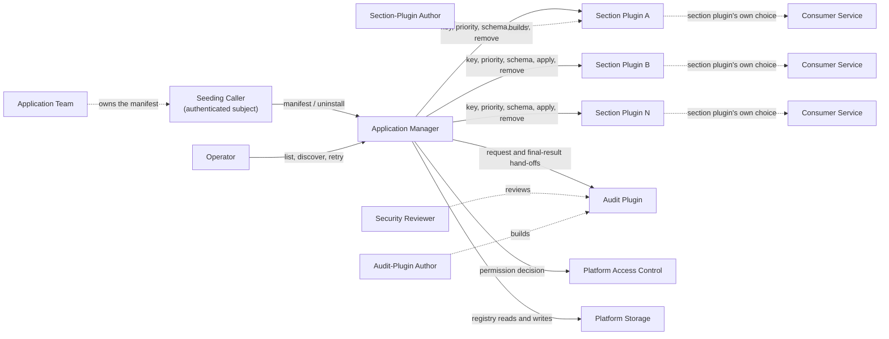

# PRD — Application Manager

The Application Manager must give every environment one trusted entry point where an application announces that it is installed, and must pass each part of that announcement to the section plugin that owns it. This PRD is written for platform product owners and for the application teams that seed their applications.

<!-- toc -->

- [1. Overview](#1-overview)
  - [1.1 Purpose](#11-purpose)
  - [1.2 Background / Problem Statement](#12-background--problem-statement)
  - [1.3 Goals (Business Outcomes)](#13-goals-business-outcomes)
  - [1.4 Glossary](#14-glossary)
- [2. Actors](#2-actors)
  - [2.1 Human Actors](#21-human-actors)
  - [2.2 System Actors](#22-system-actors)
  - [2.3 Actor Context](#23-actor-context)
- [3. Operational Concept & Environment](#3-operational-concept--environment)
  - [3.1 Gear-Specific Environment Constraints](#31-gear-specific-environment-constraints)
- [4. Scope](#4-scope)
  - [4.1 In Scope](#41-in-scope)
  - [4.2 Out of Scope](#42-out-of-scope)
- [5. Functional Requirements](#5-functional-requirements)
  - [5.1 Manifest and Validation](#51-manifest-and-validation)
  - [5.2 Dispatch and Outcomes](#52-dispatch-and-outcomes)
  - [5.3 Lifecycle and Registry](#53-lifecycle-and-registry)
  - [5.4 Discovery and Listing](#54-discovery-and-listing)
  - [5.5 Access Control and Audit](#55-access-control-and-audit)
- [6. Non-Functional Requirements](#6-non-functional-requirements)
  - [6.1 Gear-Specific NFRs](#61-gear-specific-nfrs)
  - [6.2 NFR Exclusions](#62-nfr-exclusions)
- [7. Public Library Interfaces](#7-public-library-interfaces)
  - [7.1 Public API Surface](#71-public-api-surface)
  - [7.2 External Integration Contracts](#72-external-integration-contracts)
- [8. Use Cases](#8-use-cases)
  - [First Seed](#first-seed)
  - [Re-Seed or Upgrade](#re-seed-or-upgrade)
  - [Retry After a Failed or Partly Failed Seed](#retry-after-a-failed-or-partly-failed-seed)
  - [Uninstall an Application](#uninstall-an-application)
  - [Discover Required Section Keys and Schemas](#discover-required-section-keys-and-schemas)
  - [List Seeded Applications](#list-seeded-applications)
  - [Add or Remove a Section Plugin](#add-or-remove-a-section-plugin)
  - [Record Audit Events Reliably](#record-audit-events-reliably)
- [9. Acceptance Criteria](#9-acceptance-criteria)
- [10. Dependencies](#10-dependencies)
- [11. Assumptions](#11-assumptions)
- [12. Risks](#12-risks)
- [13. Open Questions](#13-open-questions)
- [14. Traceability](#14-traceability)

<!-- /toc -->

<!--
=============================================================================
PRODUCT REQUIREMENTS DOCUMENT (PRD)
=============================================================================
PURPOSE: Define WHAT the system must do and WHY — business requirements,
functional capabilities, and quality attributes.

SCOPE:
  ✓ Business goals and success criteria
  ✓ Actors (users, systems) that interact with this gear
  ✓ Functional requirements (WHAT, not HOW)
  ✓ Non-functional requirements (quality attributes, SLOs)
  ✓ Scope boundaries (in/out of scope)
  ✓ Assumptions, dependencies, risks

NOT IN THIS DOCUMENT (see other templates):
  ✗ Stakeholder needs (managed at project/task level by steering committee)
  ✗ Technical architecture, design decisions → DESIGN.md
  ✗ Why a specific technical approach was chosen → ADR/
  ✗ Detailed implementation flows, algorithms → features/

STANDARDS ALIGNMENT:
  - IEEE 830 / ISO/IEC/IEEE 29148:2018 (requirements specification)
  - IEEE 1233 (system requirements)
  - ISO/IEC 15288 / 12207 (requirements definition)

REQUIREMENT LANGUAGE:
  - Use "MUST" or "SHALL" for mandatory requirements (implicit default)
  - Do not use "SHOULD" or "MAY" — use priority p2/p3 instead
  - Be specific and clear; no fluff, bloat, duplication, or emoji
=============================================================================
-->
## 1. Overview

### 1.1 Purpose

The Application Manager is a platform gear that learns which applications are installed in an environment. When an application is deployed, a seeding caller sends the Application Manager a manifest. A manifest is one document that describes the application and carries one section for each section plugin.

The Application Manager checks the whole manifest and then dispatches each section to the section plugin that owns it. It holds no domain logic: all domain logic and all rollback live in the section plugins. It also keeps a small registry of seeded applications. It hands every seed and uninstall request to an audit plugin, which is responsible for recording it.

### 1.2 Background / Problem Statement

An environment usually runs only a subset of all applications. Some services need to know which ones. A navigation menu is an illustration: it should show items only for applications that are installed. Today there is no single, trusted place where an application announces itself, so each service would need its own way to learn about installs.

Without a shared entry point, every application team must know every interested service and call each one differently. Failures are hard to trace, because there is no shared record of what each application sent and when. Adding a new kind of seeded data means changing every application's deployment process by hand.

The pain is easy to observe today. Answering "is application X installed here?" means checking each consumer service one by one, and their answers can disagree.

The Application Manager gives one door for this. The seeding caller sends one manifest. Section plugins decide what each part means and what to do with it. The platform gets one list of seeded applications and one audit trail, which the audit plugin owns.

Market positioning: not applicable, because this is an internal platform gear.

### 1.3 Goals (Business Outcomes)

Baseline today: there is no platform-wide record of which applications are installed, no shared entry point for seeding, no shared audit trail of what applications sent, and no shared description of what a seed must contain. Each goal is met when its success check holds at the first stable release of the gear, and it is checked again at every later release.

- **One record of installed applications.** Today: each consumer service learns about installs in its own way. Success check: every application deployed to an environment appears in the registry listing after its deploy, with the version it was deployed at.
- **An invalid manifest changes nothing.** Today: no shared check exists before data reaches the services that use it. Success check: for every request that ends as invalid manifest, no section plugin receives data.
- **Every seed and uninstall is traced.** Today: there is no shared record of what each application sent and when. Success check: every seed and uninstall request that reaches the system, including a failed one, is handed to the audit plugin, as `cpt-cf-application-manager-nfr-audit-completeness` measures.
- **One answer to "what is installed here?".** Today: an operator must check each consumer service one by one. Success check: an operator gets every seeded application with its version and how its last seed ended from the listing alone.
- **New kinds of seeded data need no gear change.** Today: a new kind of seeded data means changing every application's deployment process by hand. Success check: a section plugin is added and then removed with no change to the Application Manager's code, as `cpt-cf-application-manager-fr-plugin-extensibility` demonstrates.
- **Manifests can be built from discovery.** Today: a seeding team has no shared description of what to send. Success check: a manifest built only from the combined schema that discovery returns passes validation.
- **Failures are actionable.** Today: failures are hard to trace. Success check: every failed response states its outcome category and the outcome of each section, and an invalid-manifest response lists every problem with its location, so the caller need not consult the audit trail.

There is no formal user-satisfaction metric, because the user group is small, known, and internal.

### 1.4 Glossary

This glossary is canonical. The DESIGN links to it and adds only design-level terms.

| Term | Definition |
|------|------------|
| The system | The Application Manager gear described in this PRD. Requirements use "the system" as their subject. |
| PRD | Product requirements document: this document, which states what the system must do and why. |
| DESIGN | The design document for this gear (DESIGN.md), which states how the system meets this PRD. |
| ADR | Architecture decision record: a short document that records one design decision and the options it rejected. |
| API | Application programming interface: the defined way in which other software calls the system. |
| JSON | JavaScript Object Notation: a common text format for structured data. |
| UI | User interface: screens through which a person uses software. The system has none. |
| MFA | Multi-factor authentication: proving an identity with more than one kind of evidence. |
| SSO | Single sign-on: one login that gives access to several services. |
| SLA | Service level agreement: an agreed level of service, such as availability, and the support that backs it. |
| Application | A deployable unit that is seeded into the Application Manager. It has an application id and a version. |
| Application id | Any non-empty text within the stated limits (a configurable maximum length, no control characters) that names an application. The system never parses it, normalises it, or checks its format; it only checks whether two ids are equal, comparing the exact text. |
| Manifest | The whole document submitted for one application: an envelope plus its sections. |
| Envelope | The part of a manifest that names the application by its id and version. The Application Manager owns its rules. |
| Section | The part of a manifest meant for one section plugin. It is addressed by its section key. |
| Section key | The single key that one section plugin owns. Keys are read once, when the Application Manager starts. |
| Priority | A value that each section plugin announces at startup. It fixes the order of dispatch on seed and the order of removal on uninstall. No two section plugins share a priority. |
| Platform plugin model | The platform's standard way to register extensions that a gear calls. Section plugins and the audit plugin are built on it. |
| Plugin registration facility | The part of the platform plugin model through which the system finds its section plugins and its audit plugin, once, at startup. |
| Section plugin | An extension built on the platform plugin model that owns one section key and one priority, serves a schema for its section, and applies and removes sections. It owns all domain logic and any rollback. |
| Audit plugin | The extension built on the platform plugin model that receives the hand-offs for seed and uninstall requests and is responsible for recording them as audit events. It owns storage, retention, and any exposure of audit data. |
| Composite plugin | An extension that would host other section plugins, for example to roll back changes across them. It is out of scope. |
| Plugin call | Any call from the system to a section plugin or to the audit plugin, including a hand-off. |
| Time limit | The configured maximum wait for one plugin call. Operators set it through the time-limit setting; it is never hardcoded. |
| Seed / seeding | Submitting a manifest to the Application Manager. |
| Seeding caller | An authenticated subject, either a service or an operator, acting for an application. |
| Service subject | The identity that a non-human caller, such as a deployment job, uses when it authenticates with the platform. |
| Dispatch | Handing a section to its section plugin to apply, or asking a section plugin to remove an application. |
| Hand-off | One delivery from the system to the audit plugin. Each request has a request hand-off, made before any dispatch. If the audit plugin accepts it, the request later has a final-result hand-off, made once the outcome is decided. A hand-off is attempted when the system makes it, and accepted when the audit plugin confirms that it received it. The system attempts each hand-off exactly once and never retries it. |
| Audit event | The record that the audit plugin keeps for one seed or uninstall request. It is built from the request's hand-offs. |
| Schema | A machine-readable description of what a section must contain. Each section plugin serves its own. |
| Schema identity (fingerprint) | A short value that identifies exactly which schema was used to check a section, so that later readers can tell schemas apart. |
| Combined schema | The envelope schema with every section plugin's current schema placed under its section key. It describes a whole valid manifest. |
| Outcome category | The single overall result that the system reports for a request, such as succeeded or invalid manifest. |
| Registry | The system's record of seeded applications and of how and when each was last seeded. `cpt-cf-application-manager-fr-application-registry` states what it records. |
| Audit id | The identifier of the audit event for a request. An operator can use it to find the event through the audit plugin's own facilities, if the audit plugin offers any. |
| Idempotency | The property that repeating a request has the same effect as sending it once. Each section plugin decides whether its own handling is idempotent. |
| Opaque text | Text that the system stores and passes on but never interprets, parses, or sorts. |
| REST | Representational State Transfer: a common style of web interface in which callers read and change resources with standard requests. |
| Consumer service | A service that relies on data owned by a section plugin. The Application Manager does not know about it. |
| Platform-rejected request | A request that the platform turns away before it reaches the system: request protection such as body limits, content-type checks and throttling, and authentication, scope and license checks. The platform logs it. The system does not audit it. |
| Fail closed | Refusing a request when a required check cannot be answered, instead of letting it through. |
| Contract conformance test | A test that checks one side of a section plugin or audit plugin contract against the obligations of that contract. |

## 2. Actors

> **Note**: Stakeholder needs are managed at project/task level by steering committee. Document **actors** (users, systems) that interact with this gear.

### 2.1 Human Actors

#### Section-Plugin Author

**ID**: `cpt-cf-application-manager-actor-section-plugin-author`

- **Role**: Builds a section plugin that owns one section key and one priority, describes its section with a schema, and decides what applying and removing a section means.
- **Needs**: A clear contract for what the system sends and expects back, including how to choose a priority. Validation rules that behave the same whenever a section plugin is added or removed. Freedom to define its own re-seed, version, and rollback behaviour.

#### Audit-Plugin Author

**ID**: `cpt-cf-application-manager-actor-audit-plugin-author`

- **Role**: Builds the audit plugin that records audit events and decides storage, retention, and exposure.
- **Needs**: A well-defined audit event for each request. A clear obligation to record every event it receives. A clear rule on how sensitive content in that event may be exposed.

#### Operator

**ID**: `cpt-cf-application-manager-actor-operator`

- **Role**: Runs the platform, deploys section-plugin changes, and sets configuration such as the time-limit setting. Can also act as a seeding caller by hand, for example to retry a seed or to uninstall an application.
- **Needs**: To see which applications are seeded and how their last seed ended. To know which section keys a manifest needs. To retry safely after a failure. To get a clear signal when something in the gear fails.

#### Platform Product Owner / Application Team

**ID**: `cpt-cf-application-manager-actor-application-team`

- **Role**: Owns an application and its manifest, and decides when the application is seeded. Platform product owners use the listing to see what is installed in an environment.
- **Needs**: To learn which sections a manifest needs from the discovery output alone. To understand from a failed response what to fix. To see all installed applications in one place.

#### Security Reviewer

**ID**: `cpt-cf-application-manager-actor-security-reviewer`

- **Role**: Reviews who may seed and uninstall applications, and checks that audit data is complete and protected.
- **Needs**: Every audit event names the caller who made the request. Manifest content is not exposed by default. A clear statement of what data the gear holds and who owns it.

### 2.2 System Actors

#### Seeding Caller

**ID**: `cpt-cf-application-manager-actor-seeding-caller`

- **Role**: An authenticated subject, either a service or an operator, that acts for an application. It sends manifests and uninstall requests through the platform's standard authentication. The system trusts only what the platform's access rules allow this subject to do.
- **Direction**: The seeding caller calls the system. The system never calls the seeding caller.
- **Data exchanged**: The seeding caller sends manifests and uninstall requests, and it can read discovery and the listing when it is permitted to. For each seed or uninstall it receives one outcome category, the outcome of each section, and the audit id when the audit plugin accepted the request hand-off.
- **Availability**: The system does not depend on the seeding caller being available. A seeding caller that does not retry or re-seed leaves its application's registry entry as it was after its last request.

#### Platform Access Control

**ID**: `cpt-cf-application-manager-actor-platform-access-control`

- **Role**: The platform service that authenticates callers and holds the platform's access rules. Authentication happens before a request reaches the system. The system asks platform access control for a permission decision on every request.
- **Direction**: The system calls platform access control. Platform access control never calls the system.
- **Data exchanged**: The system sends the authenticated caller subject and the action: seed, uninstall, listing, or schema reading. Platform access control returns whether the caller is permitted.
- **Availability**: If it cannot answer, the system fails closed: the request ends as temporarily unavailable, and no section plugin is called. See `cpt-cf-application-manager-fr-dependency-failures`.

#### Platform Storage

**ID**: `cpt-cf-application-manager-actor-platform-storage`

- **Role**: The platform storage service that holds the registry. It holds no section content and no manifests.
- **Direction**: The system reads and writes registry entries in platform storage. Platform storage never calls the system.
- **Data exchanged**: Registry entries, as `cpt-cf-application-manager-fr-application-registry` describes.
- **Availability**: If it cannot answer before dispatch, seed, uninstall, and listing requests end as temporarily unavailable, and nothing is dispatched. If it fails after a seed was dispatched, the outcome is the one that `cpt-cf-application-manager-fr-dependency-failures` states.

#### Section Plugin

**ID**: `cpt-cf-application-manager-actor-section-plugin`

- **Role**: Owns one section key and one priority, and carries all domain logic for its section.
- **Direction**: The Application Manager calls the section plugin. The section plugin never calls the Application Manager.
- **Data exchanged**: At startup the system reads its key and priority. The system fetches its schema on every seed and on schema discovery. It dispatches the section plugin's own section together with the envelope, and asks it to remove an application on uninstall. The section plugin returns success, rejected, not permitted, or internal failure.
- **Availability**: If it cannot serve its schema, the request ends as temporarily unavailable and nothing is dispatched. If it fails or exceeds the time limit during dispatch, its section ends as an internal failure, and the remaining sections still go ahead.

#### Audit Plugin

**ID**: `cpt-cf-application-manager-actor-audit-plugin`

- **Role**: Receives the request hand-off of every seed and uninstall request that reaches the system, and later its final-result hand-off, and records them as one audit event per request. Exactly one audit plugin is in use.
- **Direction**: The Application Manager calls the audit plugin. The audit plugin never calls the Application Manager.
- **Data exchanged**: Through the two hand-offs, the system passes the audit event content described in `cpt-cf-application-manager-fr-audit-event`. The audit plugin returns an audit id when it accepts the request hand-off.
- **Availability**: If it cannot accept a request hand-off, nothing is dispatched, and the request ends as `cpt-cf-application-manager-fr-audit-ordering` states: temporarily unavailable, unless it was already decided as not permitted or not found, which keeps that category. If it cannot accept a final-result hand-off, the caller still gets the result and the failure is logged.

#### Consumer Service

**ID**: `cpt-cf-application-manager-actor-consumer-service`

- **Role**: An abstract service that relies on data about installed applications. A navigation menu that shows items only for installed applications is an illustration only. The Application Manager is not aware of consumer services, and they never call it. Only section plugins deal with them.

### 2.3 Actor Context

The diagram shows how the actors relate. Solid arrows are calls. Dotted arrows are relationships outside the Application Manager. The Application Manager never calls a consumer service.

## 3. Operational Concept & Environment

> **Note**: Runtime, OS, architecture, lifecycle policy, and integration patterns are defined once at the project/foundational level, not per gear. Foundational sources for this repository: [Architecture Manifest](../../../../docs/ARCHITECTURE_MANIFEST.md) and the [security guidelines](../../../../guidelines/SECURITY.md). This gear has no parent gear with its own PRD.

### 3.1 Gear-Specific Environment Constraints

**Scope and state**

- The Application Manager works platform-wide. The whole environment shares one set of seeded applications, with no per-tenant view.
- The set of section keys is small and bounded. It is fixed each time the Application Manager starts. Adding or removing a section plugin needs a redeploy that restarts the Application Manager.
- The Application Manager keeps only its own registry. Section data belongs to the section plugins, and audit data belongs to the audit plugin.

**Authentication and users**

- Every actor, including an operator acting by hand, reaches the gear only as an authenticated subject through the platform's standard authentication pipeline. The gear has no login of its own.
- Platform-rejected requests, such as unauthenticated requests, requests over the body limit or with a wrong content type, throttled requests, and requests that fail scope or license checks, are turned away before they reach the Application Manager. The platform logs them, and they are not audited.
- Users are developers and operators who already know the platform. The interfaces are machine-facing, with no end-user screens.

**Data classification and stewardship**

- The registry records only which applications are seeded, at which version, and how and when each was last seeded. None of this is sensitive, and none of it is personal data.
- Manifests are potentially sensitive. Section content is defined by section plugins, so the Application Manager cannot classify it.
- The system **MUST** state, as a rule of the seeding interface, that manifests must not carry secrets, such as passwords or keys. Manifests are also not expected to carry personal data. The system cannot detect either, so keeping them out is each seeding team's responsibility.
- Caller subjects are identifiers of services or people. They are not credentials. A caller subject that identifies a person is personal data, and every audit event carries one. It is the only personal data that the gear is expected to handle.
- The Application Manager only passes sections through. Section plugins own section data. The audit plugin owns audit events, including the manifests and caller subjects in them. The system owns only the registry.
- Each data owner handles erasure and data-subject requests for its own data: the audit plugin for audit events, each section plugin for its own data, and the system for the registry, which holds no personal data.
- Cross-border transfer and data residency follow the platform baseline. The system adds no transfer of its own beyond passing data to the section plugins and the audit plugin.
- The system **MUST NOT** write manifest content into its own logs, diagnostics, or error text. Only the audit plugin keeps manifest content.
- Audit content exists only for tracing and investigating seed and uninstall requests.
- Uninstall does not remove audit events. How long they are kept is the audit plugin's policy.

**Formats and standards**

- Manifests are structured JSON documents. Section schemas use JSON Schema, a standard way to describe what a JSON document must contain.
- A changed section-plugin schema applies from the next seed. Existing registry entries are not checked again.
- Applicable standards are JSON Schema and the platform baselines linked above.

**Capacity profile**

- The registry grows by one entry per seeded application.
- Audit volume grows by one event per request, and each event carries a full manifest.
- Manifests are small documents sent at deploy time.
- The main burst is an environment-wide re-seed after a section-plugin change.
- Concurrent seeds of different applications are supported. Concurrent seeds and uninstalls of the same application are also accepted: the system adds no coordination, each request runs its full flow and is audited, each section plugin decides how it handles concurrent requests for the same application, and the registry keeps the result of whichever request wrote last (see section 13, which links to the design decision).
- Seasonal or historical load data: not applicable, because the gear is new and its load follows deploy events.

## 4. Scope

### 4.1 In Scope

- A manifest format made of an envelope and one required section per registered section key.
- Checking the whole manifest before any section plugin receives data.
- Dispatch of sections one at a time in section-plugin priority order, continuing after failures.
- Uninstall of an application by its id, in the same priority order.
- Startup checks on section keys, priorities, the audit plugin, and settings.
- A registry of seeded applications and a way to list them.
- A discovery view of the current section keys and their schemas.
- Clear outcome categories for every seed and uninstall request.
- Handing every seed and uninstall request that reaches the system, and its final result, to the audit plugin.
- Access control on seed, uninstall, listing, and schema discovery.

### 4.2 Out of Scope

- Kubernetes and deployment tooling. A seeding job or an operator is only an example of a caller.
- Credential provisioning for seeding callers.
- A login of the gear's own. Authentication belongs to the platform.
- Any rollback that spans several section plugins. That would need a composite plugin, which is out of scope.
- Per-tenant installs.
- Giving meaning to versions or to re-seeds. The system treats the version as opaque text and passes sections through unchanged.
- Reading or exposing audit data. The audit plugin decides whether and how audit data is exposed.
- Direct calls from consumer services to the Application Manager.
- Default sections or grace periods for a newly added section key.
- A prescribed rollout order for adding or removing section plugins.
- Replaying or driving re-seeds. Each application's seeding caller is responsible for re-seeding.

## 5. Functional Requirements

> **Testing strategy**: All requirements verified via automated tests (unit, integration, e2e) targeting 90%+ code coverage unless otherwise specified. Document verification method only for non-test approaches (analysis, inspection, demonstration).

### 5.1 Manifest and Validation

#### Manifest Envelope

- [ ] `p1` - **ID**: `cpt-cf-application-manager-fr-manifest-envelope`

The system **MUST** accept a manifest made of an envelope and a set of sections. The system **MUST** require the envelope to carry an application id and a non-empty version, and **MUST** treat a manifest whose id or version is missing or empty as invalid. The system **MUST** own and enforce the envelope rules.

- **Rationale**: One predictable shape lets every seeding caller and every section plugin rely on the same identity for an application.
- **Actors**: `cpt-cf-application-manager-actor-seeding-caller`, `cpt-cf-application-manager-actor-application-team`

#### Opaque Application Id

- [ ] `p1` - **ID**: `cpt-cf-application-manager-fr-application-id`

The system **MUST** accept any non-empty text within the stated limits (maximum length, no control characters) as an application id and as a version. It **MUST NOT** parse the id, normalise it, or check its format, and **MUST** only check whether two ids are equal by their exact text, for example to find a registry entry. The system **MUST** treat a manifest with an empty id, or with an id or version beyond the limits, as invalid. The maximum length is a configurable setting. The system **MUST** check these limits before any hand-off to the audit plugin.

- **Rationale**: Application teams already have their own names. Treating the id as opaque avoids a second naming scheme.
- **Actors**: `cpt-cf-application-manager-actor-seeding-caller`, `cpt-cf-application-manager-actor-application-team`
- **Depends on**: `cpt-cf-application-manager-fr-manifest-envelope`
- **Verification Method**: Inspection of the envelope rules, plus tests with ids of unusual shape.

#### Opaque Version

- [ ] `p1` - **ID**: `cpt-cf-application-manager-fr-opaque-version`

The system **MUST** treat the application version as opaque text. It **MUST NOT** parse, compare, or sort versions. It **MUST** pass the version to section plugins on seed and on uninstall, and include it in the audit event.

- **Rationale**: Only a section plugin knows what a version means for its data.
- **Actors**: `cpt-cf-application-manager-actor-seeding-caller`, `cpt-cf-application-manager-actor-section-plugin`
- **Depends on**: `cpt-cf-application-manager-fr-manifest-envelope`
- **Verification Method**: Inspection of the envelope rules, plus tests that seed versions of any shape in any order.

#### Required Sections

- [ ] `p1` - **ID**: `cpt-cf-application-manager-fr-required-sections`

The system **MUST** require a section for every registered section key. The system **MUST** treat a manifest with a missing section as invalid as a whole, and **MUST** name the missing keys in the result and in the audit event. The system **MUST** also treat as invalid as a whole a manifest that carries a section key no section plugin owns. When no section plugin is registered, a valid manifest has an empty set of sections.

- **Rationale**: Strict rules keep every section plugin in step with every application and make a wrong manifest visible at once.
- **Actors**: `cpt-cf-application-manager-actor-seeding-caller`, `cpt-cf-application-manager-actor-section-plugin-author`
- **Depends on**: `cpt-cf-application-manager-fr-unique-section-keys`

#### Unique Section Keys

- [ ] `p1` - **ID**: `cpt-cf-application-manager-fr-unique-section-keys`

At startup, the system **MUST** read one section key from each section plugin, and **MUST** map each key to exactly one section plugin. If two section plugins claim the same key, the system **MUST** fail to start. The system **MUST** keep the key set the same until the next start.

- **Rationale**: A key that maps to one section plugin keeps routing clear, and conflicts show up at deploy time rather than at seed time.
- **Actors**: `cpt-cf-application-manager-actor-section-plugin`, `cpt-cf-application-manager-actor-section-plugin-author`, `cpt-cf-application-manager-actor-operator`

#### Section Plugin Priority

- [ ] `p1` - **ID**: `cpt-cf-application-manager-fr-section-priority`

At startup, the system **MUST** read one priority from each section plugin. The system **MUST** use the priority to fix the dispatch order on seed and the removal order on uninstall, from the lowest priority value to the highest. If two section plugins announce the same priority, the system **MUST** fail to start. The system **MUST** treat any change of order caused by a priority change as intentional.

- **Rationale**: A fixed, announced order makes dispatch predictable and lets section-plugin authors decide which section plugin goes first.
- **Actors**: `cpt-cf-application-manager-actor-section-plugin`, `cpt-cf-application-manager-actor-section-plugin-author`, `cpt-cf-application-manager-actor-operator`

#### Startup Checks

- [ ] `p1` - **ID**: `cpt-cf-application-manager-fr-startup-checks`

The system **MUST** fail to start in each of these cases:

- the plugin registration facility cannot be reached;
- a section plugin cannot report its section key or its priority;
- two section plugins claim the same section key or the same priority;
- no audit plugin is available;
- more than one audit plugin is registered;
- the time-limit setting, or another required setting, is missing or invalid;
- the platform root tenant cannot be determined;
- a section key does not follow the stated token pattern (see `cpt-cf-application-manager-contract-section-plugin`).

If the plugin registration facility answers and reports no section plugins, the system **MUST** start with an empty set of section keys. The system **MUST NOT** treat an unreachable plugin registration facility as an empty set of section plugins.

- **Rationale**: Configuration problems must show up at deploy time, when an operator is watching, and not later at seed time.
- **Actors**: `cpt-cf-application-manager-actor-operator`, `cpt-cf-application-manager-actor-section-plugin`, `cpt-cf-application-manager-actor-audit-plugin`
- **Depends on**: `cpt-cf-application-manager-fr-unique-section-keys`, `cpt-cf-application-manager-fr-section-priority`, `cpt-cf-application-manager-fr-audit-plugin`, `cpt-cf-application-manager-fr-bounded-plugin-calls`

#### Per-Seed Schema Fetch and Whole-Manifest Validation

- [ ] `p1` - **ID**: `cpt-cf-application-manager-fr-validate-before-dispatch`

On every seed request, the system **MUST** fetch the current schema from every section plugin, without reusing earlier answers. It **MUST** then validate the whole manifest: the envelope, and each section against its section plugin's schema. If any part is invalid, the system **MUST NOT** dispatch anything to any section plugin. The system **MUST** list every problem with its location in the manifest in the result.

- **Rationale**: Validating everything first prevents half-applied installs caused by a bad manifest. Fetching schemas each time lets section plugins change their schema without a restart.
- **Actors**: `cpt-cf-application-manager-actor-seeding-caller`, `cpt-cf-application-manager-actor-section-plugin`
- **Depends on**: `cpt-cf-application-manager-fr-required-sections`, `cpt-cf-application-manager-fr-plugin-served-schemas`
- **Verification Method**: Tests that count dispatches for invalid manifests.

#### Section Schema Ownership

- [ ] `p1` - **ID**: `cpt-cf-application-manager-fr-plugin-served-schemas`

The system **MUST** treat each section plugin as the only source of the schema for its section. The system **MUST NOT** keep its own copy of a section's rules. The system **MUST** apply a schema change made by a section plugin from the next seed, and **MUST NOT** check existing registry entries again.

- **Rationale**: The section plugin knows its domain. Keeping the rules in one place avoids drift between the schema and the behaviour.
- **Actors**: `cpt-cf-application-manager-actor-section-plugin`, `cpt-cf-application-manager-actor-section-plugin-author`
- **Verification Method**: Inspection of the system's configuration and public surface: no section rules are held outside the section plugins.

#### Section-Plugin-Driven Extensibility

- [ ] `p1` - **ID**: `cpt-cf-application-manager-fr-plugin-extensibility`

The system **MUST** let a kind of seeded data be added or removed only by adding or removing a section plugin, with no change to the system's own code.

- **Rationale**: New kinds of seeded data must not wait for a change to a shared gear.
- **Actors**: `cpt-cf-application-manager-actor-section-plugin-author`, `cpt-cf-application-manager-actor-operator`
- **Depends on**: `cpt-cf-application-manager-fr-unique-section-keys`, `cpt-cf-application-manager-fr-plugin-served-schemas`
- **Verification Method**: Demonstration: a test section plugin is added and then removed, with no change to the system's code.

### 5.2 Dispatch and Outcomes

#### Ordered Dispatch That Continues Past Failures

- [ ] `p1` - **ID**: `cpt-cf-application-manager-fr-ordered-dispatch`

After validation succeeds, the system **MUST** dispatch sections to their section plugins one at a time, in section-plugin priority order. The system **MUST** keep dispatching the remaining sections after a section plugin fails. The system **MUST** record the outcome of each section.

- **Rationale**: One failing section plugin must not stop the others from receiving data. Dispatching one at a time keeps behaviour easy to follow and audit.
- **Actors**: `cpt-cf-application-manager-actor-seeding-caller`, `cpt-cf-application-manager-actor-section-plugin`
- **Depends on**: `cpt-cf-application-manager-fr-validate-before-dispatch`, `cpt-cf-application-manager-fr-section-priority`

#### Section Dispatch Without Interpretation

- [ ] `p1` - **ID**: `cpt-cf-application-manager-fr-pass-through`

The system **MUST** give each section plugin only its own section, with the same content the caller sent, together with the envelope. Same content means the same data, even if formatting such as spacing or key order differs. The system **MUST NOT** compare, merge, or keep history of sections between seeds, and **MUST NOT** keep any per-section state. The audit plugin's copy of the manifest is the only copy that is kept.

- **Rationale**: Domain meaning belongs to section plugins. Passing data through unchanged keeps the Application Manager free of domain logic.
- **Actors**: `cpt-cf-application-manager-actor-section-plugin`, `cpt-cf-application-manager-actor-section-plugin-author`
- **Verification Method**: Contract conformance test that compares what a section plugin receives with what the caller sent, plus inspection of the registry content.

#### Section-Plugin-Owned Rollback and Re-Seed Semantics

- [ ] `p1` - **ID**: `cpt-cf-application-manager-fr-plugin-owned-semantics`

The system **MUST** leave rollback, replace-or-update behaviour, idempotency, and version rules to the section plugins. The system **MUST** validate, dispatch, and audit every seed on its own. The system **MUST NOT** undo anything after a failed dispatch.

- **Rationale**: Only the section plugin knows what re-seeding or undoing means for its data. Rollback across section plugins would need a composite plugin, which is out of scope.
- **Actors**: `cpt-cf-application-manager-actor-section-plugin-author`
- **Verification Method**: Tests showing that a failed dispatch is followed by no further call to that section plugin for that request.

#### Caller-Visible Outcome Categories

- [ ] `p1` - **ID**: `cpt-cf-application-manager-fr-outcome-categories`

The system **MUST** report every seed and uninstall request as exactly one of these outcome categories:

- succeeded: every section, or every section plugin for uninstall, succeeded;
- invalid manifest: the manifest failed validation, and nothing was dispatched;
- plugin rejected: at least one section plugin refused its section as unacceptable;
- not permitted: before dispatch, platform access control refused the caller; or, after dispatch, a section plugin refused because the caller lacks an extra permission;
- not found: an uninstall named an unknown application, and no section plugin was called;
- internal failure: at least one section plugin failed unexpectedly or exceeded the time limit, or, after a seed was dispatched, the system could not update the registry (see `cpt-cf-application-manager-fr-dependency-failures`), or, after an accepted uninstall, the system could not delete the registry entry;
- temporarily unavailable: before dispatch, platform access control, registry storage, the audit plugin for the request hand-off, or a section plugin's schema could not be reached; nothing was dispatched, and the caller can retry.

When more than one category applies, `cpt-cf-application-manager-fr-outcome-precedence` decides which one is reported. Platform-rejected requests never reach the system, so they get none of these categories.

- **Rationale**: Callers need to tell "fix my manifest" from "try again later" from "ask for access".
- **Actors**: `cpt-cf-application-manager-actor-seeding-caller`, `cpt-cf-application-manager-actor-operator`

#### Outcome Precedence

- [ ] `p1` - **ID**: `cpt-cf-application-manager-fr-outcome-precedence`

Before dispatch, the system **MUST** apply the categories in this order, and **MUST** let the first match decide the outcome:

1. temporarily unavailable, because platform access control cannot answer, or registry storage cannot answer for a permitted caller;
2. not permitted by platform access control;
3. not found, for uninstall only;
4. temporarily unavailable, because the audit plugin cannot accept the request hand-off or, for seed only, a section plugin cannot serve its schema;
5. invalid manifest, for seed only.

This order ranks categories only. Which requests are handed to the audit plugin, and when, is set by `cpt-cf-application-manager-fr-audit-ordering`.

After dispatch, when section plugins fail in different ways, the system **MUST** report not permitted first, then plugin rejected, then internal failure.

- **Rationale**: A fixed order gives the same answer in the same situation and points the caller to the most important fix first. A caller is never told "not permitted" or "not found" when the system could not check permission or the registry. Registry storage is consulted only for a permitted caller, so a refused caller ends as not permitted even when registry storage is down.
- **Actors**: `cpt-cf-application-manager-actor-seeding-caller`, `cpt-cf-application-manager-actor-operator`
- **Depends on**: `cpt-cf-application-manager-fr-outcome-categories`, `cpt-cf-application-manager-fr-audit-ordering`

#### Response Content

- [ ] `p1` - **ID**: `cpt-cf-application-manager-fr-response-content`

The system **MUST** include in every response to a seed or uninstall request the outcome category and the outcome of each section, or of each section plugin for uninstall. The system **MUST** include the audit id whenever the audit plugin accepted the request hand-off. The system **MUST** make every failed response tell the caller what to fix, retry, or request, without the caller consulting the audit trail.

- **Rationale**: Per-section results let callers act on partial failures, and the audit id links the response to the audit trail.
- **Actors**: `cpt-cf-application-manager-actor-seeding-caller`, `cpt-cf-application-manager-actor-operator`, `cpt-cf-application-manager-actor-application-team`
- **Depends on**: `cpt-cf-application-manager-fr-outcome-categories`, `cpt-cf-application-manager-fr-audit-event`

#### Bounded Plugin Calls

- [ ] `p1` - **ID**: `cpt-cf-application-manager-fr-bounded-plugin-calls`

The system **MUST** apply one configurable time limit to every plugin call, including hand-offs to the audit plugin. The system **MUST** end a plugin call that exceeds the time limit as follows:

- schema fetch: the request is temporarily unavailable, and nothing is dispatched;
- section dispatch or removal: that section is an internal failure, audited as a timeout, and the remaining section plugins are still called;
- request hand-off: the audit plugin is treated as unable to accept it, and the request ends as `cpt-cf-application-manager-fr-audit-ordering` states, with nothing dispatched;
- final-result hand-off: the caller still gets the result, and the failure is logged.

The system **MUST NOT** cancel or undo work that a section plugin has already started.

- **Rationale**: One slow section plugin or a slow audit plugin must not hang a whole request, and operators must be able to tune the time limit.
- **Actors**: `cpt-cf-application-manager-actor-operator`, `cpt-cf-application-manager-actor-section-plugin`, `cpt-cf-application-manager-actor-audit-plugin`
- **Verification Method**: Tests with test section plugins and a test audit plugin that exceed the time limit, plus inspection that the section plugin contract offers no cancel or undo operation.

#### Dependency Failures at Run Time

- [ ] `p1` - **ID**: `cpt-cf-application-manager-fr-dependency-failures`

The system **MUST** fail closed when platform access control cannot answer: it **MUST** refuse the request as temporarily unavailable and **MUST NOT** call any section plugin.

The system **MUST** establish that registry storage can answer before it dispatches anything for a seed or an uninstall. When registry storage cannot answer, the system **MUST** end a seed, uninstall, or listing request as temporarily unavailable and **MUST NOT** dispatch anything.

When a seed has already been dispatched and the system then cannot create or update its registry entry, the system **MUST NOT** report temporarily unavailable, because sections were dispatched. The system **MUST** instead:

- count the registry failure as an internal failure, ranked by the after-dispatch order in `cpt-cf-application-manager-fr-outcome-precedence`;
- return the outcome of each section and state that the registry was not updated;
- include the registry failure in the final-result hand-off, and log it.

Seeding the application again repairs its registry entry, as `cpt-cf-application-manager-nfr-recovery` states. Where the pre-dispatch outcomes in this requirement rank against other categories is set by `cpt-cf-application-manager-fr-outcome-precedence`.

- **Rationale**: An outage of a platform service must never let a request through unchecked or leave half-applied changes. When storage fails only after dispatch, the caller must still learn what each section plugin did.
- **Actors**: `cpt-cf-application-manager-actor-seeding-caller`, `cpt-cf-application-manager-actor-operator`, `cpt-cf-application-manager-actor-platform-access-control`, `cpt-cf-application-manager-actor-platform-storage`
- **Depends on**: `cpt-cf-application-manager-fr-outcome-categories`, `cpt-cf-application-manager-fr-outcome-precedence`
- **Verification Method**: Tests that make each dependency unavailable in turn and count section-plugin calls, plus a test in which registry storage fails after a seed is dispatched.

### 5.3 Lifecycle and Registry

#### Uninstall

- [ ] `p1` - **ID**: `cpt-cf-application-manager-fr-uninstall`

The system **MUST** let an authorized caller uninstall an application by its id. The system **MUST** accept an uninstall only when platform access control permits the caller, the application is in the registry, and the audit plugin has accepted the request hand-off.

Once the uninstall is accepted, the system **MUST** delete the registry entry, whatever the section plugins return, including when a section plugin refuses as not permitted. It **MUST** then ask every registered section plugin to remove the application, one at a time in the same priority order as seed dispatch, and continue after failures. It **MUST** pass the last seeded version to the section plugins. The system **MUST** report section-plugin outcomes only in the response and the audit event. If the system cannot delete the registry entry after the uninstall was accepted, it **MUST** still ask every section plugin to remove the application in priority order, count the delete failure as an internal failure ranked by the after-dispatch order in `cpt-cf-application-manager-fr-outcome-precedence`, include it in the final-result hand-off, and log it; uninstalling again completes the delete.

For an uninstall that is not accepted, the system **MUST** leave the registry unchanged and **MUST NOT** call any section plugin.

- **Rationale**: Retiring an application must clean up every section plugin's data from a single request.
- **Actors**: `cpt-cf-application-manager-actor-seeding-caller`, `cpt-cf-application-manager-actor-operator`, `cpt-cf-application-manager-actor-section-plugin`
- **Depends on**: `cpt-cf-application-manager-fr-section-priority`, `cpt-cf-application-manager-fr-application-registry`, `cpt-cf-application-manager-fr-audit-ordering`

#### Application Registry

- [ ] `p1` - **ID**: `cpt-cf-application-manager-fr-application-registry`

The system **MUST** keep a registry that records each seeded application, the version it was last seeded with, how its last seed ended, and when. The system **MUST** link each registry entry to the audit event of that application's last seed.

The system **MUST** create or update the entry for every seed that passes validation, whatever the dispatch outcome. This includes a seed in which a section plugin refused as not permitted. The system **MUST** record how the last seed ended as one of:

- succeeded;
- partially failed, when at least one section succeeded and at least one failed;
- the winning failure category after dispatch, when no section succeeded.

If the system cannot write the entry after dispatch, the outcome is the one that `cpt-cf-application-manager-fr-dependency-failures` states.

The system **MUST NOT** change the registry for any request that ends before dispatch: temporarily unavailable, not permitted by platform access control, not found, or invalid manifest. Platform-rejected requests never reach the system.

- **Rationale**: Product owners need a reliable list of what is installed and how the last seed ended.
- **Actors**: `cpt-cf-application-manager-actor-operator`, `cpt-cf-application-manager-actor-application-team`, `cpt-cf-application-manager-actor-seeding-caller`, `cpt-cf-application-manager-actor-platform-storage`
- **Verification Method**: Tests that compare the registry before and after each outcome that ends before dispatch.

#### Retry After Failure

- [ ] `p2` - **ID**: `cpt-cf-application-manager-fr-retry`

The system **MUST** let a caller retry a failed or partly failed seed by seeding again. The system **MUST** let a caller retry a failed uninstall by seeding the application again and then uninstalling it again.

- **Rationale**: The Application Manager keeps no history of applied state, so a fresh seed is the simple and predictable way to recover.
- **Actors**: `cpt-cf-application-manager-actor-seeding-caller`, `cpt-cf-application-manager-actor-operator`
- **Depends on**: `cpt-cf-application-manager-fr-application-registry`, `cpt-cf-application-manager-fr-uninstall`

#### Validation Rules When Section Plugins Change

- [ ] `p2` - **ID**: `cpt-cf-application-manager-fr-plugin-rollout`

When a section plugin is added or removed, the system **MUST** apply only its normal validation rules, with no default sections and no grace period:

- a manifest that lacks the section of a newly added section plugin is invalid;
- a manifest that still carries the section of a removed section plugin is invalid.

The system **MUST NOT** fill in sections, replay seeds, or drive re-seeds. Re-seeding is the responsibility of each application's seeding caller. This PRD prescribes no rollout order, and any data held by a removed section plugin is that section plugin's concern.

- **Rationale**: The same strict rules in every situation avoid silent gaps in section-plugin data and keep re-seeding with the team that owns each application.
- **Actors**: `cpt-cf-application-manager-actor-section-plugin-author`, `cpt-cf-application-manager-actor-seeding-caller`, `cpt-cf-application-manager-actor-operator`
- **Depends on**: `cpt-cf-application-manager-fr-required-sections`, `cpt-cf-application-manager-fr-unique-section-keys`
- **Verification Method**: Inspection of the public surface: no operation fills in sections, replays seeds, or starts a re-seed.

### 5.4 Discovery and Listing

#### Discovery of Section Keys and Schemas

- [ ] `p1` - **ID**: `cpt-cf-application-manager-fr-discovery`

The system **MUST** let an authorized caller:

- list the current section keys, without any plugin call;
- read the current schema for one section key;
- read the combined schema for a whole manifest.

The system **MUST** serve schemas live from the section plugins. If the section plugin for a key cannot answer, the system **MUST** end the read of that schema as temporarily unavailable. If any one section plugin cannot answer, the system **MUST** end the read of the combined schema as temporarily unavailable.

- **Rationale**: Application teams need to know what to put in a manifest before they seed.
- **Actors**: `cpt-cf-application-manager-actor-seeding-caller`, `cpt-cf-application-manager-actor-application-team`, `cpt-cf-application-manager-actor-operator`
- **Depends on**: `cpt-cf-application-manager-fr-plugin-served-schemas`, `cpt-cf-application-manager-fr-unique-section-keys`

#### Listing Seeded Applications

- [ ] `p2` - **ID**: `cpt-cf-application-manager-fr-list-applications`

The system **MUST** let an authorized caller list seeded applications with their versions, how each last seed ended, and when, without any plugin call.

- **Rationale**: Product owners and operators need a quick answer to "what is installed here?".
- **Actors**: `cpt-cf-application-manager-actor-operator`, `cpt-cf-application-manager-actor-application-team`
- **Depends on**: `cpt-cf-application-manager-fr-application-registry`

### 5.5 Access Control and Audit

#### Caller Authentication

- [ ] `p1` - **ID**: `cpt-cf-application-manager-fr-authentication`

The system **MUST** accept requests only from subjects authenticated through the platform's standard authentication pipeline. It **MUST NOT** offer a bypass, a shared secret, or a login of its own. This applies to every actor, including an operator acting by hand.

- **Rationale**: Seeding changes what other services believe is installed, so every request must be traceable to a known subject.
- **Actors**: `cpt-cf-application-manager-actor-seeding-caller`, `cpt-cf-application-manager-actor-operator`, `cpt-cf-application-manager-actor-security-reviewer`
- **Verification Method**: Inspection of the public surface: no route or setting skips platform authentication.

#### Caller Authorization

- [ ] `p1` - **ID**: `cpt-cf-application-manager-fr-authorization`

The system **MUST** check the platform's access rules separately for seed, uninstall, listing, and schema reading. The system **MUST** check seed and uninstall as separate permissions. The system **MUST** let a section plugin that needs an extra permission refuse a request as not permitted.

- **Rationale**: Seeding and uninstalling change what other services believe is installed, so they must be tightly controlled.
- **Actors**: `cpt-cf-application-manager-actor-seeding-caller`, `cpt-cf-application-manager-actor-operator`, `cpt-cf-application-manager-actor-section-plugin`, `cpt-cf-application-manager-actor-platform-access-control`
- **Depends on**: `cpt-cf-application-manager-fr-authentication`

#### Audit Event Per Request

- [ ] `p1` - **ID**: `cpt-cf-application-manager-fr-audit-event`

For every seed and uninstall request that reaches the system, the system **MUST** pass the audit plugin, through the request hand-off and the final-result hand-off, the content of one audit event. This includes requests that end as not permitted, not found, invalid manifest, or temporarily unavailable. `cpt-cf-application-manager-fr-audit-ordering` states when each hand-off is made. The system **MUST** cover these content categories in the audit event:

- request identity and receive time;
- the caller subject;
- the application id and version;
- the validation result, with any problems found;
- per-section outcomes, including the schema identity used for each section;
- the overall result;
- the full manifest as sent.

Privacy by design applies, because a caller subject can identify a person. The full manifest is kept on purpose: it is the only record of what an application sent, and the system cannot tell which section content matters for tracing, because it never interprets sections. Manifests must not carry secrets and are not expected to carry personal data (see section 3.1), so the caller subject is the only personal data expected in an audit event. Pseudonymization is not applicable beyond that: how caller subjects are stored, pseudonymized, or erased is the audit plugin's concern. Purpose limitation, exposure that is off by default, and retention are covered by section 3.1, `cpt-cf-application-manager-fr-audit-exposure`, and `cpt-cf-application-manager-contract-audit-plugin`.

- **Rationale**: A complete trail lets teams answer what was sent, by whom, and what each section plugin did.
- **Actors**: `cpt-cf-application-manager-actor-audit-plugin`, `cpt-cf-application-manager-actor-audit-plugin-author`, `cpt-cf-application-manager-actor-security-reviewer`

#### Audit Before and After Dispatch

- [ ] `p1` - **ID**: `cpt-cf-application-manager-fr-audit-ordering`

The system **MUST** attempt the request hand-off for every seed and uninstall request that reaches the system. This includes a request already decided before the hand-off as temporarily unavailable, because platform access control or registry storage could not answer, as not permitted by platform access control, or as not found. A request that reaches a replica before it is ready to serve is a request whose request hand-off was not accepted: it counts as attempted and not accepted, the failure is logged, and it ends as temporarily unavailable. The system **MUST NOT** dispatch anything unless the audit plugin has accepted the request hand-off.

If the audit plugin cannot accept the request hand-off, the system **MUST**:

- keep the category of a request already decided as temporarily unavailable, not permitted, or not found;
- end any other request as temporarily unavailable;
- dispatch nothing, return no audit id, and log the failed hand-off.

For every request whose request hand-off was accepted, the system **MUST** attempt the final-result hand-off once the outcome is decided. This includes requests that end without dispatch: not permitted, not found, invalid manifest, and temporarily unavailable, for example because a schema could not be served. If the final-result hand-off fails, the system **MUST** still return the result to the caller and **MUST** log the failure. Recording remains the audit plugin's obligation.

- **Rationale**: Handing the request over first means no change happens without a trace. A final-result hand-off for every accepted request closes each audit event. A failed final-result hand-off must not hide a result the caller needs.
- **Actors**: `cpt-cf-application-manager-actor-audit-plugin`, `cpt-cf-application-manager-actor-seeding-caller`
- **Depends on**: `cpt-cf-application-manager-fr-audit-event`
- **Verification Method**: Tests with a test audit plugin that refuses hand-offs, counting section-plugin calls.

#### Single Audit Hand-Off

- [ ] `p1` - **ID**: `cpt-cf-application-manager-fr-audit-single-handoff`

The system **MUST** attempt the request hand-off exactly once for each seed and uninstall request that reaches the system, and **MUST** attempt the final-result hand-off exactly once for each request whose request hand-off was accepted. The system **MUST NOT** retry a hand-off. Retrying until each accepted hand-off is recorded in the audit event is the audit plugin's obligation under its contract.

- **Rationale**: One party owning retries avoids duplicate events and keeps the seeding path simple.
- **Actors**: `cpt-cf-application-manager-actor-audit-plugin`, `cpt-cf-application-manager-actor-audit-plugin-author`
- **Depends on**: `cpt-cf-application-manager-fr-audit-event`
- **Verification Method**: Contract conformance test that counts the hand-offs a test audit plugin receives.

#### Audit Plugin Selection

- [ ] `p1` - **ID**: `cpt-cf-application-manager-fr-audit-plugin`

The system **MUST** use exactly one audit plugin. The audit plugin owns storage, retention, cleanup, and exposure of audit data. The system **MUST NOT** offer any way to read audit data.

- **Rationale**: One audit plugin gives one trail, and keeping audit reads out of the Application Manager keeps its surface small.
- **Actors**: `cpt-cf-application-manager-actor-audit-plugin`, `cpt-cf-application-manager-actor-audit-plugin-author`, `cpt-cf-application-manager-actor-operator`
- **Verification Method**: Inspection of the public surface: no operation returns audit data.

#### Audit Data Exposure Restrictions

- [ ] `p1` - **ID**: `cpt-cf-application-manager-fr-audit-exposure`

The system **MUST** require, through the audit plugin contract, that manifest bodies are not exposed by default through any interface, such as an endpoint, a push, an export, or a log. The system **MUST** also require, through the same contract, that an audit plugin offers any exposure only as an explicit setting that an operator enables, off by default and documented as security-relevant.

- **Rationale**: Manifests contain other section plugins' data. Uncontrolled exposure could leak it and bypass those section plugins' access rules.
- **Actors**: `cpt-cf-application-manager-actor-audit-plugin-author`, `cpt-cf-application-manager-actor-security-reviewer`, `cpt-cf-application-manager-actor-operator`
- **Depends on**: `cpt-cf-application-manager-fr-audit-plugin`
- **Verification Method**: Contract conformance test, plus review of each audit plugin's documentation.

## 6. Non-Functional Requirements

> **Global baselines**: Project-wide NFRs (performance, security, reliability, scalability) are defined once at the project/foundational level. Baseline sources: [Architecture Manifest](../../../../docs/ARCHITECTURE_MANIFEST.md) and the [security guidelines](../../../../guidelines/SECURITY.md). This gear has no parent PRD. Only gear-specific NFRs are listed here.
>
> **Testing strategy**: NFRs verified via automated benchmarks, security scans, and monitoring unless otherwise specified.

### 6.1 Gear-Specific NFRs

#### Complete Audit Hand-Off

- [ ] `p1` - **ID**: `cpt-cf-application-manager-nfr-audit-completeness`

The system **MUST** meet its half of a complete audit trail for every seed and uninstall request that reaches the system, whatever its outcome: exactly one attempted request hand-off per request, and exactly one attempted final-result hand-off per accepted request hand-off, as `cpt-cf-application-manager-fr-audit-ordering` and `cpt-cf-application-manager-fr-audit-single-handoff` state. The system relies on the audit plugin contract for the second half of the guarantee: the audit plugin eventually records every hand-off it accepts in the request's audit event.

The only case with no audit event is a request whose request hand-off the audit plugin could not accept, except that a request hand-off that exceeded the time limit counts as not accepted although the audit plugin may still have recorded it, as `cpt-cf-application-manager-contract-audit-plugin` describes. `cpt-cf-application-manager-fr-audit-ordering` sets its outcome; nothing is dispatched, and the failure is logged. A final-result hand-off that the audit plugin could not accept is also logged. Platform-rejected requests never reach the system, are logged by the platform, and are not audited. A request that reaches the system before it is ready is not exempt: it is an attempted request hand-off that was not accepted.

- **Threshold**: In every test run, all of these hold (only requests that reach the system are counted):
  - attempted request hand-offs equal seed and uninstall requests that reach the system, with none missing and none duplicated;
  - attempted final-result hand-offs equal accepted request hand-offs, with none missing and none duplicated;
  - every request hand-off or final-result hand-off that was attempted but not accepted has a logged failure, and no request whose request hand-off was not accepted caused a dispatch.
- **Rationale**: An audit trail with gaps or duplicates cannot be trusted.
- **Verification Method**: Automated tests for the system's part, and a contract conformance test owned by audit-plugin authors for the audit plugin's part.
- **Architecture Allocation**: See [DESIGN.md § NFR Allocation](./DESIGN.md#nfr-allocation) for how this is realized

#### Platform-Wide Scope

- [ ] `p1` - **ID**: `cpt-cf-application-manager-nfr-platform-scope`

The system **MUST** treat all seeded applications as one platform-wide set. The system **MUST NOT** make registry data owned by or visible per tenant, and **MUST** make registry data reachable only through the platform's access checks. A scoping marker that is always the platform root tenant is not per-tenant ownership.

- **Threshold**: No registry read or write skips the access check. No per-tenant copy of the registry exists.
- **Rationale**: Installed applications are a property of the environment, not of a tenant.
- **Verification Method**: Inspection of the public surface and of data ownership, plus tests on every action.
- **Architecture Allocation**: See [DESIGN.md § NFR Allocation](./DESIGN.md#nfr-allocation) for how this is realized

#### No Section Plugin Call Without Authorization

- [ ] `p1` - **ID**: `cpt-cf-application-manager-nfr-authorized-before-plugin`

The system **MUST NOT** call any section plugin, for schema, dispatch, or removal, for a caller who is not authorized for that action. The request is still handed to the audit plugin, as `cpt-cf-application-manager-nfr-audit-completeness` requires.

- **Threshold**: No section-plugin call happens for requests that end as not permitted or whose permission could not be checked, in tests on every action.
- **Rationale**: Callers without permission must not be able to trigger section-plugin work or probe section-plugin schemas.
- **Verification Method**: Tests with a test section plugin that records every call it receives.
- **Architecture Allocation**: See [DESIGN.md § NFR Allocation](./DESIGN.md#nfr-allocation) for how this is realized

#### Bounded Plugin Call Time

- [ ] `p1` - **ID**: `cpt-cf-application-manager-nfr-bounded-call-time`

The system **MUST** stop waiting for any plugin call once the time limit has passed. The system **MUST NOT** hardcode the time limit; operators set it through the time-limit setting.

- **Threshold**: Every plugin call ends within the time limit. Changing the time-limit setting changes the time limit with no code change. A missing or invalid time-limit setting stops the system from starting.
- **Rationale**: A stuck section plugin or audit plugin must not block seeding callers for an unbounded time.
- **Verification Method**: Tests with slow test section plugins and a slow test audit plugin, plus inspection of the settings.
- **Architecture Allocation**: See [DESIGN.md § NFR Allocation](./DESIGN.md#nfr-allocation) for how this is realized

#### Bounded Request Time

- [ ] `p2` - **ID**: `cpt-cf-application-manager-nfr-bounded-request-time`

The system **MUST** keep seed and uninstall as non-interactive operations run at deploy time. The system **MUST** keep the worst-case duration of each within the ordered sequence of plugin calls it makes, each capped by the time limit. Operators keep this bound within the platform request deadline.

- **Threshold**: In tests with test section plugins and a test audit plugin that always reach the time limit, a request never takes longer than its sequence of capped plugin calls.
- **Rationale**: Deployment pipelines need a predictable upper bound for how long a seed can take.
- **Architecture Allocation**: See [DESIGN.md § NFR Allocation](./DESIGN.md#nfr-allocation) for how this is realized

#### Validation Failure Leaves Section Plugins Untouched

- [ ] `p1` - **ID**: `cpt-cf-application-manager-nfr-no-partial-on-invalid`

The system **MUST NOT** dispatch anything to any section plugin when a manifest is invalid, or for any request that ends as temporarily unavailable (see `cpt-cf-application-manager-fr-outcome-categories`). A registry write that fails after a seed was dispatched is not a temporarily unavailable outcome; `cpt-cf-application-manager-fr-dependency-failures` states its outcome.

- **Threshold**: No section dispatch happens for requests that end as invalid manifest or temporarily unavailable.
- **Rationale**: Bad input and platform outages must never cause partial installs.
- **Verification Method**: Tests that count section dispatches for each of these outcomes.
- **Architecture Allocation**: See [DESIGN.md § NFR Allocation](./DESIGN.md#nfr-allocation) for how this is realized

#### Traceable Subject

- [ ] `p2` - **ID**: `cpt-cf-application-manager-nfr-traceable-subject`

The system **MUST** include the authenticated caller subject in every audit event.

- **Threshold**: Every audit event carries the authenticated caller subject. Tests find no event without one.
- **Rationale**: Security reviews must show who seeded or uninstalled which application.
- **Architecture Allocation**: See [DESIGN.md § NFR Allocation](./DESIGN.md#nfr-allocation) for how this is realized

#### Availability

- [ ] `p2` - **ID**: `cpt-cf-application-manager-nfr-availability`

The system **MUST** be available whenever deploys can happen in its environment. These rules also apply:

- during the restart that a section-plugin change needs, seeding is unavailable and callers retry;
- listing applications and listing section keys need no plugin call, so they stay available when the audit plugin is down;
- reading schemas does not need the audit plugin, but it does need the section plugins;
- during a rolling restart, replicas may briefly hold different section-key sets, and callers re-seed after the rollout completes.

- **Threshold**: Listing and discovery succeed in tests while the audit plugin is unavailable. There is no gear-specific availability percentage; the platform baseline applies.
- **Rationale**: Deploys must not wait on this gear, and read access must survive an audit outage.
- **Architecture Allocation**: See [DESIGN.md § NFR Allocation](./DESIGN.md#nfr-allocation) for how this is realized

#### Recovery by Re-Seeding

- [ ] `p2` - **ID**: `cpt-cf-application-manager-nfr-recovery`

The system **MUST** let its registry be fully rebuilt by re-seeding. The registry is a view of the last seeds, so recovery means each application's seeding caller seeds again. An interrupted request, or a seed whose registry write failed after dispatch, can leave the registry out of date, and re-seeding that application fixes it.

- **Threshold**: In tests, after the registry is emptied, re-seeding every application restores one entry for each of them. There is no gear-specific backup, data-loss, or downtime objective; platform storage baselines apply.
- **Rationale**: The registry holds no data that cannot be sent again, so a simple rebuild is enough.
- **Architecture Allocation**: See [DESIGN.md § NFR Allocation](./DESIGN.md#nfr-allocation) for how this is realized

#### Operational Signals

- [ ] `p2` - **ID**: `cpt-cf-application-manager-nfr-operational-signals`

The system **MUST** give operators a visible signal for failed audit hand-offs, for startup failures, and for repeated section-plugin timeouts. It **MUST** make counts of each outcome category and of plugin-call timeouts observable. The system **MUST** keep its operational logs to the platform baseline.

Support ownership by outcome category:

- invalid manifest or not found: the application team;
- plugin rejected or internal failure: the owner of the section plugin involved;
- temporarily unavailable or not permitted: the operator;
- audit hand-off or recording problems: the audit-plugin owner.

- **Threshold**: Each of the three conditions raises an operator-visible signal in tests. Category and timeout counts can be read by operators.
- **Rationale**: Operators must notice failures early and route them to the right owner.
- **Architecture Allocation**: See [DESIGN.md § NFR Allocation](./DESIGN.md#nfr-allocation) for how this is realized

#### Documentation

- [ ] `p2` - **ID**: `cpt-cf-application-manager-nfr-documentation`

The system **MUST** come with this documentation:

- machine-readable API documentation for the seeding and discovery interfaces;
- documentation of the section plugin and audit plugin contracts for section-plugin and audit-plugin authors, including how to choose a priority;
- documentation for operators of the configurable settings, such as the time-limit setting and audit exposure.

- **Threshold**: Each listed document exists and matches the released interfaces at every release.
- **Rationale**: The users are a small technical group who work from documentation rather than training.
- **Verification Method**: Inspection at each release.
- **Architecture Allocation**: See [DESIGN.md § NFR Allocation](./DESIGN.md#nfr-allocation) for how this is realized

### 6.2 NFR Exclusions

- Per-tenant isolation: not applicable, because the Application Manager is platform-wide and per-tenant installs are out of scope.
- High-volume throughput targets: not applicable, because the set of section keys is small and bounded, and seeds are infrequent, automated, deploy-time requests.
- Rate limiting at gear level: not applicable, because callers are trusted service subjects acting at deploy time. Platform request protection applies.
- Data retention and cleanup of audit data: excluded, because the audit plugin owns them.
- Response caching of schemas: excluded on purpose, because every seed must use fresh schemas.
- MFA, SSO/federation, and session management: not applicable, because the gear has no interactive sessions. The platform authentication layer owns them.
- Safety: not applicable, because the gear only handles information and has no physical interaction or potential for harm.
- Usability, including accessibility, internationalization, device and platform support, and inclusivity: not applicable, because the interfaces are machine-facing, with no end-user UI and known internal users. Diagnostic text is written for developers and is not localized.
- Regulatory compliance: no gear-specific obligations; platform baselines apply. Obligations for stored audit content belong to the audit plugin.
- Legal and privacy topics, namely terms of service, privacy policy, consent, data-subject rights, and contracts: not applicable to the gear itself, because it is an internal platform gear with no end users; platform baselines apply. Data-subject requests, including erasure, go to the owner of the data: the audit plugin for audit events and the caller subjects in them, each section plugin for its own data, and the system for the registry, which holds no personal data. See section 3.1.
- Geographic availability: not applicable, because each environment runs its own platform-wide instance.
- Availability percentage target: inherited from the platform baseline; see `cpt-cf-application-manager-nfr-availability`.
- Gear-specific backup, data-loss, and downtime objectives: not applicable, because the registry is rebuilt by re-seeding. Platform storage baselines apply.
- Disaster recovery for section data and audit data: not applicable to this gear, because section plugins and the audit plugin own that data.
- SLA and support tier: inherited from the platform baseline.
- Training material and help system: not applicable, because there is no end-user UI. The documentation requirement covers the small technical audience.

## 7. Public Library Interfaces

Define the public API surface, versioning/compatibility guarantees, and integration contracts provided by this library.

### 7.1 Public API Surface

#### Seeding and Uninstall Interface

- [ ] `p1` - **ID**: `cpt-cf-application-manager-interface-seeding`

- **Type**: REST API
- **Stability**: unstable, meaning until the first stable release.
- **Description**: Lets an authorized seeding caller submit a manifest for an application and uninstall an application by its id. Returns one outcome category, the per-section results, and the audit id when the audit plugin accepted the request hand-off.
- **Breaking Change Policy**: Additive changes are backward compatible. Breaking changes, including changes to the manifest envelope or the outcome categories, need a major version bump and notice to application teams. Callers can tell which interface version they use.

#### Discovery and Listing Interface

- [ ] `p1` - **ID**: `cpt-cf-application-manager-interface-discovery`

- **Type**: REST API
- **Stability**: unstable, meaning until the first stable release.
- **Description**: Lets an authorized caller list section keys, read one section schema or the combined schema, and list seeded applications with their versions and how and when each was last seeded.
- **Breaking Change Policy**: Additive changes are backward compatible. Breaking changes, including removing or renaming returned information, need a major version bump and notice to application teams. Callers can tell which interface version they use.

### 7.2 External Integration Contracts

#### Section Plugin Contract

- [ ] `p1` - **ID**: `cpt-cf-application-manager-contract-section-plugin`

- **Direction**: required from client
- **Actors**: `cpt-cf-application-manager-actor-section-plugin`, `cpt-cf-application-manager-actor-section-plugin-author`
- **Protocol/Format**: Platform plugin model, with section schemas in JSON Schema. Each section plugin:
  - announces one section key and one priority at startup, where the key follows a stated token pattern (lower-case letters, digits, `-`, `_` and `.`, within a bounded length);
  - serves the schema for its section as JSON Schema Draft 2020-12, with references that stay inside the served document, so that a schema that declares another dialect, uses an external reference, or does not compile is a section-plugin defect;
  - applies its section for an application;
  - removes an application on uninstall;
  - reports failures as rejected, not permitted, or internal;
  - uses its own service credentials for any work it does, never the caller's;
  - takes care of its own data when it is removed from the environment.
- **Compatibility**: Changes to the contract need coordinated updates of all section plugins. A schema change applies from the next seed, with no restart.

#### Audit Plugin Contract

- [ ] `p1` - **ID**: `cpt-cf-application-manager-contract-audit-plugin`

- **Direction**: required from client
- **Actors**: `cpt-cf-application-manager-actor-audit-plugin`, `cpt-cf-application-manager-actor-audit-plugin-author`
- **Protocol/Format**: Platform plugin model. The audit plugin accepts the request hand-off and the final-result hand-off of each request, with the content described in `cpt-cf-application-manager-fr-audit-event`, and returns an audit id when it accepts the request hand-off. Its obligations:
  - retry internally until every hand-off it accepts is recorded in the request's audit event, including the final result;
  - mark an audit event that never receives its final result as "final result unknown", at a time the audit plugin decides;
  - treat a request hand-off that may have exceeded the time limit on the system's side as possibly recorded, so that an audit event recorded from it is identifiable as one whose audit id the caller never received;
  - keep each audit event unaltered once it is complete;
  - document what it stores, how long it keeps it, how it purges it, and how it handles erasure and other data-subject requests;
  - keep manifest bodies unexposed by default, as `cpt-cf-application-manager-fr-audit-exposure` requires;
  - use stored content only for tracing and investigating seed and uninstall requests;
  - keep audit events when an application is uninstalled, removing them only under its own retention policy;
  - provide a contract conformance test that shows these obligations are met.
- **Compatibility**: Adding new event content is backward compatible. Removing or renaming content needs a major version bump.

## 8. Use Cases

### First Seed

- [ ] `p2` - **ID**: `cpt-cf-application-manager-usecase-first-seed`

**Actor**: `cpt-cf-application-manager-actor-seeding-caller`

**Other actors**: `cpt-cf-application-manager-actor-section-plugin`, `cpt-cf-application-manager-actor-audit-plugin`

**Preconditions**:

- The application is not yet in the registry.
- The caller is authenticated and authorized to seed.
- The manifest has a section for every registered key.

**Main Flow**:

1. The seeding caller submits the manifest.
2. The system checks that the caller may seed.
3. The system hands the request to the audit plugin.
4. The system fetches every schema and validates the whole manifest.
5. The system dispatches each section to its section plugin, one at a time in priority order.
6. The system creates the registry entry and hands the final result to the audit plugin.
7. The system returns succeeded, with per-section results and the audit id.

**Postconditions**:

- The application is listed with its version and a succeeded result.
- The audit plugin has accepted the request hand-off and the final-result hand-off, and holds one audit event for the request.

**Alternative Flows**:

- **Caller not permitted**: Platform access control refuses the caller. No section plugin is called. The caller gets not permitted. The request is still handed to the audit plugin, and the registry is unchanged.
- **Platform access control or registry storage cannot answer**: The caller gets temporarily unavailable, and nothing is dispatched. The request is still handed to the audit plugin, and the registry is unchanged.
- **Audit plugin unavailable**: The audit plugin cannot accept the request hand-off. The caller gets the outcome that `cpt-cf-application-manager-fr-audit-ordering` states, which is temporarily unavailable in this flow, with no audit id. Nothing is dispatched, and the failure is logged.
- **Schema temporarily unavailable**: A section plugin cannot serve its schema within the time limit. The caller gets temporarily unavailable, nothing is dispatched, and the caller can retry.
- **Unknown section key**: The manifest carries a key that no section plugin owns. The caller gets invalid manifest naming that key, and nothing is dispatched.
- **Manifest invalid**: Nothing is dispatched. The caller gets invalid manifest with every problem listed. The registry is unchanged.
- **Section plugin exceeds the time limit**: That section ends as an internal failure and is audited as a timeout. The remaining sections are still dispatched, and the registry records the result.
- **Registry cannot be updated after dispatch**: The caller gets internal failure, or a category that ranks higher after dispatch, with the per-section results and a statement that the registry was not updated. The final-result hand-off records the failure, and seeding again repairs the entry. See `cpt-cf-application-manager-fr-dependency-failures`.

### Re-Seed or Upgrade

- [ ] `p2` - **ID**: `cpt-cf-application-manager-usecase-reseed`

**Actor**: `cpt-cf-application-manager-actor-seeding-caller`

**Preconditions**:

- The application may already be seeded, with any version.

**Main Flow**:

1. The seeding caller submits a manifest with a new version or new content.
2. The system validates and dispatches it exactly like a first seed.
3. Each section plugin decides whether to replace, update, or ignore its section.
4. The system updates the registry entry.

**Postconditions**:

- The registry shows the new version and the last result.
- The audit plugin has received a new audit event.

**Alternative Flows**:

- **A section plugin refuses its section**: Other section plugins still receive their sections. The caller gets plugin rejected, and the registry records the failed result.
- **A section plugin refuses because the caller lacks an extra permission**: Other section plugins still receive their sections. The caller gets not permitted, which ranks first after dispatch. The registry entry is still updated with how the seed ended, for example partially failed when another section succeeded.

### Retry After a Failed or Partly Failed Seed

- [ ] `p2` - **ID**: `cpt-cf-application-manager-usecase-retry`

**Actor**: `cpt-cf-application-manager-actor-operator`

**Preconditions**:

- A previous seed ended as plugin rejected, internal failure, or temporarily unavailable.

**Main Flow**:

1. The operator uses the per-section results from the failed response. If needed, the operator looks up the returned audit id through the audit plugin's own facilities, if it provides any.
2. The operator or the section-plugin owner fixes the cause.
3. The seeding caller seeds the same manifest again.
4. The system treats it as a fresh seed.

**Postconditions**:

- The registry shows the newest result.
- Each attempt has its own audit event.

**Alternative Flows**:

- **Section plugin cannot repeat the seed safely**: The section plugin's own rules decide the result, because the system gives no meaning to a repeat.

### Uninstall an Application

- [ ] `p2` - **ID**: `cpt-cf-application-manager-usecase-uninstall`

**Actor**: `cpt-cf-application-manager-actor-operator`

**Other actors**: `cpt-cf-application-manager-actor-seeding-caller`, `cpt-cf-application-manager-actor-section-plugin`, `cpt-cf-application-manager-actor-audit-plugin`

**Preconditions**:

- The application is in the registry.
- The caller is authenticated and authorized to uninstall.

**Main Flow**:

1. The caller requests an uninstall by application id.
2. The system checks the permission and finds the application in the registry.
3. The system hands the request to the audit plugin, and the uninstall is accepted.
4. The system deletes the registry entry.
5. The system asks each section plugin to remove the application, one at a time in priority order.
6. The system hands the final result to the audit plugin and returns the result of each section plugin with the audit id.

**Postconditions**:

- The application is no longer listed.
- The audit plugin has accepted the request hand-off and the final-result hand-off, and holds one audit event for the request.

**Alternative Flows**:

- **Caller not permitted**: Platform access control refuses the caller. The caller gets not permitted. The registry entry is unchanged, and no section plugin is called. The request is still handed to the audit plugin.
- **Unknown application**: The caller gets not found, and no section plugin is called. The request is still handed to the audit plugin.
- **Audit plugin unavailable**: The audit plugin cannot accept the request hand-off, so the uninstall is not accepted. The caller gets the outcome that `cpt-cf-application-manager-fr-audit-ordering` states, which is temporarily unavailable in this flow. The registry entry is unchanged, and no section plugin is called.
- **A section plugin fails or refuses, including as not permitted**: Other section plugins are still asked, and the registry entry stays deleted. To retry, seed again and uninstall again.

### Discover Required Section Keys and Schemas

- [ ] `p2` - **ID**: `cpt-cf-application-manager-usecase-discovery`

**Actor**: `cpt-cf-application-manager-actor-seeding-caller`

**Other actors**: `cpt-cf-application-manager-actor-application-team`

**Preconditions**:

- The caller is authorized to read schemas.

**Main Flow**:

1. The caller asks for the current section keys.
2. The caller reads the schema for one key, or the combined schema.
3. The caller builds a manifest that matches.

**Postconditions**:

- The caller knows exactly which sections a valid manifest needs.

**Alternative Flows**:

- **Section plugin cannot serve its schema**: Reading that schema, or the combined schema, ends as temporarily unavailable, and the caller can try again. Listing the section keys still works.

### List Seeded Applications

- [ ] `p2` - **ID**: `cpt-cf-application-manager-usecase-list-applications`

**Actor**: `cpt-cf-application-manager-actor-operator`

**Other actors**: `cpt-cf-application-manager-actor-application-team`

**Preconditions**:

- The caller is authorized to list.

**Main Flow**:

1. The caller asks for the list of seeded applications.
2. The system returns each application with its version, last result, and last seed time.

**Postconditions**:

- The caller knows what is installed and how each last seed ended.

**Alternative Flows**:

- **No applications seeded**: The list is empty.

### Add or Remove a Section Plugin

- [ ] `p2` - **ID**: `cpt-cf-application-manager-usecase-plugin-change`

**Actor**: `cpt-cf-application-manager-actor-section-plugin-author`

**Other actors**: `cpt-cf-application-manager-actor-operator`, `cpt-cf-application-manager-actor-seeding-caller`

**Preconditions**:

- A new section plugin announces a section key and a priority that no other section plugin uses.

**Main Flow**:

1. The section-plugin author builds a new section plugin, or retires an existing one.
2. The operator deploys the change, which restarts the system.
3. At startup, the system reads each section plugin's key and priority, and the key set changes.
4. Discovery shows the new key set.
5. From then on, a manifest that lacks a new key, or still carries a removed key, ends as invalid manifest.
6. Each application's seeding caller updates its manifest and re-seeds.

This use case shows the effect of a change only. It prescribes no order between deploying the change and updating manifests.

**Postconditions**:

- Re-seeded manifests match the new key set.
- A removed section plugin has taken care of its own data.

**Alternative Flows**:

- **Duplicate key or priority**: The system fails to start. The operator resolves the conflict and deploys again.
- **Seed with an outdated manifest**: The caller gets invalid manifest naming each missing or unknown key, and nothing is dispatched.

### Record Audit Events Reliably

- [ ] `p2` - **ID**: `cpt-cf-application-manager-usecase-audit-recording`

**Actor**: `cpt-cf-application-manager-actor-audit-plugin-author`

**Other actors**: `cpt-cf-application-manager-actor-audit-plugin`

**Preconditions**:

- An audit plugin is in use.

**Main Flow**:

1. The audit plugin accepts the request hand-off and returns an audit id.
2. The audit plugin later accepts the final-result hand-off.
3. The audit plugin retries internally until both are recorded in the audit event.
4. Once an audit event is complete, the audit plugin never alters it.
5. The audit-plugin author runs the contract conformance test to show these obligations hold.

**Postconditions**:

- Every hand-off the audit plugin accepted is recorded in its audit event.

**Alternative Flows**:

- **Audit storage is down for a while**: The audit plugin keeps retrying. The system is not involved and does not retry.
- **The audit plugin cannot accept a request hand-off**: The system dispatches nothing and ends the request as `cpt-cf-application-manager-fr-audit-ordering` states.
- **The audit plugin cannot accept a final-result hand-off**: The caller still gets the result, and the system logs the failure.

## 9. Acceptance Criteria

- [ ] A valid manifest with every required section results in succeeded and a registry entry, and the audit plugin accepts one request hand-off and one final-result hand-off for it.
- [ ] Sections are dispatched one at a time in section-plugin priority order, and an uninstall removes the application in the same order.
- [ ] A manifest with a missing, unknown, or invalid section results in invalid manifest, no dispatch, and an audit event naming each problem.
- [ ] A manifest with an empty or missing application id, or with a missing or empty version, results in invalid manifest and no dispatch. So does an id or version beyond the maximum length or with control characters, and the check happens before any hand-off to the audit plugin.
- [ ] A manifest that still carries the key of a removed section plugin, or lacks the key of a newly added one, results in invalid manifest.
- [ ] When one section plugin fails, all others still receive their sections. The caller sees per-section results and the category that the precedence rules give.
- [ ] A seed in which at least one section succeeded and at least one failed is recorded in the registry as partially failed. A seed in which no section succeeded is recorded with the category that the after-dispatch order gives.
- [ ] A seed in which a section plugin refuses because the caller lacks an extra permission still dispatches the other sections, ends as not permitted, and updates the registry entry with how the seed ended.
- [ ] A section plugin that exceeds the time limit is reported to the caller as an internal failure, audited as a timeout, and does not block the remaining sections.
- [ ] An accepted uninstall deletes the registry entry and asks every section plugin to remove the application. The entry stays deleted when a section plugin fails or refuses as not permitted.
- [ ] When the registry entry cannot be deleted after an uninstall was accepted, every section plugin is still asked to remove the application, the caller gets internal failure, or a category that ranks higher after dispatch, the final-result hand-off records the delete failure, the failure is logged, and uninstalling again completes the delete.
- [ ] An uninstall of an unknown application ends as not found and calls no section plugin.
- [ ] An uninstall by a caller that platform access control refuses ends as not permitted, keeps the registry entry, and calls no section plugin.
- [ ] A caller that platform access control refuses causes no section-plugin call, for schema, dispatch, or removal.
- [ ] A caller permitted only to seed is refused an uninstall as not permitted, and a caller permitted only to uninstall is refused a seed as not permitted. A caller without the listing or schema-reading permission is refused that read as not permitted.
- [ ] A seed or uninstall that ends as not permitted by platform access control, or as not found, is still handed to the audit plugin: one request hand-off, and one final-result hand-off once that is accepted.
- [ ] A request that ends without dispatch after its request hand-off was accepted, as invalid manifest or as temporarily unavailable, also gets one final-result hand-off.
- [ ] When the audit plugin cannot accept the request hand-off, nothing is dispatched, and the caller gets temporarily unavailable with no audit id. A request already decided as not permitted or not found keeps that category, and the failed hand-off is logged.
- [ ] An uninstall whose request hand-off the audit plugin cannot accept keeps the registry entry and calls no section plugin.
- [ ] When a final-result hand-off cannot be accepted, the caller still gets the result and the failure is logged.
- [ ] The system attempts each request hand-off and each final-result hand-off once, and makes no second attempt when the audit plugin refuses one.
- [ ] When platform access control cannot answer, the request ends as temporarily unavailable and no section plugin is called. A seed or uninstall in that state is still handed to the audit plugin.
- [ ] When registry storage cannot answer, a seed, uninstall, or listing request ends as temporarily unavailable, nothing is dispatched, and the registry is unchanged.
- [ ] When several pre-dispatch causes apply, the category follows `cpt-cf-application-manager-fr-outcome-precedence`. For example, a request while platform access control cannot answer ends as temporarily unavailable even when the audit plugin is also down, and an uninstall of an unknown application by a refused caller ends as not permitted.
- [ ] When registry storage fails after a seed was dispatched, the caller gets internal failure, or a category that ranks higher after dispatch, with the per-section results and a statement that the registry was not updated. The final-result hand-off records the failure, and seeding again restores the registry entry.
- [ ] When a section plugin serves a schema that declares another dialect, uses an external reference, or does not compile, a seed ends as temporarily unavailable, nothing is dispatched, and the failure is reported as a section-plugin defect.
- [ ] A request that reaches a replica before it is ready is counted as an attempted request hand-off that was not accepted, is logged, and ends as temporarily unavailable.
- [ ] A refused caller ends as not permitted even while registry storage cannot answer.
- [ ] When a section plugin cannot serve its schema, a seed ends as temporarily unavailable and nothing is dispatched. Reading that schema ends as temporarily unavailable, reading the combined schema ends as temporarily unavailable, and listing the section keys still works.
- [ ] The registry is unchanged after requests that end before dispatch: invalid manifest, temporarily unavailable, not permitted by platform access control, or not found.
- [ ] The system fails to start when two section plugins share a key or a priority, or when a section plugin reports no key or priority.
- [ ] The system fails to start when the plugin registration facility cannot be reached, when no audit plugin is available, when more than one audit plugin is registered, when the time-limit setting is missing or invalid, when the platform root tenant cannot be determined, or when a section key does not follow the token pattern.
- [ ] When the plugin registration facility reports no section plugins, the system starts with an empty set of section keys, and a manifest with an empty set of sections results in succeeded.
- [ ] Discovery shows the current section keys and live schemas.
- [ ] Listing applications and listing section keys still work while the audit plugin is unavailable.
- [ ] Inspection of the public surface shows no way to read audit data or manifests through the Application Manager.

## 10. Dependencies

| Dependency | Description | Criticality |
|------------|-------------|-------------|
| Section plugins | Own section keys and priorities, serve schemas, and apply and remove sections. A section plugin that cannot report its key or priority stops the system from starting. When the plugin registration facility reports none, the system starts with an empty key set. See `cpt-cf-application-manager-fr-startup-checks`. | p1 |
| Audit plugin | Accepts the hand-offs for every seed and uninstall request that reaches the system and records them as audit events. Without one, the system fails to start. If it cannot accept a request hand-off, nothing is dispatched and the request ends as `cpt-cf-application-manager-fr-audit-ordering` states. | p1 |
| Platform access control | Authenticates callers and decides seed, uninstall, listing, and schema-read permissions. If it cannot answer, the system fails closed. See `cpt-cf-application-manager-fr-dependency-failures`. | p1 |
| Plugin registration facility | Lets the system find its section plugins and its audit plugin once, at startup. If it cannot be reached, the system fails to start; an unreachable facility is never read as "no section plugins". See `cpt-cf-application-manager-fr-startup-checks`. | p1 |
| Platform tenant directory | Gives the platform root tenant, which the system needs once at startup. If it is unreachable, startup fails after the bounded retry. See `cpt-cf-application-manager-fr-startup-checks`. | p1 |
| Platform storage | Holds the registry. If it cannot answer before dispatch, seed, uninstall, and listing end as temporarily unavailable, and nothing is dispatched. If it fails after a seed was dispatched, see `cpt-cf-application-manager-fr-dependency-failures`. | p1 |
| Platform observability facility | Carries the system's operational logs, metrics, and operator signals, as `cpt-cf-application-manager-nfr-operational-signals` requires. If it loses signals, request handling is not affected. | p2 |

## 11. Assumptions

- The set of section keys is small and bounded, and it is fixed while the Application Manager runs.
- Seeding callers authenticate through the platform as service subjects or as operators, and their credentials are provisioned outside this gear.
- Each application's seeding caller is responsible for re-seeding after a section plugin is added or removed.
- Section plugins use their own service credentials for any work they do, never the caller's.
- Seeding teams keep secrets out of manifests.
- Seeding happens at deploy time and not on user request paths.
- The platform plugin model lets each section plugin announce a priority.
- Section plugins and the audit plugin are registered before the system starts.

## 12. Risks

| Risk | Impact | Mitigation |
|------|--------|------------|
| A section plugin is slow or down during seeding | Seeds end as temporarily unavailable or as internal failures | Configurable time limit, per-section results, and retry by seeding again |
| Partial success leaves section plugins out of step | Some consumer services see the application and others do not | Section-plugin-owned rollback, clear per-section results, the audit trail, and retry |
| Adding or removing a section plugin makes existing manifests invalid | Seeds fail until each application re-seeds with the new key set | Discovery shows the current key set, the invalid-manifest result names each missing or unknown key, and each seeding caller re-seeds |
| A priority change reorders dispatch | A section plugin that relies on another's data sees a different order | Order changes are treated as intentional, and section-plugin authors document how they choose a priority |
| The audit trail holds full manifests | Exposure could leak other section plugins' data | The audit plugin contract forbids manifest exposure by default; exposure is an explicit, off-by-default operator setting |
| A manifest carries a secret | The secret is stored in the audit trail | The rule that manifests must not carry secrets, and exposure off by default |
| Two seeds for the same application overlap | Section plugins may see interleaved dispatches, and the registry keeps whichever result was written last | Each section plugin handles concurrent requests for the same application as part of its own idempotency; both requests are fully audited, so the trail shows the interleaving; seeding again settles the registry entry |
| Registry and section-plugin state disagree after a failed uninstall | The application looks removed while a section plugin still holds data | The audit trail shows section-plugin outcomes; retry by seeding and uninstalling again |
| Registry storage fails after a seed was dispatched | The registry misses that seed's result while section plugins hold its data | The caller gets internal failure with the per-section results and a statement that the registry was not updated, the final-result hand-off records it, and seeding again repairs the entry |
| The audit plugin is unavailable | Seed and uninstall requests end as temporarily unavailable, except those already decided as not permitted or not found, which keep that category (see `cpt-cf-application-manager-fr-audit-ordering`) | The system fails to start without an audit plugin, callers retry, and listing and discovery stay available |
| A request is turned away by the platform before it reaches the system | The request has no audit event, because request protection (body limits, content-type checks, throttling) and authentication, scope and license checks run first | The platform logs these requests; only requests that reach the system are audited (see `cpt-cf-application-manager-nfr-audit-completeness`) |
| The audit plugin does not honour its retry-and-record obligation | Audit events are lost | The obligation is part of the audit plugin contract, backed by a contract conformance test owned by audit-plugin authors |

## 13. Open Questions

- **OQ2 — Concurrent seeds for the same application**: resolved. The system adds no coordination, each section plugin decides how it handles concurrent requests, the registry keeps the result of whichever request wrote last, and both requests are audited. See [DESIGN §4.2](./DESIGN.md#42-concurrent-requests-for-the-same-application).

## 14. Traceability

Links to related specification artifacts.

- **Design**: [DESIGN.md](./DESIGN.md)
- **ADRs**: [ADR/](./ADR/)
- **Features**: not applicable — this gear's document set has no separate feature specifications.
